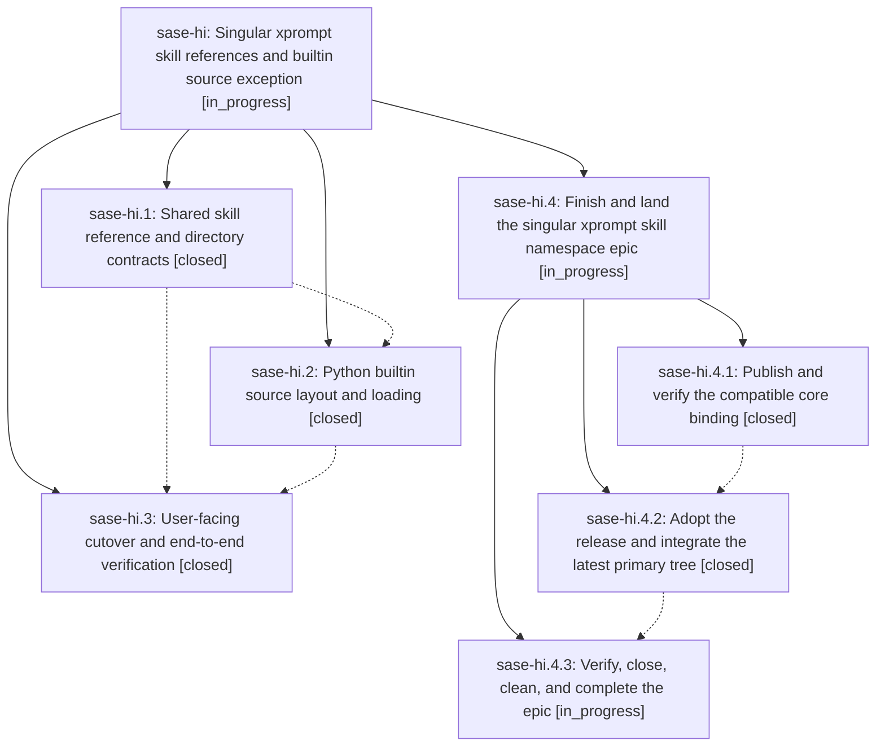

# Bead: sase-hi — Singular xprompt skill references and builtin source exception

[Bead Pages](../README.md) / sase-hi

**Status:** ◐ in_progress · **Type:** ▸ plan · **Tier:** epic
**Owner:** `bryanbugyi34@gmail.com` · **Created by:** [bbugyi200.athena.sase-hf.land.w2](https://github.com/sase-org/sase--agents/blob/main/agents/bbugyi200.athena.sase-hf.land.w2/README.md) · **Assignee:** `sase-hi.land`
**Created:** 2026-08-08 11:49:49 EDT
**Plan:** [202608/xprompt\_skill\_singular\_namespace.md](https://github.com/sase-org/sase--plans/blob/main/202608/xprompt_skill_singular_namespace.md)

## Description

Xprompt-backed skills expand through the singular #skill/ namespace while user and plugin sources remain in plural skills/ directories and bundled Markdown skill sources live only under src/sase/xprompts/skills/.

## Notes

[2026-08-08T18:48:17Z · sase-hi.land] DISCOVERED ISSUE: Land verification found the published dependency is incompatible with the epic's claimed cutover. Core commit 8a0db599 (sase-hi.1) is one commit after tag v0.20.1, while pyproject/uv.lock still select sase-core-rs 0.20.1. The installed wheel reports content-layout schema 3, skill_reference_name('foo') == 'skills/foo', rejects #skill/sase_plan, and accepts #skills/sase_plan. Later unreleased core commits 8344869 (sase-hn.1) and 4071bf0 (sase-ho.1) build on the singular contract and advance the layout to schema 5, so the release/adoption must reconcile those active epics rather than publishing or pinning an obsolete intermediate. Remaining work will be proposed as a three-phase continuation whose final phase closes sase-hi, runs post-close Symvision, and marks the linked plan done.

## Phases

| Bead | Title | Status | Size | Created | Agents | Commits |
|---|---|---|---|---|---:|---:|
| [sase-hi.1](sase-hi.1.md) | Shared skill reference and directory contracts | ✓ closed | medium | 2026-08-08 | 1 | 1 |
| [sase-hi.2](sase-hi.2.md) | Python builtin source layout and loading | ✓ closed | medium | 2026-08-08 | 1 | 1 |
| [sase-hi.3](sase-hi.3.md) | User-facing cutover and end-to-end verification | ✓ closed | medium | 2026-08-08 | 1 | 1 |

## Lineage

## Agents

| Agent | Bead | Commits |
|---|---|---:|
| [bbugyi200.athena.sase-hi.1](https://github.com/sase-org/sase--agents/blob/main/agents/bbugyi200.athena.sase-hi.1/README.md) | [sase-hi.1](sase-hi.1.md) | 1 |
| [bbugyi200.athena.sase-hi.2](https://github.com/sase-org/sase--agents/blob/main/agents/bbugyi200.athena.sase-hi.2/README.md) | [sase-hi.2](sase-hi.2.md) | 1 |
| [bbugyi200.athena.sase-hi.3](https://github.com/sase-org/sase--agents/blob/main/agents/bbugyi200.athena.sase-hi.3/README.md) | [sase-hi.3](sase-hi.3.md) | 1 |
| [bbugyi200.athena.sase-hi.4.1](https://github.com/sase-org/sase--agents/blob/main/agents/bbugyi200.athena.sase-hi.4.1/README.md) | [sase-hi.4.1](sase-hi.4.1.md) | 0 |
| [bbugyi200.athena.sase-hi.4.2](https://github.com/sase-org/sase--agents/blob/main/agents/bbugyi200.athena.sase-hi.4.2/README.md) | [sase-hi.4.2](sase-hi.4.2.md) | 1 |
| [bbugyi200.athena.sase-hi.4.3](https://github.com/sase-org/sase--agents/blob/main/agents/bbugyi200.athena.sase-hi.4.3/README.md) | [sase-hi.4.3](sase-hi.4.3.md) | 0 |
| [bbugyi200.athena.sase-hi.4.land](https://github.com/sase-org/sase--agents/blob/main/agents/bbugyi200.athena.sase-hi.4.land/README.md) | [sase-hi.4](sase-hi.4.md) | 0 |
| [bbugyi200.athena.sase-hi.land](https://github.com/sase-org/sase--agents/blob/main/agents/bbugyi200.athena.sase-hi.land/README.md) | [sase-hi](README.md) | 0 |

## Commits

| Repo | Commit | Subject | Bead | Committed |
|---|---|---|---|---|
| sase-core | [`sase-core@8a0db59`](https://github.com/sase-org/sase-core/commit/8a0db5999a9f4dd3a64031cf31ca994151535fc8) | feat!: use singular skill xprompt references | [sase-hi.1](sase-hi.1.md) | 2026-08-08 12:26:12 EDT |
| sase | [`92f0ff3`](https://github.com/sase-org/sase/commit/92f0ff3774ca867ee971cedb092045d2a4824262) | feat(xprompts): load bundled skills from xprompt resources | [sase-hi.2](sase-hi.2.md) | 2026-08-08 13:11:31 EDT |
| sase | [`54c1436`](https://github.com/sase-org/sase/commit/54c1436cd27fdcd8015ea33faa745bf42c2e5883) | feat!: cut over skill xprompt references | [sase-hi.3](sase-hi.3.md) | 2026-08-08 14:37:32 EDT |
| sase | [`5170a39`](https://github.com/sase-org/sase/commit/5170a3986737e900e2858d7a5897ac34e896a9cc) | fix: validate current skill layout binding contract | [sase-hi.4.2](sase-hi.4.2.md) | 2026-08-08 16:15:25 EDT |
