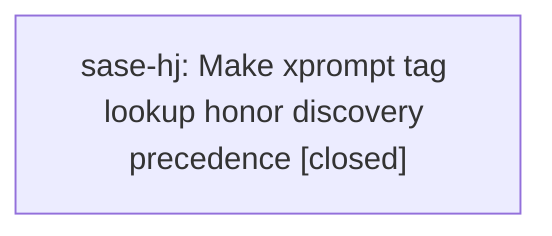

# Bead: sase-hj — Make xprompt tag lookup honor discovery precedence

[Bead Pages](../README.md) / sase-hj

**Status:** ✓ closed · **Resolution:** done · **Type:** ◆ task
**Owner:** `bryanbugyi34@gmail.com` · **Created by:** [bbugyi200.athena.research.03.cdx](https://github.com/sase-org/sase--agents/blob/main/agents/bbugyi200.athena.research.03.cdx/README.md) · **Assignee:** `sase-hj` · **Size:** medium
**Created:** 2026-08-08 11:52:17 EDT · **Closed:** 2026-08-08 18:09:41 EDT

## Description

Reproduction: get_all_xprompts()/get_all_workflows() merge lower-priority definitions before higher-priority ones with dict.update(), but replacing an existing name does not move its insertion position. get_by_tag() then returns matches[-1]. If a built-in tagged role name is replaced by a project-local same-name definition while a differently named plugin also carries the tag, the lower-priority plugin remains later and wins. get_all_prompts() additionally places all YAML workflows after all converted Markdown/config xprompts. Impact: internal CRS, fix-hook, mentor, append, and bead-role selection can invoke a definition that violates documented discovery precedence. Scope: introduce an explicit precedence/provenance-aware resolution order for current tag lookup, add real-loader regression coverage for same-name and different-name providers, and reconcile strict override semantics/documentation. Supporting research: file:explicit:1d025d6168ae18d8ce0f7dde

## Notes

[2026-08-08T22:09:41Z · sase-hj] Implemented discovery-rank-aware xprompt/workflow merging and strict tag resolution. Verified just fmt; just _lint-symvision; .venv/bin/pytest tests/test_xprompt_tags_lookup.py; .venv/bin/pytest tests/test_xprompt_loader_config.py tests/test_workflow_loader_project.py tests/test_bead_xprompt_tags.py. Ran just check: lint/SASE validation stages passed and scoped lane escalated to full suite; it failed only tracked flake tests/test_multi_prompt_launcher_xprompt_groups.py::test_launcher_qualifies_research_swarm_per_dispatch after 16,491 passed / 9 skipped, then that node passed immediately in isolation. Recorded recurrence on sase-ct and sase-h8.10.5.

[2026-08-08T22:11:25Z · sase-hj] Verified with just fmt; just _lint-symvision; .venv/bin/pytest tests/test_xprompt_tags_lookup.py; .venv/bin/pytest tests/test_xprompt_loader_config.py tests/test_workflow_loader_project.py tests/test_bead_xprompt_tags.py. just check completed lint/SASE validation and escalated to the full suite; the only failure was known tracked flake tests/test_multi_prompt_launcher_xprompt_groups.py::test_launcher_qualifies_research_swarm_per_dispatch, which passed immediately in isolation and was recorded on sase-ct and sase-h8.10.5.

## References

- file:explicit:1d025d6168ae18d8ce0f7dde

## Lineage

## Agents

| Agent | Bead | Commits |
|---|---|---:|
| [bbugyi200.athena.sase-hj](https://github.com/sase-org/sase--agents/blob/main/agents/bbugyi200.athena.sase-hj/README.md) | [sase-hj](README.md) | 1 |

## Commits

| Repo | Commit | Subject | Bead | Committed |
|---|---|---|---|---|
| sase | [`f11fbbb`](https://github.com/sase-org/sase/commit/f11fbbb338e6526843ae7fcd24ff0545789fc991) | fix(xprompt): honor discovery precedence in tag lookup | [sase-hj](README.md) | 2026-08-08 18:12:53 EDT |
