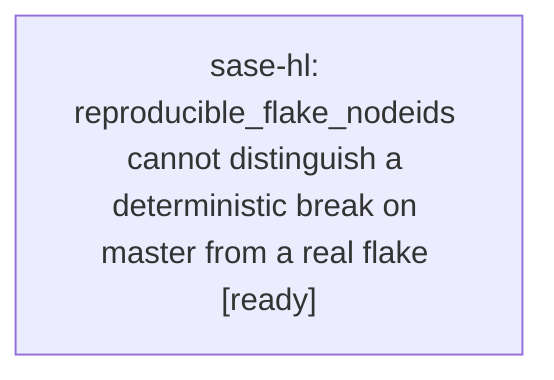

# Bead: sase-hl — reproducible\_flake\_nodeids cannot distinguish a deterministic break on master from a real flake

[Bead Pages](../README.md) / sase-hl

**Status:** ◇ ready · **Type:** ◆ task · **+1 reports:** +5 · **↺ Reopened:** ↺1
**Owner:** `bryanbugyi34@gmail.com` · **Created by:** [bbugyi200.athena.sase-h8.10.4](https://github.com/sase-org/sase--agents/blob/main/agents/bbugyi200.athena.sase-h8.10.4/README.md) · **Assignee:** `sase-hl` · **Size:** medium
**Created:** 2026-08-08 11:59:49 EDT

## Previously Closed

> ↺ Closed 2026-08-08T20:54:02Z · done
>
> (none)
>
> Reopened 2026-08-08T20:55:24Z by a +1 from @sase-ho.2

## Description

Proposed by sase-h8's land phase (bead sase-h8.10.4, epic sase-h8) while closing out the parallel-suite flake class. sase-h8.3's triage phase identified two false-positive modes in tests/_test_selection_health.py::reproducible_flake_nodeids that the sase-h8.8 gate phase would need to handle. sase-h8.8 handled only mode (1): catastrophic full runs (hundreds of failures) get discounted via the max_failures_per_run parameter, so a broken suite run does not promote every node it names into flake debt. Mode (2) is still unhandled and is inherent to the function's current design, per its own docstring: 'A genuine miss recurs only across the ancestors of the one diff that broke it... A test whose failures instead span two or more full runs with no file in common cannot be attributed to any of those diffs.' A node that is actually a deterministic break on master (not a flake at all) will still satisfy this heuristic and get classified as a reproducible flake whenever two different workspaces hit it with disjoint change sets -- exactly the live example sase-h8.3 recorded: the six ff0b765a4 notification-gate nodes broke deterministically at a specific master commit, and different workspaces reported them alongside disjoint unrelated diffs, which is indistinguishable under the current rule from genuine host-load flakiness. Left unaddressed, this lets a real regression on master hide inside the flake-suppressed set and skip the --fail-on-new-flake gate sase-h8.8 built, rather than failing the build the way a deterministic break should. Needs a mechanism to distinguish 'many unrelated diffs, still broken' (a real regression pinned to a specific commit range) from 'many unrelated diffs, intermittently broken' (an actual flake) -- for example checking whether the node fails consistently across ALL full runs after some commit rather than only sometimes.

## Notes

[2026-08-08T20:54:02Z · sase-hl] Implemented commit-ordered reproducible-flake classification that requires an independent full-run pass between unrelated failures and ignores pass evidence from runs changing the node's test file. Verified .venv/bin/pytest tests/test_test_selection_health_correlation.py tests/test_selection_health_tool.py tests/test_test_selection_health_report.py (50 passed), just selection-health --fail-on-new-flake (no new reproducible flakes), and just check.

[2026-08-08T20:56:02Z · sase-hl] Verified focused selection-health tests, just selection-health --fail-on-new-flake, and just check passed.

## +1 Evidence

> **+1** by `vt` · 2026-08-08 13:46:05 EDT
>
> Independent recurrence during launch_state_thrash verification on 2026-08-08: a second just check-full run passed the full pytest lane (test phase green) but failed the post-test flake-baseline gate because selection-health still reported the three historical bd/work_task deterministic failures as new reproducible flakes: the two test_bead_worker_builtin_xprompts_do_not_author_wait_directives parametrizations and test_builtin_task_prompt_routes_distinct_follow_ups_through_skill. The underlying bd/work_task content regression is already tracked/fixed by closed task sase-hm, so this corroborates this bead's classifier bug: reproducible_flake_nodeids/flake-baseline accounting cannot distinguish fixed deterministic master breaks from actual ongoing flakes and keeps the gate red for unrelated work.

> **+1** by `sase-hi.land` · 2026-08-08 14:45:49 EDT
>
> Independent recurrence proposed by child bead sase-hi.3 during singular-skill cutover verification: the full pytest lane passed and tests/test_bead_xprompt_tags.py passed on the current tree, but the post-test selection-health gate still classified historical deterministic bd/work_task assertion failures as reproducible flakes; one recorded node ID no longer exists. This is the same classifier defect, not a new task.

> **+1** by `codex-root` · 2026-08-08 15:31:45 EDT
>
> Independent recurrence during artifact-reference launch compatibility verification at master 54c1436cd: just check-full passed the complete pytest lane after the two causal stale expectations were corrected, but its post-test flake-baseline gate remained red on the same three historical bd/work_task failures (both test_bead_worker_builtin_xprompts_do_not_author_wait_directives parametrizations and test_builtin_task_prompt_routes_distinct_follow_ups_through_skill). tests/test_bead_xprompt_tags.py passes on the current tree and closed task sase-hm fixed the deterministic regression, confirming the remaining failure is reproducible_flake_nodeids retaining fixed historical breakage rather than a live product flake.

> **+1** by `w0` · 2026-08-08 16:27:48 EDT
>
> Independent recurrence during multi-target bead-work verification on 2026-08-08: just check-full passed the full pytest lane, then failed only the post-test flake-baseline gate on the same three historical bd/work_task nodes: both test_bead_worker_builtin_xprompts_do_not_author_wait_directives parametrizations and test_builtin_task_prompt_routes_distinct_follow_ups_through_skill. This change touched bead work CLI dispatch/parser/docs, and focused tests/test_bead_xprompt_tags.py is not in scope; the failure confirms selection-health still counts fixed historical deterministic breakage as live reproducible flake debt.

> **+1** by `sase-ho.2` · 2026-08-08 16:55:24 EDT
>
> Independent recurrence during python_ref_registry_2 verification on 2026-08-08: just check-full passed the full pytest lane, then failed only the post-test flake-baseline gate on the same three historical bd/work_task nodes: both test_bead_worker_builtin_xprompts_do_not_author_wait_directives parametrizations and test_builtin_task_prompt_routes_distinct_follow_ups_through_skill. The current change touched ref registry, sidecar ref config, xprompt/catalog/LSP metadata, and artifact ref filtering, not bead worker prompt behavior; this corroborates that selection-health still counts fixed historical deterministic failures as live reproducible-flake debt.

## Lineage

## Agents

| Agent | Bead | Commits |
|---|---|---:|
| [bbugyi200.athena.sase-hl](https://github.com/sase-org/sase--agents/blob/main/agents/bbugyi200.athena.sase-hl/README.md) | [sase-hl](README.md) | 1 |

## Commits

| Repo | Commit | Subject | Bead | Committed |
|---|---|---|---|---|
| sase | [`a67cd98`](https://github.com/sase-org/sase/commit/a67cd989afc5f552669305c535b18076b93d533b) | fix: require pass evidence for reproducible flakes | [sase-hl](README.md) | 2026-08-08 16:57:40 EDT |
