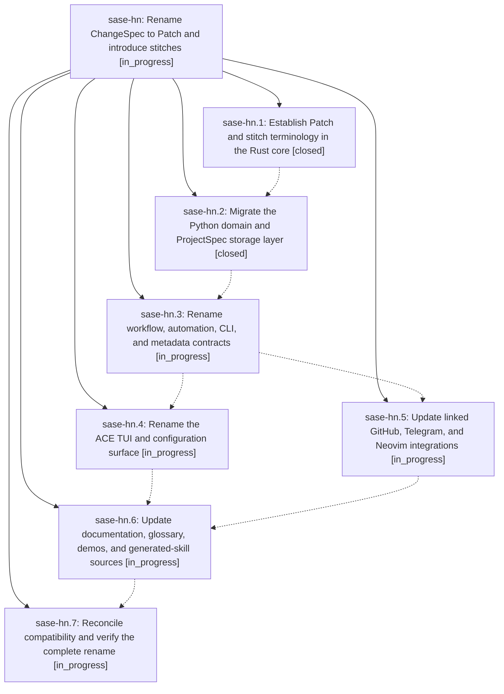

# Bead: sase-hn — Rename ChangeSpec to Patch and introduce stitches

[Bead Pages](../README.md) / sase-hn

**Status:** ◐ in_progress · **Type:** ▸ plan · **Tier:** epic
**Owner:** `bryanbugyi34@gmail.com` · **Created by:** [bbugyi200.athena.vu](https://github.com/sase-org/sase--agents/blob/main/agents/bbugyi200.athena.vu/README.md) · **Assignee:** `sase-hn.land`
**Created:** 2026-08-08 13:05:30 EDT
**Plan:** [202608/patch\_and\_stitch\_terminology.md](https://github.com/sase-org/sase--plans/blob/main/202608/patch_and_stitch_terminology.md)

## Description

Make Patch and stitch the canonical SASE vocabulary everywhere without changing workflow semantics or breaking existing data, commands, configuration, integrations, or machine consumers

## Notes

[2026-08-08T19:35:19Z · codex-root] DISCOVERED ISSUE: A concurrent sase-hn.2 landing exposed a same-process post-rebase import hazard in ❌ Commit message rejected: the message is empty.

Expected: <type>[(<scope>)][!]: <description>
Allowed types: build, chore, ci, deps, docs, feat, fix, perf, refactor, revert, 
style, test
Examples:
  fix(commit): reject non-conventional subjects
  feat!: drop the legacy config format

Rewrite the subject line and re-run the same command. Do not disable
commit.message.require_conventional_subject to get past this check.. While committing unrelated artifact-reference launch fixes, the primary commit and push succeeded, but tracking failed after the wrapper rebased onto 3e6da8d5f with  in commit_utils/entries.py. A fresh interpreter on the rebased tree imports that symbol successfully and the focused suite passes (61 passed), so master is not persistently broken; the long-lived commit process observed a hybrid pre/post-migration module state while source files changed beneath it. Impact: COMMITS/prompt-archive bookkeeping can be skipped when this epic's module migration lands during another agent's commit. Routed through /sase_new_task to this active epic because phase sase-hn.2 causally introduced the module move that triggered the compatibility-shim reload hazard; no new task bead.

[2026-08-08T19:35:45Z · codex-root] CORRECTION to the preceding mangled note: A concurrent sase-hn.2 landing exposed a same-process post-rebase import hazard in sase commit. While committing unrelated artifact-reference launch fixes, the primary commit and push succeeded, but tracking failed after the wrapper rebased onto 3e6da8d5f with an ImportError for PROJECT_SPEC_SECTION_HEADERS from sase.ace.changespec.section_order in commit_utils/entries.py. A fresh interpreter on the rebased tree imports that symbol successfully and the focused suite passes with 61 tests, so master is not persistently broken; the long-lived commit process observed a hybrid pre-migration and post-migration module state while source files changed beneath it. Impact: COMMITS and prompt-archive bookkeeping can be skipped when this epic module migration lands during another agent commit. Routed through sase_new_task to this active epic because phase sase-hn.2 causally introduced the module move that triggered the compatibility-shim reload hazard; no new task bead.

## Phases

| Bead | Title | Status | Size | Created | Agents | Commits |
|---|---|---|---|---|---:|---:|
| [sase-hn.1](sase-hn.1.md) | Establish Patch and stitch terminology in the Rust core | ✓ closed | medium | 2026-08-08 | 1 | 1 |
| [sase-hn.2](sase-hn.2.md) | Migrate the Python domain and ProjectSpec storage layer | ✓ closed | large | 2026-08-08 | 1 | 2 |
| [sase-hn.3](sase-hn.3.md) | Rename workflow, automation, CLI, and metadata contracts | ◐ in_progress | large | 2026-08-08 | 1 | 0 |
| [sase-hn.4](sase-hn.4.md) | Rename the ACE TUI and configuration surface | ◐ in_progress | large | 2026-08-08 | 1 | 0 |
| [sase-hn.5](sase-hn.5.md) | Update linked GitHub, Telegram, and Neovim integrations | ◐ in_progress | medium | 2026-08-08 | 1 | 0 |
| [sase-hn.6](sase-hn.6.md) | Update documentation, glossary, demos, and generated-skill sources | ◐ in_progress | medium | 2026-08-08 | 1 | 0 |
| [sase-hn.7](sase-hn.7.md) | Reconcile compatibility and verify the complete rename | ◐ in_progress | large | 2026-08-08 | 1 | 0 |

## Lineage

## Agents

| Agent | Bead | Commits |
|---|---|---:|
| [bbugyi200.athena.sase-hn.1](https://github.com/sase-org/sase--agents/blob/main/agents/bbugyi200.athena.sase-hn.1/README.md) | [sase-hn.1](sase-hn.1.md) | 1 |
| [bbugyi200.athena.sase-hn.2](https://github.com/sase-org/sase--agents/blob/main/families/bbugyi200.athena.sase-hn.2.md) | [sase-hn.2](sase-hn.2.md) | 1 |
| [bbugyi200.athena.sase-hn.3](https://github.com/sase-org/sase--agents/blob/main/agents/bbugyi200.athena.sase-hn.3/README.md) | [sase-hn.3](sase-hn.3.md) | 0 |
| [bbugyi200.athena.sase-hn.4](https://github.com/sase-org/sase--agents/blob/main/agents/bbugyi200.athena.sase-hn.4/README.md) | [sase-hn.4](sase-hn.4.md) | 0 |
| [bbugyi200.athena.sase-hn.5](https://github.com/sase-org/sase--agents/blob/main/agents/bbugyi200.athena.sase-hn.5/README.md) | [sase-hn.5](sase-hn.5.md) | 0 |
| [bbugyi200.athena.sase-hn.6](https://github.com/sase-org/sase--agents/blob/main/agents/bbugyi200.athena.sase-hn.6/README.md) | [sase-hn.6](sase-hn.6.md) | 0 |
| [bbugyi200.athena.sase-hn.7](https://github.com/sase-org/sase--agents/blob/main/agents/bbugyi200.athena.sase-hn.7/README.md) | [sase-hn.7](sase-hn.7.md) | 0 |
| [bbugyi200.athena.sase-hn.land](https://github.com/sase-org/sase--agents/blob/main/agents/bbugyi200.athena.sase-hn.land/README.md) | [sase-hn](README.md) | 0 |

## Commits

| Repo | Commit | Subject | Bead | Committed |
|---|---|---|---|---|
| sase-core | [`sase-core@8344869`](https://github.com/sase-org/sase-core/commit/83448690a9c54b4342482d66c1e843d290c4564d) | feat(core): add Patch and stitch wire contract | [sase-hn.1](sase-hn.1.md) | 2026-08-08 13:36:43 EDT |
| sase | [`3e6da8d`](https://github.com/sase-org/sase/commit/3e6da8d5fb1b7d4887b8f78cfce863d702fa1fb7) | feat: Migrate the Python domain and ProjectSpec storage layer (sase-hn.2) | [sase-hn.2](sase-hn.2.md) | 2026-08-08 15:28:09 EDT |
| sase | [`6367ef3`](https://github.com/sase-org/sase/commit/6367ef34734011e7ebe37885b7bf074260627412) | refactor(patch): canonicalize Python patch storage | [sase-hn.2](sase-hn.2.md) | 2026-08-08 17:04:42 EDT |
