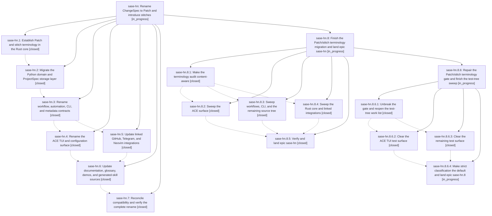

# Bead: sase-hn — Rename ChangeSpec to Patch and introduce stitches

[Bead Pages](../README.md) / sase-hn

**Status:** ◐ in_progress · **Type:** ▸ plan · **Tier:** epic
**Owner:** `bryanbugyi34@gmail.com` · **Created by:** [bbugyi200.athena.vu](https://github.com/sase-org/sase--agents/blob/main/agents/bbugyi200.athena.vu/README.md) · **Assignee:** `sase-hn.land`
**Created:** 2026-08-08 13:05:30 EDT
**Plan:** [202608/patch\_and\_stitch\_terminology.md](https://github.com/sase-org/sase--plans/blob/main/202608/patch_and_stitch_terminology.md)

## Description

Make Patch and stitch the canonical SASE vocabulary everywhere without changing workflow semantics or breaking existing data, commands, configuration, integrations, or machine consumers

## Notes

[2026-08-08T19:35:19Z · codex-root] DISCOVERED ISSUE: A concurrent sase-hn.2 landing exposed a same-process post-rebase import hazard in ❌ Commit message rejected: the message is empty.

Expected: <type>[(<scope>)][!]: <description>
Allowed types: build, chore, ci, deps, docs, feat, fix, perf, refactor, revert, 
style, test
Examples:
  fix(commit): reject non-conventional subjects
  feat!: drop the legacy config format

Rewrite the subject line and re-run the same command. Do not disable
commit.message.require_conventional_subject to get past this check.. While committing unrelated artifact-reference launch fixes, the primary commit and push succeeded, but tracking failed after the wrapper rebased onto 3e6da8d5f with  in commit_utils/entries.py. A fresh interpreter on the rebased tree imports that symbol successfully and the focused suite passes (61 passed), so master is not persistently broken; the long-lived commit process observed a hybrid pre/post-migration module state while source files changed beneath it. Impact: COMMITS/prompt-archive bookkeeping can be skipped when this epic's module migration lands during another agent's commit. Routed through /sase_new_task to this active epic because phase sase-hn.2 causally introduced the module move that triggered the compatibility-shim reload hazard; no new task bead.

[2026-08-08T19:35:45Z · codex-root] CORRECTION to the preceding mangled note: A concurrent sase-hn.2 landing exposed a same-process post-rebase import hazard in sase commit. While committing unrelated artifact-reference launch fixes, the primary commit and push succeeded, but tracking failed after the wrapper rebased onto 3e6da8d5f with an ImportError for PROJECT_SPEC_SECTION_HEADERS from sase.ace.changespec.section_order in commit_utils/entries.py. A fresh interpreter on the rebased tree imports that symbol successfully and the focused suite passes with 61 tests, so master is not persistently broken; the long-lived commit process observed a hybrid pre-migration and post-migration module state while source files changed beneath it. Impact: COMMITS and prompt-archive bookkeeping can be skipped when this epic module migration lands during another agent commit. Routed through sase_new_task to this active epic because phase sase-hn.2 causally introduced the module move that triggered the compatibility-shim reload hazard; no new task bead.

[2026-08-09T02:15:11Z · toobig-23.split_file.src.sase.artifact_ref_prompt.0] DISCOVERED ISSUE: Independent reproduction during unrelated artifact_ref_prompt module-split verification on 2026-08-08. 'just check' passes formatting, keep-sorted, Ruff, mypy, pyscripts, test-wait, and changelog gates, then Symvision fails with: Private functions/classes should not be imported: _parse_timestamp_value in src/sase/ace/tui/models/patch_groups/_buckets.py. The source was introduced by this epic's c7026e50e 'feat(tui): rename ACE patch surface'; src/sase/ace/tui/models/changespec_groups/_buckets.py aliases _patch_buckets._parse_timestamp_value and changespec_groups/__init__.py mutates that private symbol for legacy compatibility. This is causally part of the active Patch/ChangeSpec compatibility work, so no standalone task bead was created.

[2026-08-09T02:37:55Z · toobig-23.split_file.src.sase.xprompt.workflow_loader.0] DISCOVERED ISSUE: Independent recurrence during unrelated workflow_loader.py module-split verification on 2026-08-08. After all refactor-caused Symvision private-import findings were fixed, 'just _lint-symvision' fails only on the existing cross-module import of _parse_timestamp_value in src/sase/ace/tui/models/patch_groups/_buckets.py. This independently confirms the compatibility residue already reported at 02:15 belongs to active reconciliation phase sase-hn.7 and continues to block a clean 'just check'; no standalone task bead created.

## Phases

| Bead | Title | Status | Size | Created | Agents | Commits |
|---|---|---|---|---|---:|---:|
| [sase-hn.1](sase-hn.1.md) | Establish Patch and stitch terminology in the Rust core | ✓ closed | medium | 2026-08-08 | 1 | 1 |
| [sase-hn.2](sase-hn.2.md) | Migrate the Python domain and ProjectSpec storage layer | ✓ closed | large | 2026-08-08 | 1 | 2 |
| [sase-hn.3](sase-hn.3.md) | Rename workflow, automation, CLI, and metadata contracts | ✓ closed | large | 2026-08-08 | 1 | 1 |
| [sase-hn.4](sase-hn.4.md) | Rename the ACE TUI and configuration surface | ✓ closed | large | 2026-08-08 | 1 | 2 |
| [sase-hn.5](sase-hn.5.md) | Update linked GitHub, Telegram, and Neovim integrations | ✓ closed | medium | 2026-08-08 | 1 | 0 |
| [sase-hn.6](sase-hn.6.md) | Update documentation, glossary, demos, and generated-skill sources | ✓ closed | medium | 2026-08-08 | 1 | 1 |
| [sase-hn.7](sase-hn.7.md) | Reconcile compatibility and verify the complete rename | ✓ closed | large | 2026-08-08 | 1 | 1 |

## Lineage

## Agents

| Agent | Bead | Commits |
|---|---|---:|
| [bbugyi200.athena.sase-hn.1](https://github.com/sase-org/sase--agents/blob/main/agents/bbugyi200.athena.sase-hn.1/README.md) | [sase-hn.1](sase-hn.1.md) | 1 |
| [bbugyi200.athena.sase-hn.2](https://github.com/sase-org/sase--agents/blob/main/families/bbugyi200.athena.sase-hn.2.md) | [sase-hn.2](sase-hn.2.md) | 1 |
| [bbugyi200.athena.sase-hn.3](https://github.com/sase-org/sase--agents/blob/main/families/bbugyi200.athena.sase-hn.3.md) | [sase-hn.3](sase-hn.3.md) | 1 |
| [bbugyi200.athena.sase-hn.4](https://github.com/sase-org/sase--agents/blob/main/families/bbugyi200.athena.sase-hn.4.md) | [sase-hn.4](sase-hn.4.md) | 2 |
| [bbugyi200.athena.sase-hn.5](https://github.com/sase-org/sase--agents/blob/main/agents/bbugyi200.athena.sase-hn.5/README.md) | [sase-hn.5](sase-hn.5.md) | 0 |
| [bbugyi200.athena.sase-hn.6](https://github.com/sase-org/sase--agents/blob/main/agents/bbugyi200.athena.sase-hn.6/README.md) | [sase-hn.6](sase-hn.6.md) | 1 |
| [bbugyi200.athena.sase-hn.7](https://github.com/sase-org/sase--agents/blob/main/families/bbugyi200.athena.sase-hn.7.md) | [sase-hn.7](sase-hn.7.md) | 1 |
| [bbugyi200.athena.sase-hn.8.1](https://github.com/sase-org/sase--agents/blob/main/agents/bbugyi200.athena.sase-hn.8.1/README.md) | [sase-hn.8.1](sase-hn.8.1.md) | 1 |
| [bbugyi200.athena.sase-hn.8.2](https://github.com/sase-org/sase--agents/blob/main/families/bbugyi200.athena.sase-hn.8.2.md) | [sase-hn.8.2](sase-hn.8.2.md) | 1 |
| [bbugyi200.athena.sase-hn.8.3](https://github.com/sase-org/sase--agents/blob/main/families/bbugyi200.athena.sase-hn.8.3.md) | [sase-hn.8.3](sase-hn.8.3.md) | 1 |
| [bbugyi200.athena.sase-hn.8.4](https://github.com/sase-org/sase--agents/blob/main/agents/bbugyi200.athena.sase-hn.8.4/README.md) | [sase-hn.8.4](sase-hn.8.4.md) | 2 |
| [bbugyi200.athena.sase-hn.8.5](https://github.com/sase-org/sase--agents/blob/main/agents/bbugyi200.athena.sase-hn.8.5/README.md) | [sase-hn.8.5](sase-hn.8.5.md) | 2 |
| [bbugyi200.athena.sase-hn.8.6.1](https://github.com/sase-org/sase--agents/blob/main/agents/bbugyi200.athena.sase-hn.8.6.1/README.md) | [sase-hn.8.6.1](sase-hn.8.6.1.md) | 1 |
| [bbugyi200.athena.sase-hn.8.6.2](https://github.com/sase-org/sase--agents/blob/main/families/bbugyi200.athena.sase-hn.8.6.2.md) | [sase-hn.8.6.2](sase-hn.8.6.2.md) | 1 |
| [bbugyi200.athena.sase-hn.8.6.3](https://github.com/sase-org/sase--agents/blob/main/agents/bbugyi200.athena.sase-hn.8.6.3/README.md) | [sase-hn.8.6.3](sase-hn.8.6.3.md) | 1 |
| [bbugyi200.athena.sase-hn.8.6.4](https://github.com/sase-org/sase--agents/blob/main/agents/bbugyi200.athena.sase-hn.8.6.4/README.md) | [sase-hn.8.6.4](sase-hn.8.6.4.md) | 0 |
| [bbugyi200.athena.sase-hn.8.6.land](https://github.com/sase-org/sase--agents/blob/main/agents/bbugyi200.athena.sase-hn.8.6.land/README.md) | [sase-hn.8.6](sase-hn.8.6.md) | 0 |
| [bbugyi200.athena.sase-hn.8.land](https://github.com/sase-org/sase--agents/blob/main/agents/bbugyi200.athena.sase-hn.8.land/README.md) | [sase-hn.8](sase-hn.8.md) | 0 |
| [bbugyi200.athena.sase-hn.land](https://github.com/sase-org/sase--agents/blob/main/agents/bbugyi200.athena.sase-hn.land/README.md) | [sase-hn](README.md) | 0 |

## Commits

| Repo | Commit | Subject | Bead | Committed |
|---|---|---|---|---|
| sase-core | [`sase-core@8344869`](https://github.com/sase-org/sase-core/commit/83448690a9c54b4342482d66c1e843d290c4564d) | feat(core): add Patch and stitch wire contract | [sase-hn.1](sase-hn.1.md) | 2026-08-08 13:36:43 EDT |
| sase | [`3e6da8d`](https://github.com/sase-org/sase/commit/3e6da8d5fb1b7d4887b8f78cfce863d702fa1fb7) | feat: Migrate the Python domain and ProjectSpec storage layer (sase-hn.2) | [sase-hn.2](sase-hn.2.md) | 2026-08-08 15:28:09 EDT |
| sase | [`6367ef3`](https://github.com/sase-org/sase/commit/6367ef34734011e7ebe37885b7bf074260627412) | refactor(patch): canonicalize Python patch storage | [sase-hn.2](sase-hn.2.md) | 2026-08-08 17:04:42 EDT |
| sase | [`d9e11c7`](https://github.com/sase-org/sase/commit/d9e11c78673a1ec6255f5d9bd85e977534f9315b) | feat: add canonical patch workflow contracts | [sase-hn.3](sase-hn.3.md) | 2026-08-08 18:30:49 EDT |
| sase-core | [`sase-core@984033d`](https://github.com/sase-org/sase-core/commit/984033d676a7a7e10b35bfab7a44ee9d919a9fa3) | feat(core): accept canonical patch completion metadata | [sase-hn.4](sase-hn.4.md) | 2026-08-08 21:45:55 EDT |
| sase | [`c7026e5`](https://github.com/sase-org/sase/commit/c7026e50ef202e6d4dd63d8001af9d0c55ba4cdd) | feat(tui): rename ACE patch surface | [sase-hn.4](sase-hn.4.md) | 2026-08-08 21:48:53 EDT |
| sase | [`2634fb4`](https://github.com/sase-org/sase/commit/2634fb4759db483a1374a4b87332c88e7270e3ec) | feat: adopt Patch terminology across docs and skills | [sase-hn.6](sase-hn.6.md) | 2026-08-08 22:32:55 EDT |
| sase | [`db632d7`](https://github.com/sase-org/sase/commit/db632d7fda78ae7d2ebc9a209e057d60943638c3) | feat: audit Patch/stitch compatibility terminology | [sase-hn.7](sase-hn.7.md) | 2026-08-08 23:56:21 EDT |
| sase | [`a4a3406`](https://github.com/sase-org/sase/commit/a4a3406795802e77f6d34c3564612f85e891df92) | fix: tighten patch terminology audit classification | [sase-hn.8.1](sase-hn.8.1.md) | 2026-08-09 00:28:33 EDT |
| sase-core | [`sase-core@3a5753f`](https://github.com/sase-org/sase-core/commit/3a5753ff6e924b223a5e79f0427a8120d734c3fe) | refactor(core): use patch terminology across core docs and internals | [sase-hn.8.4](sase-hn.8.4.md) | 2026-08-09 01:53:40 EDT |
| sase | [`8651758`](https://github.com/sase-org/sase/commit/865175867ad8b505ed867de9e28254129ca85a8c) | test: update patch terminology audit expectations | [sase-hn.8.4](sase-hn.8.4.md) | 2026-08-09 01:58:04 EDT |
| sase | [`77d18c3`](https://github.com/sase-org/sase/commit/77d18c3e1456e03944278b8d34e030bca7838200) | feat(cli): adopt Patch terminology across workflows | [sase-hn.8.3](sase-hn.8.3.md) | 2026-08-09 02:16:28 EDT |
| sase | [`50f8961`](https://github.com/sase-org/sase/commit/50f8961ac7cb1b2ba654ed4bcb06804db433d42e) | feat(ace): rename ACE ChangeSpecs to Patches | [sase-hn.8.2](sase-hn.8.2.md) | 2026-08-09 02:48:05 EDT |
| sase | [`cac21c8`](https://github.com/sase-org/sase/commit/cac21c867e301b97a59b3918fb8242cdae51c9b9) | fix: enforce Patch terminology audit gate | [sase-hn.8.5](sase-hn.8.5.md) | 2026-08-09 03:58:02 EDT |
| sase--plans | [`sase--plans@4fbaea1`](https://github.com/sase-org/sase--plans/commit/4fbaea178aa166c69725c4fa6dce246e8d08c11f) | docs: mark Patch terminology plans done | [sase-hn.8.5](sase-hn.8.5.md) | 2026-08-09 03:59:21 EDT |
| sase | [`4a85503`](https://github.com/sase-org/sase/commit/4a855032ff96612934d810a9ac0fed463d2f7448) | fix: keep Patch terminology lint unblocked by missing repos | [sase-hn.8.6.1](sase-hn.8.6.1.md) | 2026-08-09 04:45:47 EDT |
| sase | [`684eddd`](https://github.com/sase-org/sase/commit/684eddd2dbce9aafb2dc39349daaabc4c966ede6) | test(ace): clear patch terminology defects in tests | [sase-hn.8.6.3](sase-hn.8.6.3.md) | 2026-08-09 05:10:49 EDT |
| sase | [`7feb0b8`](https://github.com/sase-org/sase/commit/7feb0b84b69a0b3a197db2aab5e5ac37c986081c) | test(ace): rename TUI tests to Patch terminology | [sase-hn.8.6.2](sase-hn.8.6.2.md) | 2026-08-09 06:45:04 EDT |
