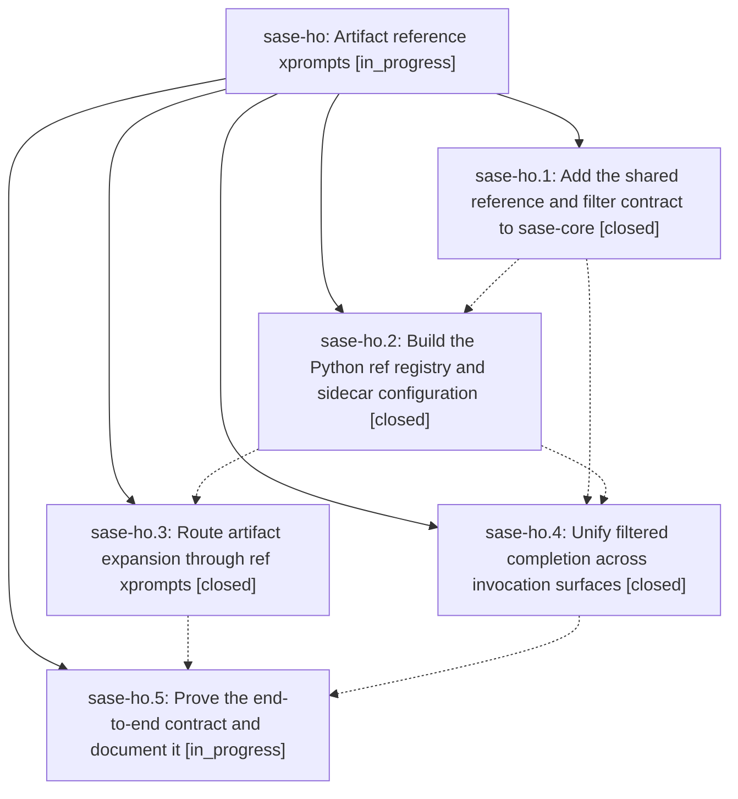

# Bead: sase-ho — Artifact reference xprompts

[Bead Pages](../README.md) / sase-ho

**Status:** ◐ in_progress · **Type:** ▸ plan · **Tier:** epic
**Owner:** `bryanbugyi34@gmail.com` · **Created by:** [bbugyi200.athena.vw](https://github.com/sase-org/sase--agents/blob/main/agents/bbugyi200.athena.vw/README.md) · **Assignee:** `sase-ho.land`
**Created:** 2026-08-08 13:31:49 EDT
**Plan:** [202608/artifact\_reference\_xprompts.md](https://github.com/sase-org/sase--plans/blob/main/202608/artifact_reference_xprompts.md)

## Description

Define artifact-reference renderers as contextual `#ref/` xprompts, automatically synthesize and configure them for sidecar repositories, and enforce one shared path-filter contract in resolution and completion.

## Phases

| Bead | Title | Status | Size | Created | Agents | Commits |
|---|---|---|---|---|---:|---:|
| [sase-ho.1](sase-ho.1.md) | Add the shared reference and filter contract to sase-core | ✓ closed | large | 2026-08-08 | 1 | 1 |
| [sase-ho.2](sase-ho.2.md) | Build the Python ref registry and sidecar configuration | ✓ closed | large | 2026-08-08 | 1 | 1 |
| [sase-ho.3](sase-ho.3.md) | Route artifact expansion through ref xprompts | ✓ closed | medium | 2026-08-08 | 1 | 0 |
| [sase-ho.4](sase-ho.4.md) | Unify filtered completion across invocation surfaces | ✓ closed | medium | 2026-08-08 | 1 | 1 |
| [sase-ho.5](sase-ho.5.md) | Prove the end-to-end contract and document it | ◐ in_progress | medium | 2026-08-08 | 1 | 0 |

## Lineage

## Agents

| Agent | Bead | Commits |
|---|---|---:|
| [bbugyi200.athena.sase-ho.1](https://github.com/sase-org/sase--agents/blob/main/families/bbugyi200.athena.sase-ho.1.md) | [sase-ho.1](sase-ho.1.md) | 1 |
| [bbugyi200.athena.sase-ho.2](https://github.com/sase-org/sase--agents/blob/main/families/bbugyi200.athena.sase-ho.2.md) | [sase-ho.2](sase-ho.2.md) | 1 |
| [bbugyi200.athena.sase-ho.3](https://github.com/sase-org/sase--agents/blob/main/agents/bbugyi200.athena.sase-ho.3/README.md) | [sase-ho.3](sase-ho.3.md) | 0 |
| [bbugyi200.athena.sase-ho.4](https://github.com/sase-org/sase--agents/blob/main/agents/bbugyi200.athena.sase-ho.4/README.md) | [sase-ho.4](sase-ho.4.md) | 1 |
| [bbugyi200.athena.sase-ho.5](https://github.com/sase-org/sase--agents/blob/main/agents/bbugyi200.athena.sase-ho.5/README.md) | [sase-ho.5](sase-ho.5.md) | 0 |
| [bbugyi200.athena.sase-ho.land](https://github.com/sase-org/sase--agents/blob/main/agents/bbugyi200.athena.sase-ho.land/README.md) | [sase-ho](README.md) | 0 |

## Commits

| Repo | Commit | Subject | Bead | Committed |
|---|---|---|---|---|
| sase-core | [`sase-core@4071bf0`](https://github.com/sase-org/sase-core/commit/4071bf083ea59e1ecdb97a64c816d272f3f5ad66) | feat(core)!: add reference artifact contract | [sase-ho.1](sase-ho.1.md) | 2026-08-08 14:36:01 EDT |
| sase | [`e007352`](https://github.com/sase-org/sase/commit/e0073528f2055f39a9d634b7c3096563c50465ed) | feat: add Python ref registry | [sase-ho.2](sase-ho.2.md) | 2026-08-08 17:00:59 EDT |
| sase-core | [`sase-core@5764c32`](https://github.com/sase-org/sase-core/commit/5764c323bdc19376de026d2fefa50c12b678a34e) | fix(lsp): invalidate ref completion sources | [sase-ho.4](sase-ho.4.md) | 2026-08-08 18:04:33 EDT |
