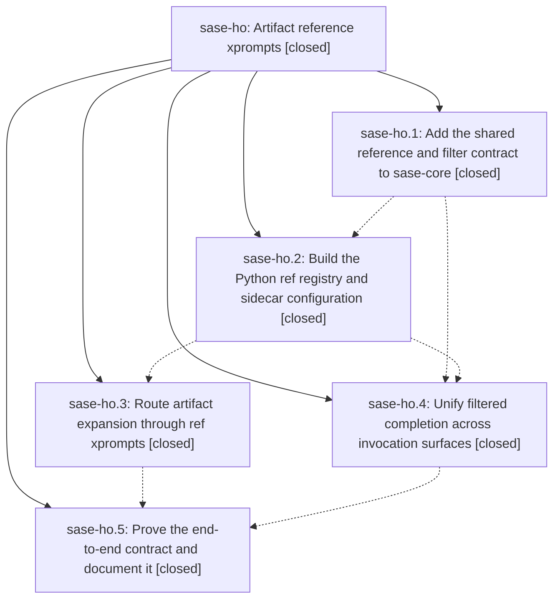

# Bead: sase-ho — Artifact reference xprompts

[Bead Pages](../README.md) / sase-ho

**Status:** ✓ closed · **Resolution:** done · **Type:** ▸ plan · **Tier:** epic
**Owner:** `bryanbugyi34@gmail.com` · **Created by:** [bbugyi200.athena.vw](https://github.com/sase-org/sase--agents/blob/main/agents/bbugyi200.athena.vw/README.md) · **Assignee:** `sase-ho.land`
**Created:** 2026-08-08 13:31:49 EDT · **Closed:** 2026-08-08 19:04:20 EDT
**Plan:** [202608/artifact\_reference\_xprompts.md](https://github.com/sase-org/sase--plans/blob/main/202608/artifact_reference_xprompts.md)

## Description

Define artifact-reference renderers as contextual `#ref/` xprompts, automatically synthesize and configure them for sidecar repositories, and enforce one shared path-filter contract in resolution and completion.

## Notes

[2026-08-08T23:04:20Z · sase-ho.land] Verified all 5 phases closed with real commits: sase-ho.1 in the linked sase-core repo (4071bf0, released as sase-core-rs v0.21.0), .2 e0073528f, .3 be6277b67, .4 f164eee9a, .5 ce8ea893f. Verified the feature live rather than trusting the notes: sase xprompt list exposes the 6 packaged built-in refs (ref/agent, ref/bead, ref/bug, ref/chat, ref/commit, ref/file) plus generated ref/plans and ref/research carrying ref_sidecar_role, the shared **/*.md default path filter, and a file_path input; sase xprompt show ref/research renders the documented default wording with correct provenance. The single PROPOSED FOLLOW-UP (sase-ho.2: core artifact-reference contract unpublished) is resolved -- the installed sase_core_rs binding exposes artifact_ref_filter_path_payloads and artifact_ref_path_filter_wire_schema_version.

Integration (step 2): master HEAD was broken with NameError: name _XPromptWriteTarget is not defined in src/sase/xprompt/write_targets.py, because two rebase artifacts each re-added a compatibility alias after 996f76d32 had restored the public class -- one from this epic (ce8ea893f), one from 01fa3b106. While I was verifying, the sase-hp.5 agent landed the same fix upstream as 1d47fdef5 plus bcf5748b6; I discarded my duplicate, fast-forwarded onto them, and recorded the diagnosis as DISCOVERED ISSUE notes on the still-open epics sase-hp and sase-hq.

One genuine integration gap remained and is fixed here: this epic introduced two synthetic xprompt source-path prefixes (sidecar_ref_config: and generated_sidecar_ref:) that the concurrently-landed editable-xprompt work would have classified as editable file paths -- classify_source fell through to its editable Other fallback and resolve_source_to_file_path returned a bogus target, so the ACE xprompt browser would have offered to edit and write back a ref renderer that has no standalone markdown definition. classify_source now marks both read-only (sidecar_ref_config: -> the owning sase/sase.yml, generated_sidecar_ref: -> Built-in) and resolve_source_to_file_path maps them to the owning sase.yml and None respectively, with tests in tests/ace/tui/modals/test_xprompt_browser_helpers.py.

Follow-ups: the only non-epic-caused proposal is sase-hv (ready, size small), filed via /sase_new_task -- ACE prompt-bar definition jump (gd) cannot resolve #ref/<kind> because get_xprompt_or_workflow does not pass include_refs=True. Deliberately kept out of this epic because the plan scopes definition navigation to sase xprompt show, the xprompt picker, and the LSP catalog, all of which work. No symvision epic-symbol whitelist entries reference sase-ho, and just check passes lint plus the scoped test lane.

## Phases

| Bead | Title | Status | Size | Created | Agents | Commits |
|---|---|---|---|---|---:|---:|
| [sase-ho.1](sase-ho.1.md) | Add the shared reference and filter contract to sase-core | ✓ closed | large | 2026-08-08 | 1 | 1 |
| [sase-ho.2](sase-ho.2.md) | Build the Python ref registry and sidecar configuration | ✓ closed | large | 2026-08-08 | 1 | 1 |
| [sase-ho.3](sase-ho.3.md) | Route artifact expansion through ref xprompts | ✓ closed | medium | 2026-08-08 | 1 | 1 |
| [sase-ho.4](sase-ho.4.md) | Unify filtered completion across invocation surfaces | ✓ closed | medium | 2026-08-08 | 1 | 2 |
| [sase-ho.5](sase-ho.5.md) | Prove the end-to-end contract and document it | ✓ closed | medium | 2026-08-08 | 1 | 1 |

## Lineage

## Agents

| Agent | Bead | Commits |
|---|---|---:|
| [bbugyi200.athena.sase-ho.1](https://github.com/sase-org/sase--agents/blob/main/families/bbugyi200.athena.sase-ho.1.md) | [sase-ho.1](sase-ho.1.md) | 1 |
| [bbugyi200.athena.sase-ho.2](https://github.com/sase-org/sase--agents/blob/main/families/bbugyi200.athena.sase-ho.2.md) | [sase-ho.2](sase-ho.2.md) | 1 |
| [bbugyi200.athena.sase-ho.3](https://github.com/sase-org/sase--agents/blob/main/agents/bbugyi200.athena.sase-ho.3/README.md) | [sase-ho.3](sase-ho.3.md) | 1 |
| [bbugyi200.athena.sase-ho.4](https://github.com/sase-org/sase--agents/blob/main/agents/bbugyi200.athena.sase-ho.4/README.md) | [sase-ho.4](sase-ho.4.md) | 2 |
| [bbugyi200.athena.sase-ho.5](https://github.com/sase-org/sase--agents/blob/main/agents/bbugyi200.athena.sase-ho.5/README.md) | [sase-ho.5](sase-ho.5.md) | 1 |
| [bbugyi200.athena.sase-ho.land](https://github.com/sase-org/sase--agents/blob/main/agents/bbugyi200.athena.sase-ho.land/README.md) | [sase-ho](README.md) | 1 |

## Commits

| Repo | Commit | Subject | Bead | Committed |
|---|---|---|---|---|
| sase-core | [`sase-core@4071bf0`](https://github.com/sase-org/sase-core/commit/4071bf083ea59e1ecdb97a64c816d272f3f5ad66) | feat(core)!: add reference artifact contract | [sase-ho.1](sase-ho.1.md) | 2026-08-08 14:36:01 EDT |
| sase | [`e007352`](https://github.com/sase-org/sase/commit/e0073528f2055f39a9d634b7c3096563c50465ed) | feat: add Python ref registry | [sase-ho.2](sase-ho.2.md) | 2026-08-08 17:00:59 EDT |
| sase | [`be6277b`](https://github.com/sase-org/sase/commit/be6277b6722e7d393eb21c97150ddd4b47e117b4) | feat: render artifact refs through ref xprompts | [sase-ho.3](sase-ho.3.md) | 2026-08-08 18:03:01 EDT |
| sase-core | [`sase-core@5764c32`](https://github.com/sase-org/sase-core/commit/5764c323bdc19376de026d2fefa50c12b678a34e) | fix(lsp): invalidate ref completion sources | [sase-ho.4](sase-ho.4.md) | 2026-08-08 18:04:33 EDT |
| sase | [`f164eee`](https://github.com/sase-org/sase/commit/f164eee9a832f28df1bdd5d59479b0a3edffc245) | feat(tui): complete filtered ref argument completion | [sase-ho.4](sase-ho.4.md) | 2026-08-08 18:06:35 EDT |
| sase | [`ce8ea89`](https://github.com/sase-org/sase/commit/ce8ea893fdbd601531beed3d920d187baf070bf2) | fix: select the active project for ref renderers | [sase-ho.5](sase-ho.5.md) | 2026-08-08 18:38:47 EDT |
| sase | [`0a45fee`](https://github.com/sase-org/sase/commit/0a45feebcf1bf691d83c272938e450e32b70a46e) | fix(ace): treat synthesized ref renderers as read-only xprompt sources | [sase-ho](README.md) | 2026-08-08 19:11:49 EDT |
