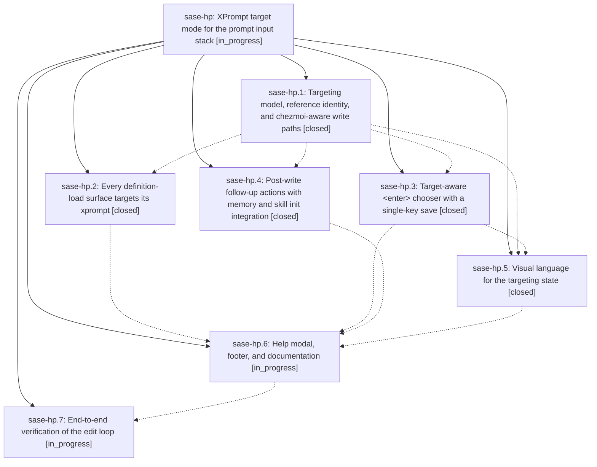

# Bead: sase-hp — XPrompt target mode for the prompt input stack

[Bead Pages](../README.md) / sase-hp

**Status:** ◐ in_progress · **Type:** ▸ plan · **Tier:** epic
**Owner:** `bryanbugyi34@gmail.com` · **Created by:** [bbugyi200.athena.vy](https://github.com/sase-org/sase--agents/blob/main/agents/bbugyi200.athena.vy/README.md) · **Assignee:** `sase-hp.land`
**Created:** 2026-08-08 15:51:55 EDT
**Plan:** [202608/xprompt\_target\_mode.md](https://github.com/sase-org/sase--plans/blob/main/202608/xprompt_target_mode.md)

## Description

Editing an existing xprompt definition from the ACE TUI is a first-class, obvious, reliable loop: loading a definition from any surface puts the prompt input widget stack into a visibly distinct "targeting" state, <enter> offers a single-keypress "save to the targeted xprompt" option, and saving writes the correct file (chezmoi source included) and then offers exactly the follow-up actions that file needs — commit/push, a scoped chezmoi apply, or the matching `sase memory init` / `sase skill init`.

## Notes

[2026-08-08T22:05:21Z · sase-ht] DISCOVERED ISSUE: During verification for task bead sase-ht on 2026-08-08, the targeted repo-init sidecar tests could not start because tests/conftest.py autouse setup imports sase.ace.tui.modals.models_panel, which imports the prompt-save xprompt git path and fails with ImportError: cannot import name 'XPromptWriteTarget' from 'sase.xprompt.write_targets'. Reproduction: after just install, run '.venv/bin/pytest tests/main/test_repo_init_handler.py tests/main/test_repo_init_handler_creation.py tests/main/test_init_onboarding_interactive.py tests/sdd_store/test_sidecar_init_creation.py tests/sdd_store/test_sidecar_bead_adoption.py'; every node errors during setup before test execution. This appears causally tied to this epic's post-write target-mode changes, especially phase sase-hp.4's write_targets/post-write action integration, and currently blocks ordinary pytest-based verification outside the specific focused suite that phase ran.

[2026-08-08T22:10:47Z · sase-hu] DISCOVERED ISSUE: Independent recurrence while verifying task bead sase-hu on 2026-08-08: after just install, running '.venv/bin/python -m pytest tests/test_validate_test_environment_tool.py' collected 12 tests but every node errored during tests/conftest.py autouse setup because importing sase.ace.tui.modals.models_panel reaches src/sase/ace/tui/actions/agent_workflow/_prompt_bar_save_xprompt_git.py, which imports XPromptWriteTarget from sase.xprompt.write_targets even though that module only defines _XPromptWriteTarget. This blocks ordinary pytest verification for unrelated validator-cache work and matches the existing sase-hp target-mode integration issue.

## Phases

| Bead | Title | Status | Size | Created | Agents | Commits |
|---|---|---|---|---|---:|---:|
| [sase-hp.1](sase-hp.1.md) | Targeting model, reference identity, and chezmoi-aware write paths | ✓ closed | medium | 2026-08-08 | 1 | 1 |
| [sase-hp.2](sase-hp.2.md) | Every definition-load surface targets its xprompt | ✓ closed | medium | 2026-08-08 | 1 | 1 |
| [sase-hp.3](sase-hp.3.md) | Target-aware \<enter\> chooser with a single-key save | ✓ closed | medium | 2026-08-08 | 1 | 1 |
| [sase-hp.4](sase-hp.4.md) | Post-write follow-up actions with memory and skill init integration | ✓ closed | medium | 2026-08-08 | 1 | 1 |
| [sase-hp.5](sase-hp.5.md) | Visual language for the targeting state | ✓ closed | medium | 2026-08-08 | 1 | 3 |
| [sase-hp.6](sase-hp.6.md) | Help modal, footer, and documentation | ◐ in_progress | small | 2026-08-08 | 1 | 0 |
| [sase-hp.7](sase-hp.7.md) | End-to-end verification of the edit loop | ◐ in_progress | small | 2026-08-08 | 1 | 0 |

## Lineage

## Agents

| Agent | Bead | Commits |
|---|---|---:|
| [bbugyi200.athena.sase-hp.1](https://github.com/sase-org/sase--agents/blob/main/agents/bbugyi200.athena.sase-hp.1/README.md) | [sase-hp.1](sase-hp.1.md) | 1 |
| [bbugyi200.athena.sase-hp.2](https://github.com/sase-org/sase--agents/blob/main/agents/bbugyi200.athena.sase-hp.2/README.md) | [sase-hp.2](sase-hp.2.md) | 1 |
| [bbugyi200.athena.sase-hp.3](https://github.com/sase-org/sase--agents/blob/main/agents/bbugyi200.athena.sase-hp.3/README.md) | [sase-hp.3](sase-hp.3.md) | 1 |
| [bbugyi200.athena.sase-hp.4](https://github.com/sase-org/sase--agents/blob/main/agents/bbugyi200.athena.sase-hp.4/README.md) | [sase-hp.4](sase-hp.4.md) | 1 |
| [bbugyi200.athena.sase-hp.5](https://github.com/sase-org/sase--agents/blob/main/agents/bbugyi200.athena.sase-hp.5/README.md) | [sase-hp.5](sase-hp.5.md) | 3 |
| [bbugyi200.athena.sase-hp.6](https://github.com/sase-org/sase--agents/blob/main/agents/bbugyi200.athena.sase-hp.6/README.md) | [sase-hp.6](sase-hp.6.md) | 0 |
| [bbugyi200.athena.sase-hp.7](https://github.com/sase-org/sase--agents/blob/main/agents/bbugyi200.athena.sase-hp.7/README.md) | [sase-hp.7](sase-hp.7.md) | 0 |
| [bbugyi200.athena.sase-hp.land](https://github.com/sase-org/sase--agents/blob/main/agents/bbugyi200.athena.sase-hp.land/README.md) | [sase-hp](README.md) | 0 |

## Commits

| Repo | Commit | Subject | Bead | Committed |
|---|---|---|---|---|
| sase | [`7a9a56b`](https://github.com/sase-org/sase/commit/7a9a56b85caefc1c8c15931918e69d0af2511ece) | feat: route xprompt edits through write targets | [sase-hp.1](sase-hp.1.md) | 2026-08-08 16:19:51 EDT |
| sase | [`48e8f10`](https://github.com/sase-org/sase/commit/48e8f10d3c792e027750318533a5518c94df4260) | feat(tui): add target-aware prompt submit chooser | [sase-hp.3](sase-hp.3.md) | 2026-08-08 17:05:16 EDT |
| sase | [`3dfbb8a`](https://github.com/sase-org/sase/commit/3dfbb8af32e2ed07161354a9e3b0225b068cd235) | feat(tui): edit selected xprompts in the prompt bar | [sase-hp.2](sase-hp.2.md) | 2026-08-08 17:14:30 EDT |
| sase | [`d337a4e`](https://github.com/sase-org/sase/commit/d337a4edc215001e42cf7eb8736bba593366b381) | feat(xprompt): offer post-write follow-up actions | [sase-hp.4](sase-hp.4.md) | 2026-08-08 17:23:32 EDT |
| sase | [`e213d03`](https://github.com/sase-org/sase/commit/e213d03f9240101ba674cbec0f40ebb520fd0bf6) | feat(tui): show xprompt target state in prompt bar | [sase-hp.5](sase-hp.5.md) | 2026-08-08 18:20:53 EDT |
| sase | [`bcf5748`](https://github.com/sase-org/sase/commit/bcf5748b6bf736a87b44f2100cc7f7f501b10133) | test(tui): accept read-only xprompt target path | [sase-hp.5](sase-hp.5.md) | 2026-08-08 18:41:51 EDT |
| sase | [`1d47fde`](https://github.com/sase-org/sase/commit/1d47fdef5e23cccc00e4c869aed722965397c731) | fix(xprompt): remove stale write target alias | [sase-hp.5](sase-hp.5.md) | 2026-08-08 18:45:00 EDT |
