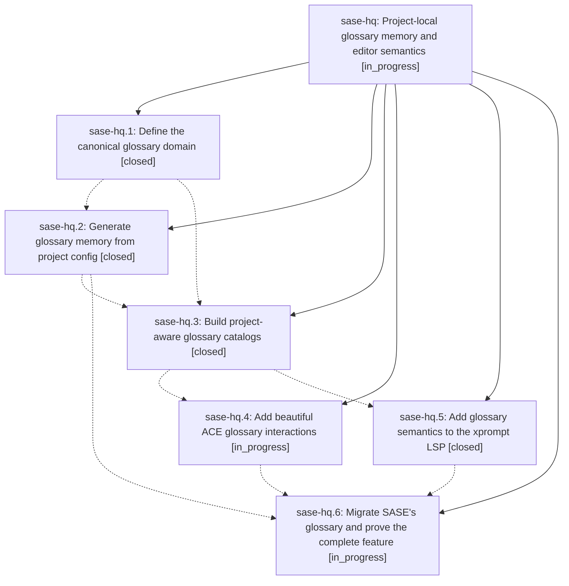

# Bead: sase-hq — Project-local glossary memory and editor semantics

[Bead Pages](../README.md) / sase-hq

**Status:** ◐ in_progress · **Type:** ▸ plan · **Tier:** epic
**Owner:** `bryanbugyi34@gmail.com` · **Created by:** [bbugyi200.athena.w2](https://github.com/sase-org/sase--agents/blob/main/agents/bbugyi200.athena.w2/README.md) · **Assignee:** `sase-hq.land`
**Created:** 2026-08-08 17:02:22 EDT
**Plan:** [202608/project\_glossary.md](https://github.com/sase-org/sase--plans/blob/main/202608/project_glossary.md)

## Description

Make one project-local glossary configuration the reliable source for generated agent memory, project-aware prompt highlighting, definition previews, and definition editing in ACE and every SASE LSP client.

## Notes

[2026-08-08T22:56:26Z · sase-ho.land] DISCOVERED ISSUE: commit 01fa3b106 (phase sase-hq.2, 'feat(memory): generate glossary note from project config') added 'XPromptWriteTarget = _XPromptWriteTarget' immediately above __all__ in src/sase/xprompt/write_targets.py, but 996f76d32 had already renamed that dataclass back to the public name, so the alias references an undefined symbol. Reproduction on commit 01fa3b106: executing the module body raises "NameError: name '_XPromptWriteTarget' is not defined", and ruff reports F811 for the same pattern. This is a rebase artifact -- the phase's tree still had the private _XPromptWriteTarget from 8f8c39829 -- and it is not glossary-specific. Impact: every importer of sase.xprompt.write_targets fails. Fixed while landing epic sase-ho by removing the dangling alias (a duplicate of it, added by ce8ea893f, was removed too). Recording here so this epic's remaining phases (sase-hq.3-.6) re-check their trees for the same stale private name before landing. Details also noted on epic sase-hp, which owns this file.

[2026-08-08T22:59:44Z · sase-ho.land] CORRECTION to the previous DISCOVERED ISSUE note from the sase-ho land agent: the dangling alias was removed upstream by commit 1d47fdef5 ('fix(xprompt): remove stale write target alias', sase-hp.5), not by the sase-ho land agent. The diagnosis stands -- 01fa3b106 (sase-hq.2) contributed one of the two duplicate alias lines as a rebase artifact -- so the standing advice for phases sase-hq.3 through sase-hq.6 to re-check their trees for the stale private _XPromptWriteTarget name before landing is unchanged.

## Phases

| Bead | Title | Status | Size | Created | Agents | Commits |
|---|---|---|---|---|---:|---:|
| [sase-hq.1](sase-hq.1.md) | Define the canonical glossary domain | ✓ closed | medium | 2026-08-08 | 1 | 2 |
| [sase-hq.2](sase-hq.2.md) | Generate glossary memory from project config | ✓ closed | medium | 2026-08-08 | 1 | 1 |
| [sase-hq.3](sase-hq.3.md) | Build project-aware glossary catalogs | ✓ closed | medium | 2026-08-08 | 1 | 0 |
| [sase-hq.4](sase-hq.4.md) | Add beautiful ACE glossary interactions | ◐ in_progress | medium | 2026-08-08 | 1 | 0 |
| [sase-hq.5](sase-hq.5.md) | Add glossary semantics to the xprompt LSP | ✓ closed | medium | 2026-08-08 | 1 | 0 |
| [sase-hq.6](sase-hq.6.md) | Migrate SASE's glossary and prove the complete feature | ◐ in_progress | medium | 2026-08-08 | 1 | 0 |

## Lineage

## Agents

| Agent | Bead | Commits |
|---|---|---:|
| [bbugyi200.athena.sase-hq.1](https://github.com/sase-org/sase--agents/blob/main/agents/bbugyi200.athena.sase-hq.1/README.md) | [sase-hq.1](sase-hq.1.md) | 2 |
| [bbugyi200.athena.sase-hq.2](https://github.com/sase-org/sase--agents/blob/main/agents/bbugyi200.athena.sase-hq.2/README.md) | [sase-hq.2](sase-hq.2.md) | 1 |
| [bbugyi200.athena.sase-hq.3](https://github.com/sase-org/sase--agents/blob/main/agents/bbugyi200.athena.sase-hq.3/README.md) | [sase-hq.3](sase-hq.3.md) | 0 |
| [bbugyi200.athena.sase-hq.4](https://github.com/sase-org/sase--agents/blob/main/agents/bbugyi200.athena.sase-hq.4/README.md) | [sase-hq.4](sase-hq.4.md) | 0 |
| [bbugyi200.athena.sase-hq.5](https://github.com/sase-org/sase--agents/blob/main/agents/bbugyi200.athena.sase-hq.5/README.md) | [sase-hq.5](sase-hq.5.md) | 0 |
| [bbugyi200.athena.sase-hq.6](https://github.com/sase-org/sase--agents/blob/main/agents/bbugyi200.athena.sase-hq.6/README.md) | [sase-hq.6](sase-hq.6.md) | 0 |
| [bbugyi200.athena.sase-hq.land](https://github.com/sase-org/sase--agents/blob/main/agents/bbugyi200.athena.sase-hq.land/README.md) | [sase-hq](README.md) | 0 |

## Commits

| Repo | Commit | Subject | Bead | Committed |
|---|---|---|---|---|
| sase-core | [`sase-core@f6a29d3`](https://github.com/sase-org/sase-core/commit/f6a29d36e56a7af5fa29af2d48104442d2faab66) | feat(core): add glossary catalog domain | [sase-hq.1](sase-hq.1.md) | 2026-08-08 18:11:11 EDT |
| sase | [`544e98a`](https://github.com/sase-org/sase/commit/544e98a1904f319217c0661db39d037b56a538f9) | feat(config): expose project glossary API | [sase-hq.1](sase-hq.1.md) | 2026-08-08 18:13:03 EDT |
| sase | [`01fa3b1`](https://github.com/sase-org/sase/commit/01fa3b106a3ee2123e7263eaeaacf98ab7338e0b) | feat(memory): generate glossary note from project config | [sase-hq.2](sase-hq.2.md) | 2026-08-08 18:40:43 EDT |
