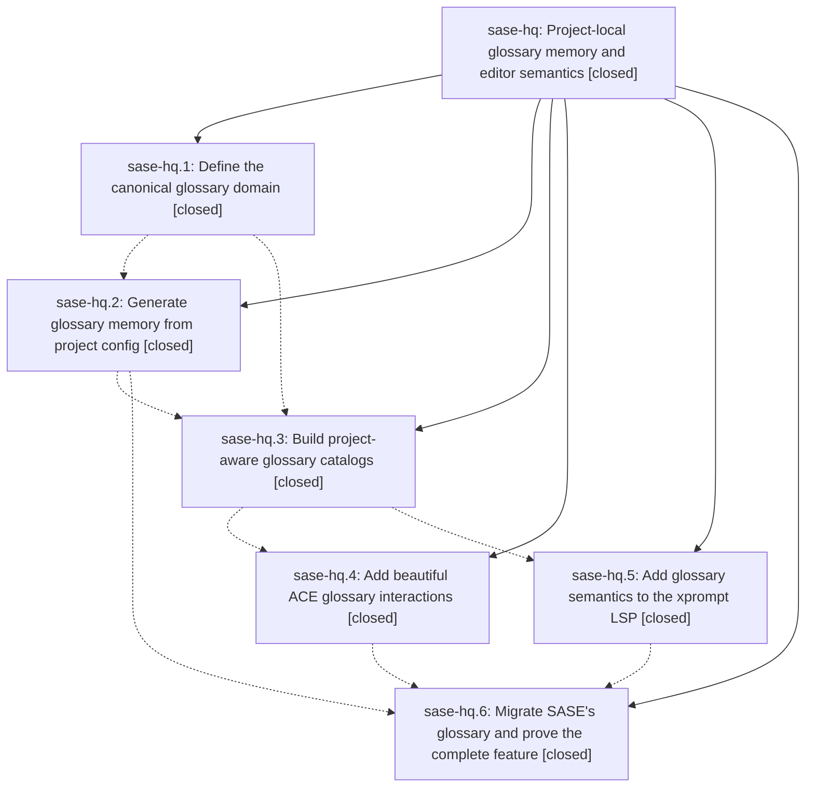

# Bead: sase-hq — Project-local glossary memory and editor semantics

[Bead Pages](../README.md) / sase-hq

**Status:** ✓ closed · **Resolution:** done · **Type:** ▸ plan · **Tier:** epic
**Owner:** `bryanbugyi34@gmail.com` · **Created by:** [bbugyi200.athena.w2](https://github.com/sase-org/sase--agents/blob/main/agents/bbugyi200.athena.w2/README.md) · **Assignee:** `sase-hq.land`
**Created:** 2026-08-08 17:02:22 EDT · **Closed:** 2026-08-08 21:04:47 EDT
**Plan:** [202608/project\_glossary.md](https://github.com/sase-org/sase--plans/blob/main/202608/project_glossary.md)

## Description

Make one project-local glossary configuration the reliable source for generated agent memory, project-aware prompt highlighting, definition previews, and definition editing in ACE and every SASE LSP client.

## Notes

[2026-08-08T22:56:26Z · sase-ho.land] DISCOVERED ISSUE: commit 01fa3b106 (phase sase-hq.2, 'feat(memory): generate glossary note from project config') added 'XPromptWriteTarget = _XPromptWriteTarget' immediately above __all__ in src/sase/xprompt/write_targets.py, but 996f76d32 had already renamed that dataclass back to the public name, so the alias references an undefined symbol. Reproduction on commit 01fa3b106: executing the module body raises "NameError: name '_XPromptWriteTarget' is not defined", and ruff reports F811 for the same pattern. This is a rebase artifact -- the phase's tree still had the private _XPromptWriteTarget from 8f8c39829 -- and it is not glossary-specific. Impact: every importer of sase.xprompt.write_targets fails. Fixed while landing epic sase-ho by removing the dangling alias (a duplicate of it, added by ce8ea893f, was removed too). Recording here so this epic's remaining phases (sase-hq.3-.6) re-check their trees for the same stale private name before landing. Details also noted on epic sase-hp, which owns this file.

[2026-08-08T22:59:44Z · sase-ho.land] CORRECTION to the previous DISCOVERED ISSUE note from the sase-ho land agent: the dangling alias was removed upstream by commit 1d47fdef5 ('fix(xprompt): remove stale write target alias', sase-hp.5), not by the sase-ho land agent. The diagnosis stands -- 01fa3b106 (sase-hq.2) contributed one of the two duplicate alias lines as a rebase artifact -- so the standing advice for phases sase-hq.3 through sase-hq.6 to re-check their trees for the stale private _XPromptWriteTarget name before landing is unchanged.

[2026-08-09T01:04:47Z · sase-hq.land] LAND VERIFICATION (sase-hq.land, 2026-08-08, master 7b473c789 + two land fixes in the workspace tree).

VERIFIED (step 1). Read all six child beads and every note. All six phases are closed with resolution done and their reported verification matches the tree. Epic commits: 544e98a19 (.1 core glossary facade, schema, default_config, focused tests), 01fa3b106 (.2 memory-init generation, README discovery, collision protection, retirement), 1d77fab2d (.3 editor glossary catalog helper + LSP catalog materialization), bb07bd865 (.4 ACE warm/highlight/preview/jump + PNG snapshot), 7b473c789 (.6 migration, docs, memory regeneration); .5 landed in sase-core as f6a29d3 and 943af9b. Spot-read the actual source: the ACE glossary overlay sits after the code-literal/placeholder mixins and before misspelling/Jinja so explicit xprompt, artifact-ref, and code-literal overlays keep precedence; K and Ctrl+] fall through to glossary only after the explicit-token resolvers and before word lookup; project selection reuses _xprompt_arg_assist_project_from_text, the same precedence as artifact refs and xprompt assist; the LSP catalog is materialized alongside the existing vcs/model/artifact-ref catalogs. Migration is faithful -- the 14 old hand-written terms became 16 config entries (Projects, Repos, and Workspaces split into Project/Repo/Workspace as the plan required), definitions preserved verbatim, and sase/memory/glossary.md now carries sase_generated: glossary. The Rust side has real coverage (semantic tokens without overlaps, hover/definition source ranges, malformed-catalog degradation, 5 core glossary unit tests). No child bead recorded a PROPOSED FOLLOW-UP.

The epic's own two notes (the dangling _XPromptWriteTarget alias from 01fa3b106) are resolved: no occurrence of that name remains anywhere in src/ or tests/, and 1d47fdef5 removed it upstream as the correction note states.

VERIFIED (step 2, integration with the 12 non-epic commits that landed since 544e98a19). Two real defects found and fixed in the workspace tree:

1. tests/ace/tui/visual/snapshots/png/prompt_artifact_ref_highlight_120x40.png was wrong at HEAD and 'just test-visual' failed (1 failed / 569 passed). aeab1cb9c (sase-h8.10.5.land) had regenerated that golden against the buggy subdued render that task sase-hx -- filed 17 minutes earlier -- documents as an unfixed regression, and 7b473c789 then added deterministic seeding that restores the correct vivid render, leaving the two in conflict. Restored the pre-aeab1cb9c golden; it is byte-identical (sha256 1af6f373...) to the current actual output, proving aeab1cb9c's stated reason ('current prompt target-state styling') did not in fact change this snapshot. 'just test-visual' is now 570 passed / 1 skipped. Recorded the corrected evidence and the fact that sase-hq.6's seeding now masks sase-hx's defect on sase-hx, and the re-baselining anti-pattern on sase-h8.10.

2. The ACE '?' help modal was never updated for this epic's new K / Ctrl+] behavior, which src/sase/ace/CLAUDE.md makes mandatory. docs/ace.md was updated but src/sase/ace/tui/modals/help_modal/binding_common.py still advertised only 'Preview xprompt/skill/file/word' and 'Jump to xprompt/skill/file'. Added a 'K / Ctrl+] on glossary term -> Preview / jump to definition' row to PROMPT_INPUT_SECTION (both existing rows kept intact; the 32-char description cap left no room to extend them).

Reviewed the other parallel commits for conflict or missed reuse and found none: 44bad7776 (agent loading refresh split) and d9e11c786/9c06b4f70 touch unrelated subsystems; ce8ea893f, 0a45feebc, e213d03f9, and 65f82ccd9 touch the same prompt-bar/ref-renderer area but the glossary code already routes through the shared project-selection helper they standardized, and docs/ace.md merged cleanly.

GATES: 'just check-full' green (fmt python+markdown, keep-sorted, ruff, mypy, pyscripts, test waits, changelog, symvision, toobig, SASE validation, committed plans, test, flake baseline), 'just test-visual' 570 passed / 1 skipped, 'sase memory init --check' clean, sase_core_rs rebuilt from the linked sase-core checkout at origin/master.

FOLLOW-UP FILED: task sase-hz (ready, xsmall) -- the sase-core-rs floor is still 0.21.0 while this epic's three PyO3 bindings (compile_glossary_catalog, glossary_catalog, glossary_validate) ship only in the unreleased 0.21.1. Reproduced against the published wheel: tools/check_sase_core_rs_bindings reports 'sase_core_rs 0.21.0 is missing 3 of 264 required binding(s)', which is exactly CI's published-core-minimum-smoke lane, so that lane is red on master. This is caused by this epic but cannot be finished here: it is blocked on sase-core release-plz PR #98 ('chore: release v0.21.1') being merged and published, and bumping the floor before then would make 'uv lock' unresolvable. The plan itself sequenced it this way ('land and release the sase-core work before raising the main repository's dependency floor'), and the repo's convention is a standalone build(deps) commit per core release (491579083, 7bdeee08e, 25be8cc68). No proposal was declined. Also left corrective notes on sase-hx, sase-h8.10, and sase-hy (whose 'the SASE glossary is hand-written' premise this epic invalidated).

The two land fixes are uncommitted in the sase_10 workspace tree awaiting the commit finalizer.

[2026-08-09T01:15:25Z · sase-hq.land] LAND VERIFICATION (epic sase-hq, project glossary).

STEP 1 - VERIFY: Read the epic bead, its linked plan (sase/repos/plans/202608/project_glossary.md), and all six phase beads plus every note. All phases closed done and the reported work is really in the tree: 544e98a19 (core glossary facade + config schema), 01fa3b106 (memory-init generation/retirement/collision protection), 1d77fab2d (editor catalog helper + LSP materialization), bb07bd865 (ACE highlight/preview/jump), 7b473c789 (glossary migration + docs); phase .5 landed in the sibling sase-core repo as f6a29d3/943af9b. Confirmed against source: overlay precedence, K / Ctrl+] fallthrough to existing preview/jump, and project selection all match the plan. The migration is faithful - 14 hand-written memory terms became 16 config entries with 'Projects, Repos, and Workspaces' split as the plan required. No child bead recorded a PROPOSED FOLLOW-UP. The epic's own _XPromptWriteTarget note is resolved: that name appears nowhere in src/ or tests/.

STEP 2 - INTEGRATE: Reviewed the 12 non-epic commits that landed since the epic started. Two real conflicts, both fixed:
(a) just test-visual was failing on master. aeab1cb9c (another epic's land agent) regenerated prompt_artifact_ref_highlight_120x40.png against the buggy render that task sase-hx documents as an unfixed regression; 7b473c789 then added deterministic seeding that restores the correct render, leaving the two commits in conflict. Restored the pre-aeab1cb9c golden - it is byte-identical (sha256 1af6f373...) to today's actual output, which disproves that commit's stated reason for the refresh. Visual suite now 570 passed / 1 skipped.
(b) The ACE '?' help modal was never updated for the epic's new K / Ctrl+] glossary behavior, which src/sase/ace/CLAUDE.md makes mandatory. Added a 'K / Ctrl+] on glossary term' row.

STEP 3 - FOLLOW-UPS: Filed ready task sase-hz (xsmall) for the sase-core-rs version floor: the floor is still 0.21.0 but this epic's three PyO3 bindings ship only in unreleased 0.21.1, so CI's published-core-minimum-smoke lane is red on master (reproduced: 'sase_core_rs 0.21.0 is missing 3 of 264 required binding(s)'). Blocked on sase-core release-plz PR #98 merging and publishing; bumping the floor first makes uv lock unresolvable. Left corrective notes on sase-hx, sase-h8.10, and sase-hy (whose 'the SASE glossary is hand-written' premise this epic invalidated).

POST-CLOSE: removed the five expired sase-hq symvision whitelist entries and the dead code they were hiding (editor_glossary_catalog_for_prompt wrapper, leading_vcs_project_ref and its helpers), made three internal-only symbols private; just symvision clean. Plan file set to status: done.

## Phases

| Bead | Title | Status | Size | Created | Agents | Commits |
|---|---|---|---|---|---:|---:|
| [sase-hq.1](sase-hq.1.md) | Define the canonical glossary domain | ✓ closed | medium | 2026-08-08 | 1 | 2 |
| [sase-hq.2](sase-hq.2.md) | Generate glossary memory from project config | ✓ closed | medium | 2026-08-08 | 1 | 1 |
| [sase-hq.3](sase-hq.3.md) | Build project-aware glossary catalogs | ✓ closed | medium | 2026-08-08 | 1 | 0 |
| [sase-hq.4](sase-hq.4.md) | Add beautiful ACE glossary interactions | ✓ closed | medium | 2026-08-08 | 1 | 1 |
| [sase-hq.5](sase-hq.5.md) | Add glossary semantics to the xprompt LSP | ✓ closed | medium | 2026-08-08 | 1 | 2 |
| [sase-hq.6](sase-hq.6.md) | Migrate SASE's glossary and prove the complete feature | ✓ closed | medium | 2026-08-08 | 1 | 1 |

## Lineage

## Agents

| Agent | Bead | Commits |
|---|---|---:|
| [bbugyi200.athena.sase-hq.1](https://github.com/sase-org/sase--agents/blob/main/agents/bbugyi200.athena.sase-hq.1/README.md) | [sase-hq.1](sase-hq.1.md) | 2 |
| [bbugyi200.athena.sase-hq.2](https://github.com/sase-org/sase--agents/blob/main/agents/bbugyi200.athena.sase-hq.2/README.md) | [sase-hq.2](sase-hq.2.md) | 1 |
| [bbugyi200.athena.sase-hq.3](https://github.com/sase-org/sase--agents/blob/main/agents/bbugyi200.athena.sase-hq.3/README.md) | [sase-hq.3](sase-hq.3.md) | 0 |
| [bbugyi200.athena.sase-hq.4](https://github.com/sase-org/sase--agents/blob/main/agents/bbugyi200.athena.sase-hq.4/README.md) | [sase-hq.4](sase-hq.4.md) | 1 |
| [bbugyi200.athena.sase-hq.5](https://github.com/sase-org/sase--agents/blob/main/agents/bbugyi200.athena.sase-hq.5/README.md) | [sase-hq.5](sase-hq.5.md) | 2 |
| [bbugyi200.athena.sase-hq.6](https://github.com/sase-org/sase--agents/blob/main/agents/bbugyi200.athena.sase-hq.6/README.md) | [sase-hq.6](sase-hq.6.md) | 1 |
| [bbugyi200.athena.sase-hq.land](https://github.com/sase-org/sase--agents/blob/main/agents/bbugyi200.athena.sase-hq.land/README.md) | [sase-hq](README.md) | 2 |

## Commits

| Repo | Commit | Subject | Bead | Committed |
|---|---|---|---|---|
| sase-core | [`sase-core@f6a29d3`](https://github.com/sase-org/sase-core/commit/f6a29d36e56a7af5fa29af2d48104442d2faab66) | feat(core): add glossary catalog domain | [sase-hq.1](sase-hq.1.md) | 2026-08-08 18:11:11 EDT |
| sase | [`544e98a`](https://github.com/sase-org/sase/commit/544e98a1904f319217c0661db39d037b56a538f9) | feat(config): expose project glossary API | [sase-hq.1](sase-hq.1.md) | 2026-08-08 18:13:03 EDT |
| sase | [`01fa3b1`](https://github.com/sase-org/sase/commit/01fa3b106a3ee2123e7263eaeaacf98ab7338e0b) | feat(memory): generate glossary note from project config | [sase-hq.2](sase-hq.2.md) | 2026-08-08 18:40:43 EDT |
| sase-core | [`sase-core@943af9b`](https://github.com/sase-org/sase-core/commit/943af9b9d8fab98a44c1f14e392ac84222b100c6) | feat(xprompt-lsp): add glossary semantics | [sase-hq.5](sase-hq.5.md) | 2026-08-08 19:34:09 EDT |
| sase--agents | [`sase--agents@cc902eb`](https://github.com/sase-org/sase--agents/commit/cc902ebae2d4ba9d607f885ecab20d816d0c6321) | chore(agents): archive prompt for bbugyi200.athena.sase-hq.5 | [sase-hq.5](sase-hq.5.md) | 2026-08-08 19:37:58 EDT |
| sase | [`bb07bd8`](https://github.com/sase-org/sase/commit/bb07bd865bde7033bf841f973c1c0f527284c777) | feat(ace): add prompt glossary interactions | [sase-hq.4](sase-hq.4.md) | 2026-08-08 19:57:12 EDT |
| sase | [`7b473c7`](https://github.com/sase-org/sase/commit/7b473c7893a86f9f88c4fabc7a7ca5fbc6144c44) | feat: migrate SASE glossary into project config | [sase-hq.6](sase-hq.6.md) | 2026-08-08 20:42:30 EDT |
| sase | [`4d3262f`](https://github.com/sase-org/sase/commit/4d3262f5c6b23f6e1c11f857844ffe4cc6ba82dc) | refactor(glossary): retire sase-hq epic symbols and finish landing cleanup | [sase-hq](README.md) | 2026-08-08 21:31:53 EDT |
| sase--plans | [`sase--plans@6c89284`](https://github.com/sase-org/sase--plans/commit/6c89284f4070c27c8c46c95e29c406fb48771292) | docs(plans): mark the project glossary epic done | [sase-hq](README.md) | 2026-08-08 21:33:28 EDT |
