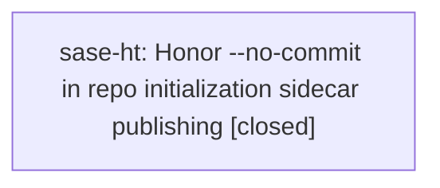

# Bead: sase-ht — Honor --no-commit in repo initialization sidecar publishing

[Bead Pages](../README.md) / sase-ht

**Status:** ✓ closed · **Resolution:** done · **Type:** ◆ task
**Owner:** `bryanbugyi34@gmail.com` · **Created by:** [bbugyi200.athena.w4](https://github.com/sase-org/sase--agents/blob/main/families/bbugyi200.athena.w4.md) · **Assignee:** `sase-ht` · **Size:** small
**Created:** 2026-08-08 17:50:47 EDT · **Closed:** 2026-08-08 18:10:21 EDT

## Description

Discovered while verifying telegram_bead_project_discovery on 2026-08-08. The help for 'sase init repo --no-commit' says it renders files in-place without committing or pushing, but running 'sase init repo --no-commit' after 'sase init repo --check' reported generated sidecar-guide drift still attempted sidecar publication and exited 1 with an error like 'failed to push initialized sidecar .../sase/repos/beads'. A prior plain 'sase init repo' in the same verification also created a local plans-sidecar commit while failing to push, so the no-commit path needs an explicit test that it never commits or pushes any SDD sidecar. Scope: make the --no-commit flag suppress all repo-init sidecar commit and push operations, preserve the render-in-place behavior, and add regression coverage for beads/plans sidecars.

## Notes

[2026-08-08T22:10:21Z · sase-ht] Implemented --no-commit/no-publish propagation for configured and materialized repo-init sidecars, including guide-file seeding and plans-to-beads adoption cleanup. Verified: just install completed; focused command-handler tests passed with conftest workaround (36 passed); sidecar init regression file passed (5 passed); direct no-publish sidecar init smoke passed; direct no-publish bead-adoption smoke passed; Ruff format/check clean for touched files; focused mypy clean for changed source files. Full just check was attempted and passed fmt/keep-sorted/Ruff, then stopped on unrelated missing XPromptWriteTarget mypy errors from active xprompt target-mode work; recorded that blocker on epic bead sase-hp.

[2026-08-08T22:11:16Z · sase-ht] Verified sidecar initialization respects --no-commit: focused handler tests passed, sidecar init regression passed, direct no-publish init/adoption smokes passed, ruff and focused mypy clean; just check attempted and blocked by unrelated missing XPromptWriteTarget imports recorded on sase-hp.

## Lineage

## Agents

| Agent | Bead | Commits |
|---|---|---:|
| [bbugyi200.athena.sase-ht](https://github.com/sase-org/sase--agents/blob/main/agents/bbugyi200.athena.sase-ht/README.md) | [sase-ht](README.md) | 1 |

## Commits

| Repo | Commit | Subject | Bead | Committed |
|---|---|---|---|---|
| sase | [`a78726f`](https://github.com/sase-org/sase/commit/a78726f2413ed6d8e7c3810825f2ce0dd09137f5) | fix: honor no-commit mode for sidecar init | [sase-ht](README.md) | 2026-08-08 18:12:22 EDT |
