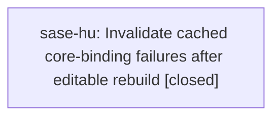

# Bead: sase-hu — Invalidate cached core-binding failures after editable rebuild

[Bead Pages](../README.md) / sase-hu

**Status:** ✓ closed · **Resolution:** done · **Type:** ◆ task
**Owner:** `bryanbugyi34@gmail.com` · **Created by:** [bbugyi200.athena.sase-h8.10.5.land](https://github.com/sase-org/sase--agents/blob/main/families/bbugyi200.athena.sase-h8.10.5.land.md) · **Assignee:** `sase-hu` · **Size:** small
**Created:** 2026-08-08 18:00:11 EDT · **Closed:** 2026-08-08 18:13:21 EDT

## Description

Reproduction on master 607b72bb0: just install successfully builds and installs editable sase-core-rs 0.21.0, but subsequent just invocations replay a partially-initialized-module import failure, rebuild the extension, and then validate successfully. The persisted .venv/.sase-test-setup-validation.json still records core-bindings code 2 after the successful rebuild. Root cause evidence: tools/validate_test_environment fingerprints extension binaries only under site-packages, while the editable sase_core_rs.pth points to the linked core checkout and the actual ABI3 shared object lives there, so rebuilding does not change the cache fingerprint or replace the cached failure. Scope: include the editable extension target in environment identity or explicitly invalidate and update the verdict after rust-install; add a regression proving the next setup does not rebuild.

## Notes

[2026-08-08T22:13:21Z · sase-hu] Implemented editable .pth extension fingerprinting in tools/validate_test_environment and added regression coverage for invalidating a cached core-bindings failure after the editable extension target changes. Verified direct validator regression script passed, ruff check/format --check passed for the touched files, git diff --check passed, just install completed, just _setup completed silently without rebuilding, and .venv/.sase-test-setup-validation.json now records core-bindings/core-version/dependency-group:dev/editable-metadata all code 0. just check was run and passed fmt, keep-sorted, and Ruff before stopping at unrelated active-epic blocker sase-hp: missing XPromptWriteTarget export causes mypy errors and pytest conftest import failures; this recurrence was noted on sase-hp.

[2026-08-08T22:14:38Z · sase-hu] Verified just install completed; direct validator regression passed; just _setup completed without rebuilding; validation cache recorded core-bindings code 0; ruff check, ruff format --check, and git diff --check passed. just check was attempted and stopped on unrelated active sase-hp XPromptWriteTarget blocker.

## References

- file:explicit:714a5e3b00cf5e01c18f9fec

## Lineage

## Agents

| Agent | Bead | Commits |
|---|---|---:|
| [bbugyi200.athena.sase-hu](https://github.com/sase-org/sase--agents/blob/main/agents/bbugyi200.athena.sase-hu/README.md) | [sase-hu](README.md) | 1 |

## Commits

| Repo | Commit | Subject | Bead | Committed |
|---|---|---|---|---|
| sase | [`71ceee7`](https://github.com/sase-org/sase/commit/71ceee7f88e5ec94b726cb68b508410dfa22cff6) | fix: track editable core binding rebuilds | [sase-hu](README.md) | 2026-08-08 18:15:43 EDT |
