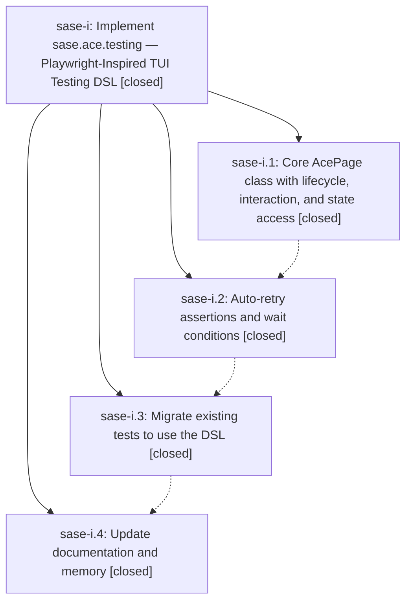

# Bead: sase-i — Implement sase.ace.testing — Playwright-Inspired TUI Testing DSL

[Bead Pages](../README.md) / sase-i

**Status:** ✓ closed · **Resolution:** (unrecorded) · **Type:** plan · **Tier:** epic
**Owner:** `bryanbugyi34@gmail.com`
**Created:** 2026-04-12 20:37:38 UTC · **Closed:** 2026-04-12 21:21:49 UTC
**Plan:** [202604/ace\_testing\_dsl.md](https://github.com/sase-org/sase--plans/blob/main/202604/ace_testing_dsl.md)

## Phases

| Bead | Title | Status | Size | Agents | Commits |
|---|---|---|---|---:|---:|
| [sase-i.1](sase-i.1.md) | Core AcePage class with lifecycle, interaction, and state access | ✓ closed | small | 0 | 0 |
| [sase-i.2](sase-i.2.md) | Auto-retry assertions and wait conditions | ✓ closed | small | 0 | 1 |
| [sase-i.3](sase-i.3.md) | Migrate existing tests to use the DSL | ✓ closed | small | 0 | 1 |
| [sase-i.4](sase-i.4.md) | Update documentation and memory | ✓ closed | small | 0 | 1 |

## Lineage

## Commits

| Commit | Subject | Bead | Committed (UTC) |
|---|---|---|---|
| [`d5d68d3`](https://github.com/sase-org/sase/commit/d5d68d3392d77a147cdfd6b98ee5669708877a0e) | feat: Add auto-retry assertions and wait conditions to AcePage testing DSL (sase-i.2) | [sase-i.2](sase-i.2.md) | 2026-04-12 21:01:33 |
| [`3db8722`](https://github.com/sase-org/sase/commit/3db8722b03caac2f11b9e7e2089fe55293a5ae22) | feat: Migrate existing ace TUI tests to use AcePage testing DSL (sase-i.3) | [sase-i.3](sase-i.3.md) | 2026-04-12 21:11:06 |
| [`f0aa9d1`](https://github.com/sase-org/sase/commit/f0aa9d1b21a33ebfd7d927fa8c09069031d7180c) | chore: Update e2e testing docs with AcePage DSL examples (sase-i.4) | [sase-i.4](sase-i.4.md) | 2026-04-12 21:16:19 |
