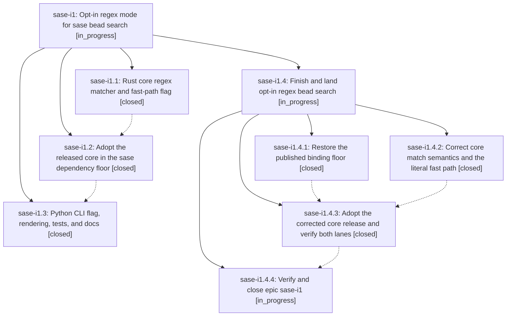

# Bead: sase-i1 — Opt-in regex mode for sase bead search

[Bead Pages](../README.md) / sase-i1

**Status:** ◐ in_progress · **Type:** ▸ plan · **Tier:** epic
**Owner:** `bryanbugyi34@gmail.com` · **Created by:** [bbugyi200.athena.w8](https://github.com/sase-org/sase--agents/blob/main/agents/bbugyi200.athena.w8/README.md) · **Assignee:** `sase-i1.land`
**Created:** 2026-08-09 07:40:29 EDT
**Plan:** [202608/bead\_search\_regex.md](https://github.com/sase-org/sase--plans/blob/main/202608/bead_search_regex.md)

## Description

`sase bead search -e/--regex <pattern>` matches beads with a regular expression on both the Rust fast path and the Python fallback, while the default literal search keeps its current substring semantics and compiles no regex at all.

## Notes

[2026-08-09T13:03:49Z · sase-i1.land] LANDING VERIFICATION (blocked; corrective epic plan validated). Reviewed sase-i1 plus every child and all notes/history, the linked plan, core commit 721f20d7710db7a53d622d1527d5be5d255c68b7, main commit a3a536a033daebf647439bde081d7e609a8dc99e, current source, and all seven non-epic main commits that landed after the epic began. The unrelated commits do not overlap bead search; fcc9be44f correctly keeps distinctive-term task searches literal. Core release commit c416cd0b7db4fbf61be4523f3c9ecbe037361a9b and v0.21.2 are now published, and the released wheel accepts regex=False/True, but pyproject.toml and uv.lock still allow/resolve 0.21.1. A normal uv dependency sync therefore replaces the local source build with 0.21.1 and 14 focused CLI/facade tests fail because bead_search rejects the regex keyword. Core focused tests pass (64 search tests and 2 PyO3 bead_search tests), but inspection and direct CLI reproduction found that SearchMatcher truth is derived from non-empty highlight ranges: literal search builds offset tables for every field instead of using the required cheap contains path, and valid zero-width regexes such as word-boundary match no beads. The Rust tests explicitly pin that incorrect result. Invalid patterns also differ by lane: compact/JSON say invalid regex while full says invalid search regex. Follow-up outcomes: sase-i1.1 commit-resume publication failure is already attached with this proposing bead named to causal active epic sase-hn.8; sase-i1.2 release/floor proposal is epic work and will be completed, not filed; sase-i1.3 VCS-tag flakes are already tracked by sase-hk/sase-cw and active epic sase-h8, and the plan-approval flake is already corroborated on sase-ct. Its baseline-only observation is not another independent test failure, so no duplicate +1 was added. The original plan required the pre-existing compact-snippet parity gap to be tracked separately; created ready medium task sase-i4 after reproducing it. Remaining epic work is captured in validated epic plan sase_plan_bead_search_regex_landing.md; its final phase closes sase-i1 without force, runs post-close Symvision, and marks the linked plan done.

[2026-08-09T13:04:32Z · sase-i1.land] LANDING VERIFICATION: blocked after full child-note, source, commit, release, and post-start integration audit. Normal dependency sync still installs allowed core 0.21.1 and 14 focused Python CLI/facade tests fail on the new regex keyword. Core 0.21.2 focused tests pass but pin three plan violations found in source and direct reproduction: literal truth builds highlight offsets instead of using the cheap contains path, zero-width regexes match no beads, and invalid-pattern text differs between fast and fallback lanes. Release/floor work remains epic work. Follow-ups: commit resume already attached to active epic sase-hn.8; VCS flakes already tracked by sase-hk, sase-cw, and sase-h8; plan-approval flake already on sase-ct; baseline-only observation declined as non-independent evidence; pre-existing snippet parity filed as ready medium task sase-i4. Remaining work and mandatory close, Symvision, and plan-done finalizer are in validated epic plan sase_plan_bead_search_regex_landing.md.

## Phases

| Bead | Title | Status | Size | Created | Agents | Commits |
|---|---|---|---|---|---:|---:|
| [sase-i1.1](sase-i1.1.md) | Rust core regex matcher and fast-path flag | ✓ closed | medium | 2026-08-09 | 1 | 1 |
| [sase-i1.2](sase-i1.2.md) | Adopt the released core in the sase dependency floor | ✓ closed | small | 2026-08-09 | 1 | 0 |
| [sase-i1.3](sase-i1.3.md) | Python CLI flag, rendering, tests, and docs | ✓ closed | medium | 2026-08-09 | 1 | 1 |

## Lineage

## Agents

| Agent | Bead | Commits |
|---|---|---:|
| [bbugyi200.athena.sase-i1.1](https://github.com/sase-org/sase--agents/blob/main/agents/bbugyi200.athena.sase-i1.1/README.md) | [sase-i1.1](sase-i1.1.md) | 1 |
| [bbugyi200.athena.sase-i1.2](https://github.com/sase-org/sase--agents/blob/main/agents/bbugyi200.athena.sase-i1.2/README.md) | [sase-i1.2](sase-i1.2.md) | 0 |
| [bbugyi200.athena.sase-i1.3](https://github.com/sase-org/sase--agents/blob/main/agents/bbugyi200.athena.sase-i1.3/README.md) | [sase-i1.3](sase-i1.3.md) | 1 |
| [bbugyi200.athena.sase-i1.4.1](https://github.com/sase-org/sase--agents/blob/main/agents/bbugyi200.athena.sase-i1.4.1/README.md) | [sase-i1.4.1](sase-i1.4.1.md) | 0 |
| [bbugyi200.athena.sase-i1.4.2](https://github.com/sase-org/sase--agents/blob/main/agents/bbugyi200.athena.sase-i1.4.2/README.md) | [sase-i1.4.2](sase-i1.4.2.md) | 1 |
| [bbugyi200.athena.sase-i1.4.3](https://github.com/sase-org/sase--agents/blob/main/agents/bbugyi200.athena.sase-i1.4.3/README.md) | [sase-i1.4.3](sase-i1.4.3.md) | 1 |
| [bbugyi200.athena.sase-i1.4.4](https://github.com/sase-org/sase--agents/blob/main/agents/bbugyi200.athena.sase-i1.4.4/README.md) | [sase-i1.4.4](sase-i1.4.4.md) | 0 |
| [bbugyi200.athena.sase-i1.4.land](https://github.com/sase-org/sase--agents/blob/main/agents/bbugyi200.athena.sase-i1.4.land/README.md) | [sase-i1.4](sase-i1.4.md) | 0 |
| [bbugyi200.athena.sase-i1.land](https://github.com/sase-org/sase--agents/blob/main/agents/bbugyi200.athena.sase-i1.land/README.md) | [sase-i1](README.md) | 0 |

## Commits

| Repo | Commit | Subject | Bead | Committed |
|---|---|---|---|---|
| sase-core | [`sase-core@721f20d`](https://github.com/sase-org/sase-core/commit/721f20d7710db7a53d622d1527d5be5d255c68b7) | feat(bead): add regex search support | [sase-i1.1](sase-i1.1.md) | 2026-08-09 08:08:48 EDT |
| sase | [`a3a536a`](https://github.com/sase-org/sase/commit/a3a536a033daebf647439bde081d7e609a8dc99e) | feat(bead): add regex mode to bead search | [sase-i1.3](sase-i1.3.md) | 2026-08-09 08:46:44 EDT |
| sase-core | [`sase-core@49650a0`](https://github.com/sase-org/sase-core/commit/49650a074294d9175b9a36f30ee891841ef032cb) | fix(bead): correct regex search match semantics | [sase-i1.4.2](sase-i1.4.2.md) | 2026-08-09 09:14:48 EDT |
| sase | [`d7e9ae8`](https://github.com/sase-org/sase/commit/d7e9ae8ae5ebcc9b55d68bfa8cc739c4a550a977) | fix(search): require corrected core matcher release | [sase-i1.4.3](sase-i1.4.3.md) | 2026-08-09 10:16:12 EDT |
