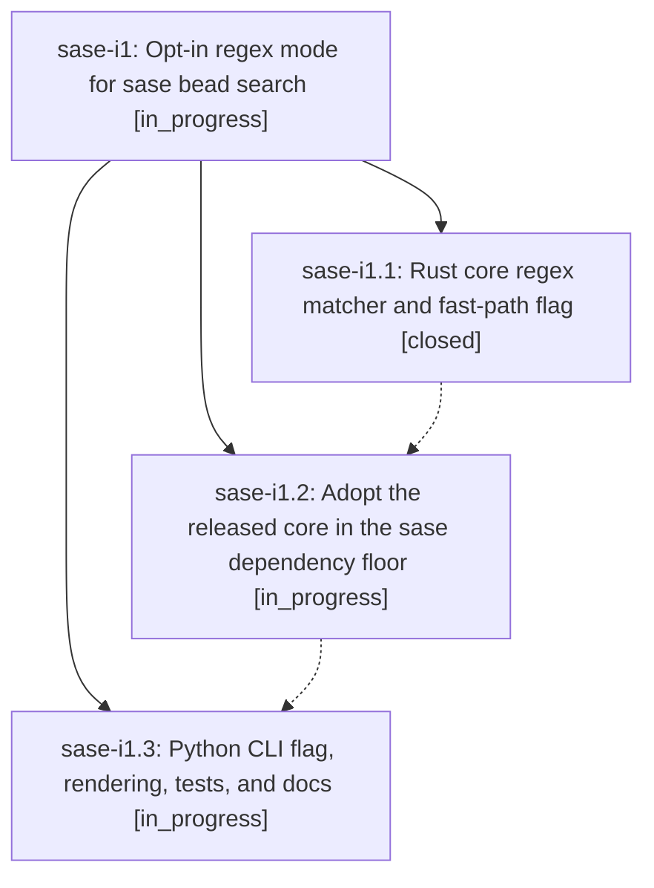

# Bead: sase-i1 — Opt-in regex mode for sase bead search

[Bead Pages](../README.md) / sase-i1

**Status:** ◐ in_progress · **Type:** ▸ plan · **Tier:** epic
**Owner:** `bryanbugyi34@gmail.com` · **Created by:** [bbugyi200.athena.w8](https://github.com/sase-org/sase--agents/blob/main/agents/bbugyi200.athena.w8/README.md) · **Assignee:** `sase-i1.land`
**Created:** 2026-08-09 07:40:29 EDT
**Plan:** [202608/bead\_search\_regex.md](https://github.com/sase-org/sase--plans/blob/main/202608/bead_search_regex.md)

## Description

`sase bead search -e/--regex <pattern>` matches beads with a regular expression on both the Rust fast path and the Python fallback, while the default literal search keeps its current substring semantics and compiles no regex at all.

## Phases

| Bead | Title | Status | Size | Created | Agents | Commits |
|---|---|---|---|---|---:|---:|
| [sase-i1.1](sase-i1.1.md) | Rust core regex matcher and fast-path flag | ✓ closed | medium | 2026-08-09 | 1 | 1 |
| [sase-i1.2](sase-i1.2.md) | Adopt the released core in the sase dependency floor | ◐ in_progress | small | 2026-08-09 | 1 | 0 |
| [sase-i1.3](sase-i1.3.md) | Python CLI flag, rendering, tests, and docs | ◐ in_progress | medium | 2026-08-09 | 1 | 0 |

## Lineage

## Agents

| Agent | Bead | Commits |
|---|---|---:|
| [bbugyi200.athena.sase-i1.1](https://github.com/sase-org/sase--agents/blob/main/agents/bbugyi200.athena.sase-i1.1/README.md) | [sase-i1.1](sase-i1.1.md) | 1 |
| [bbugyi200.athena.sase-i1.2](https://github.com/sase-org/sase--agents/blob/main/agents/bbugyi200.athena.sase-i1.2/README.md) | [sase-i1.2](sase-i1.2.md) | 0 |
| [bbugyi200.athena.sase-i1.3](https://github.com/sase-org/sase--agents/blob/main/agents/bbugyi200.athena.sase-i1.3/README.md) | [sase-i1.3](sase-i1.3.md) | 0 |
| [bbugyi200.athena.sase-i1.land](https://github.com/sase-org/sase--agents/blob/main/agents/bbugyi200.athena.sase-i1.land/README.md) | [sase-i1](README.md) | 0 |

## Commits

| Repo | Commit | Subject | Bead | Committed |
|---|---|---|---|---|
| sase-core | [`sase-core@721f20d`](https://github.com/sase-org/sase-core/commit/721f20d7710db7a53d622d1527d5be5d255c68b7) | feat(bead): add regex search support | [sase-i1.1](sase-i1.1.md) | 2026-08-09 08:08:48 EDT |
