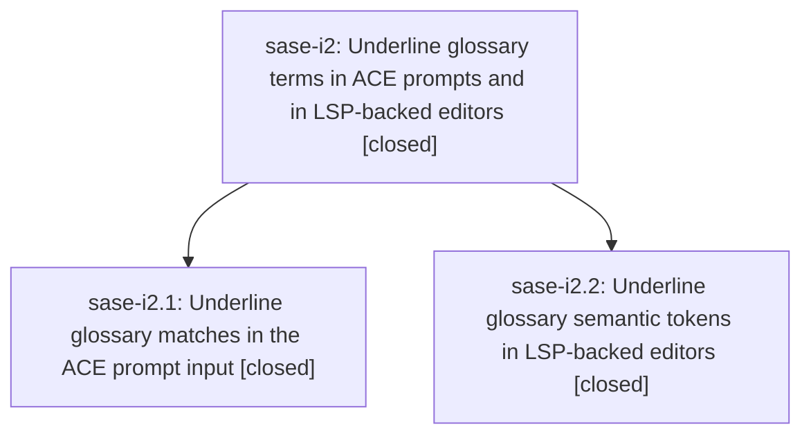

# Bead: sase-i2 — Underline glossary terms in ACE prompts and in LSP-backed editors

[Bead Pages](../README.md) / sase-i2

**Status:** ✓ closed · **Resolution:** done · **Type:** ▸ plan · **Tier:** epic
**Owner:** `bryanbugyi34@gmail.com` · **Created by:** [bbugyi200.athena.w9](https://github.com/sase-org/sase--agents/blob/main/agents/bbugyi200.athena.w9/README.md) · **Assignee:** `sase-i2.land`
**Created:** 2026-08-09 07:49:40 EDT · **Closed:** 2026-08-09 08:59:35 EDT
**Plan:** [202608/glossary\_term\_underline.md](https://github.com/sase-org/sase--plans/blob/main/202608/glossary_term_underline.md)

## Description

A matched project glossary term reads as a definable link everywhere SASE renders prompt text: bold, theme-accent, and underlined in the ACE prompt input, and underlined on top of the colorscheme's semantic-token color in Neovim, without weakening the red misspelling underline it sits next to.

## Notes

[2026-08-09T12:59:35Z · sase-i2.land] LAND VERIFICATION complete for sase-i2. Reviewed the epic (no epic-level notes), linked plan plans:202608/glossary_term_underline.md, both closed child beads, every child note, and the actual commits/source. Verified sase-i2.1 in c2c8e883d: glossary.term remains theme-accent and bold with underline=True; inline code/delimiter styles explicitly clear underline; the visual fake skips literal zones; overlap/code-chip/widget regressions, docs, and dark/light PNG goldens are present. Inspected both goldens: Agent Clan/Patch are underlined and the inline-code Agent Clan chip is not. Verified sase-i2.2 in sase commit a787f36fa plus sase-nvim commit 13ae8e503: SaseGlossaryTerm is an overridable underline-only group; LspTokenUpdate filters to type tokens from sase-xprompt-lsp and preserves colorscheme color; setup, headless coverage, plugin README, and sase editor/xprompt docs are present. Reverification: sase-nvim glossary_highlight and alt_highlight headless tests passed; 24 focused ACE glossary/codeblock widget tests passed; 2 focused glossary PNG tests passed; full visual suite passed 571 with 1 skipped. just check-full passed every format/lint/Symvision/SASE/plan gate and 27,921 tests, with only two unrelated known full-parallel VCS-tag selector flakes; both passed immediately together in isolation (2 passed in 0.95s) and no glossary test failed. Integration review covered non-epic commits since the first epic commit: f35fa9548 (BY_DATE anchors), 7c7de9c9f (config schema compatibility), and later base commit a3a536a03 (bead-search regex); no overlap, duplication, conflict, or adoption need was found, and HEAD equals origin/master. Follow-ups: sase-i2.2's plan-approval flake was corroborated as the existing sase-ct class (+1) and recorded on active epic sase-h8; the later two VCS-tag recurrences were added as supplementary evidence there. sase-i2.1's stale dismissed-bundle index proposal and sase-i2.2's post-primary resume failure are one root cause, independently echoed by sase-i1.1: Patch phase sase-hn.8.2 commit 50f8961ac renamed the persisted column to meta_patch without bumping SCHEMA_VERSION=1. Reproduced a legacy-v1 index failure (OperationalError: no such column: meta_patch) and routed the issue to causally responsible active epic sase-hn.8; no duplicate task was created. No proposal was declined, and no remaining issue is caused by sase-i2.

[2026-08-09T13:01:28Z · sase-i2.land] Verified both child phases and all notes against their commits, source, documentation, tests, and visual goldens; reviewed all non-epic commits since the epic began and found no glossary integration conflicts or duplication. Routed the plan-approval flake to existing task sase-ct and active flake epic sase-h8; routed the two related dismissed-index publication reports to causally responsible active epic sase-hn.8. Visual verification passed 571 tests with 1 skip; just check-full passed all static and validation gates plus 27,921 tests, with only two known unrelated parallel VCS-selector flakes that passed in isolation; post-close Symvision was clean.

## Phases

| Bead | Title | Status | Size | Created | Agents | Commits |
|---|---|---|---|---|---:|---:|
| [sase-i2.1](sase-i2.1.md) | Underline glossary matches in the ACE prompt input | ✓ closed | medium | 2026-08-09 | 1 | 1 |
| [sase-i2.2](sase-i2.2.md) | Underline glossary semantic tokens in LSP-backed editors | ✓ closed | medium | 2026-08-09 | 1 | 2 |

## Lineage

## Agents

| Agent | Bead | Commits |
|---|---|---:|
| [bbugyi200.athena.sase-i2.1](https://github.com/sase-org/sase--agents/blob/main/agents/bbugyi200.athena.sase-i2.1/README.md) | [sase-i2.1](sase-i2.1.md) | 1 |
| [bbugyi200.athena.sase-i2.2](https://github.com/sase-org/sase--agents/blob/main/agents/bbugyi200.athena.sase-i2.2/README.md) | [sase-i2.2](sase-i2.2.md) | 2 |
| [bbugyi200.athena.sase-i2.land](https://github.com/sase-org/sase--agents/blob/main/agents/bbugyi200.athena.sase-i2.land/README.md) | [sase-i2](README.md) | 1 |

## Commits

| Repo | Commit | Subject | Bead | Committed |
|---|---|---|---|---|
| sase | [`a787f36`](https://github.com/sase-org/sase/commit/a787f36fa5024267cfafb75381ef89a3d574b810) | docs(editor): document glossary semantic token styling | [sase-i2.2](sase-i2.2.md) | 2026-08-09 08:18:32 EDT |
| sase-nvim | [`sase-nvim@13ae8e5`](https://github.com/sase-org/sase-nvim/commit/13ae8e5036d9f76fc5c687c7c6fe77a120cdcf2b) | feat: underline glossary semantic tokens | [sase-i2.2](sase-i2.2.md) | 2026-08-09 08:21:22 EDT |
| sase | [`c2c8e88`](https://github.com/sase-org/sase/commit/c2c8e883d21188af90675ceae3631a16a64eaae5) | feat(ace): underline glossary terms in prompt | [sase-i2.1](sase-i2.1.md) | 2026-08-09 08:28:23 EDT |
| sase--plans | [`sase--plans@2e6cd68`](https://github.com/sase-org/sase--plans/commit/2e6cd68a09cb7929636a223cd06d8c5e0d113b9a) | docs(plan): mark glossary underline epic done | [sase-i2](README.md) | 2026-08-09 09:03:35 EDT |
