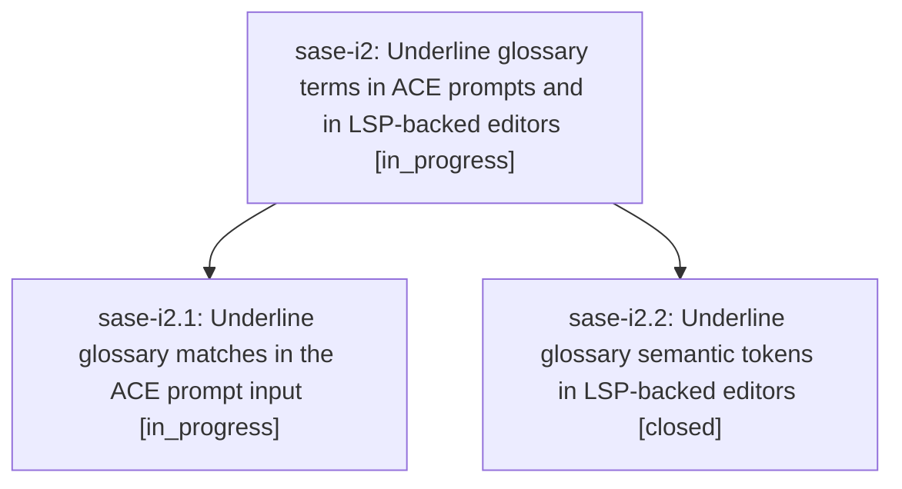

# Bead: sase-i2 — Underline glossary terms in ACE prompts and in LSP-backed editors

[Bead Pages](../README.md) / sase-i2

**Status:** ◐ in_progress · **Type:** ▸ plan · **Tier:** epic
**Owner:** `bryanbugyi34@gmail.com` · **Created by:** [bbugyi200.athena.w9](https://github.com/sase-org/sase--agents/blob/main/agents/bbugyi200.athena.w9/README.md) · **Assignee:** `sase-i2.land`
**Created:** 2026-08-09 07:49:40 EDT
**Plan:** [202608/glossary\_term\_underline.md](https://github.com/sase-org/sase--plans/blob/main/202608/glossary_term_underline.md)

## Description

A matched project glossary term reads as a definable link everywhere SASE renders prompt text: bold, theme-accent, and underlined in the ACE prompt input, and underlined on top of the colorscheme's semantic-token color in Neovim, without weakening the red misspelling underline it sits next to.

## Phases

| Bead | Title | Status | Size | Created | Agents | Commits |
|---|---|---|---|---|---:|---:|
| [sase-i2.1](sase-i2.1.md) | Underline glossary matches in the ACE prompt input | ◐ in_progress | medium | 2026-08-09 | 1 | 0 |
| [sase-i2.2](sase-i2.2.md) | Underline glossary semantic tokens in LSP-backed editors | ✓ closed | medium | 2026-08-09 | 1 | 1 |

## Lineage

## Agents

| Agent | Bead | Commits |
|---|---|---:|
| [bbugyi200.athena.sase-i2.1](https://github.com/sase-org/sase--agents/blob/main/agents/bbugyi200.athena.sase-i2.1/README.md) | [sase-i2.1](sase-i2.1.md) | 0 |
| [bbugyi200.athena.sase-i2.2](https://github.com/sase-org/sase--agents/blob/main/agents/bbugyi200.athena.sase-i2.2/README.md) | [sase-i2.2](sase-i2.2.md) | 1 |
| [bbugyi200.athena.sase-i2.land](https://github.com/sase-org/sase--agents/blob/main/agents/bbugyi200.athena.sase-i2.land/README.md) | [sase-i2](README.md) | 0 |

## Commits

| Repo | Commit | Subject | Bead | Committed |
|---|---|---|---|---|
| sase | [`a787f36`](https://github.com/sase-org/sase/commit/a787f36fa5024267cfafb75381ef89a3d574b810) | docs(editor): document glossary semantic token styling | [sase-i2.2](sase-i2.2.md) | 2026-08-09 08:18:32 EDT |
