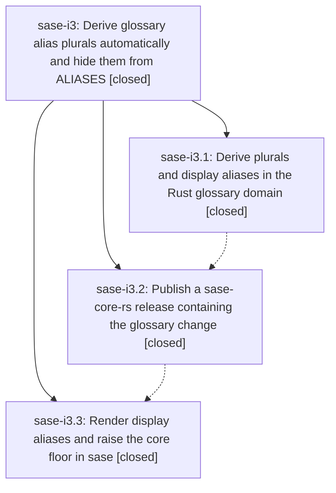

# Bead: sase-i3 — Derive glossary alias plurals automatically and hide them from ALIASES

[Bead Pages](../README.md) / sase-i3

**Status:** ✓ closed · **Resolution:** done · **Type:** ▸ plan · **Tier:** epic
**Owner:** `bryanbugyi34@gmail.com` · **Created by:** [bbugyi200.athena.wa.f0](https://github.com/sase-org/sase--agents/blob/main/agents/bbugyi200.athena.wa.f0/README.md) · **Assignee:** `sase-i3.land`
**Created:** 2026-08-09 08:17:20 EDT · **Closed:** 2026-08-09 09:41:03 EDT
**Plan:** [202608/glossary\_alias\_plurals.md](https://github.com/sase-org/sase--plans/blob/main/202608/glossary_alias_plurals.md)

## Description

Glossary matching recognizes the plural form of every term and alias without it being configured, while the generated `ALIASES:` line lists only aliases the system cannot derive on its own and disappears entirely when nothing is left to list.

## Notes

[2026-08-09T13:34:48Z · sase-i3.land] LANDING VERIFICATION (not closing yet). Reviewed the epic, linked plan, every child, and every child note. Verified core commit 5c555dc, release commit c416cd0/tag v0.21.2, sase commit b73609337, and the current Rust/Python/LSP/memory source. The implementation separates configured/display/effective aliases, derives conservative plurals for matching, keeps validation authored-only, preserves glossary schema v1 compatibility, renders only display_aliases, and leaves editor hover/ACE preview on configured aliases. Generated output matches the approved table exactly: five shortened ALIASES lines remain and title-case Aliases is absent. A clean Python 3.12 environment installed sase-core-rs==0.21.2 from PyPI and proved Widget Box derives/matches Widget Boxes with display_aliases empty. cargo test --workspace glossary passed the relevant 10 core, 3 LSP, and 1 config test; 27 focused sase tests passed; sase memory init --check passed. Audited every non-epic commit since creation: glossary underlining, LSP styling docs, Glossary of Terms title, bead regex, new-task guidance, schema compatibility, BY_DATE, and later release metadata all compose in the final tree, so no main-repo integration edit remains. UNRESOLVED EPIC DEFECT: phase sase-i3.2 claimed the v0.21.2 changelog covered the glossary feature, but both actual v0.21.2 changelogs list only bead regex search. The tag ships the glossary code, so publication is correct; the missing release note still violates the phase requirement. FOLLOW-UP OUTCOME: sase-i3.3 proposed filing three selection-health flakes. The two VCS-tag nodes are already owned by sase-hk/sase-cw and active flake epic sase-h8; the plan-approval node is already corroborated on sase-ct/sase-h8. The proposing phase observed baseline output, not an independent test failure, and current selection-health dynamically classifies/suppresses all three. Declined a redundant task and +1 as duplicate, non-independent evidence. Remaining changelog correction plus normal close, post-close Symvision, and linked-plan status done are captured in validated tale plan sase_plan_glossary_alias_plurals_landing.md.

[2026-08-09T13:41:03Z · sase-i3.land] Reviewed epic sase-i3, all three child phase beads, and all child notes before close. Confirmed core commit 5c555dc is included in v0.21.2 and prior notes verified the published 0.21.2 wheel deriving Widget Boxes with display_aliases empty; prior landing audit verified Rust/Python/LSP/memory behavior, the exact generated alias table, and post-start integration with underline docs, Glossary of Terms title, bead search, new-task guidance, schema compatibility, BY_DATE, and release metadata. Corrected the remaining phase-2 release documentation defect by adding "- *(glossary)* derive plural aliases for matching" under the existing 0.21.2 Added section in both crates/sase_core/CHANGELOG.md and crates/sase_core_py/CHANGELOG.md, without retagging, bumping, or publishing. Verified in sase-core: cargo fmt --check passed and cargo test --workspace glossary passed with 10 core glossary tests, 1 config glossary test, and 3 LSP glossary tests. Verified in sase: just install passed; focused glossary pytest initially exposed one stale direct GlossaryEntry test fixture missing display_aliases, repaired that fixture, and rerun passed 31 tests; dependency floor remains sase-core-rs>=0.21.2,<0.22.0; generated root instruction files retain exactly the five expected ALIASES lines and no title-case Aliases lines. PATH="$PWD/.venv/bin:$PATH" sase memory init --check was rerun and reported unrelated home generated instruction drift only: renumbering two headings in ~/.local/share/chezmoi/home provider shims, not caused by this glossary work, so no memory files were regenerated or edited. just selection-health passed and lists the two VCS-tag selector nodes plus the plan-approval node from the sole sase-i3.3 PROPOSED FOLLOW-UP under flake-suppressed; declined creating a task or +1 because this is duplicate, non-independent evidence already owned by sase-hk, sase-cw, sase-ct, and active flake epic sase-h8.

## Phases

| Bead | Title | Status | Size | Created | Agents | Commits |
|---|---|---|---|---|---:|---:|
| [sase-i3.1](sase-i3.1.md) | Derive plurals and display aliases in the Rust glossary domain | ✓ closed | medium | 2026-08-09 | 1 | 1 |
| [sase-i3.2](sase-i3.2.md) | Publish a sase-core-rs release containing the glossary change | ✓ closed | small | 2026-08-09 | 1 | 0 |
| [sase-i3.3](sase-i3.3.md) | Render display aliases and raise the core floor in sase | ✓ closed | medium | 2026-08-09 | 1 | 1 |

## Lineage

## Agents

| Agent | Bead | Commits |
|---|---|---:|
| [bbugyi200.athena.sase-i3.1](https://github.com/sase-org/sase--agents/blob/main/agents/bbugyi200.athena.sase-i3.1/README.md) | [sase-i3.1](sase-i3.1.md) | 1 |
| [bbugyi200.athena.sase-i3.2](https://github.com/sase-org/sase--agents/blob/main/agents/bbugyi200.athena.sase-i3.2/README.md) | [sase-i3.2](sase-i3.2.md) | 0 |
| [bbugyi200.athena.sase-i3.3](https://github.com/sase-org/sase--agents/blob/main/agents/bbugyi200.athena.sase-i3.3/README.md) | [sase-i3.3](sase-i3.3.md) | 1 |
| [bbugyi200.athena.sase-i3.land](https://github.com/sase-org/sase--agents/blob/main/families/bbugyi200.athena.sase-i3.land.md) | [sase-i3](README.md) | 3 |

## Commits

| Repo | Commit | Subject | Bead | Committed |
|---|---|---|---|---|
| sase-core | [`sase-core@5c555dc`](https://github.com/sase-org/sase-core/commit/5c555dcda69367e31b64edc57d487f0b4a464b5c) | feat(glossary): derive plural aliases for matching | [sase-i3.1](sase-i3.1.md) | 2026-08-09 08:31:38 EDT |
| sase | [`b736093`](https://github.com/sase-org/sase/commit/b73609337d9bd1e7be6184bd4cd97f16cb342683) | feat(glossary): render core display aliases | [sase-i3.3](sase-i3.3.md) | 2026-08-09 09:20:30 EDT |
| sase-core | [`sase-core@a717c60`](https://github.com/sase-org/sase-core/commit/a717c6087982ac0dd2ca27af686740b958ed1e41) | docs(glossary): document plural alias release note | [sase-i3](README.md) | 2026-08-09 09:46:21 EDT |
| sase | [`a764618`](https://github.com/sase-org/sase/commit/a76461812e1fdf1a6661dbb790bd8fc54ed95300) | test(glossary): include display aliases in prompt fixture | [sase-i3](README.md) | 2026-08-09 09:50:01 EDT |
| sase--plans | [`sase--plans@8aaeb59`](https://github.com/sase-org/sase--plans/commit/8aaeb593e283543a7a92eb804a02c32f183e3b0c) | docs(plan): mark glossary alias plural plan done | [sase-i3](README.md) | 2026-08-09 09:51:34 EDT |
