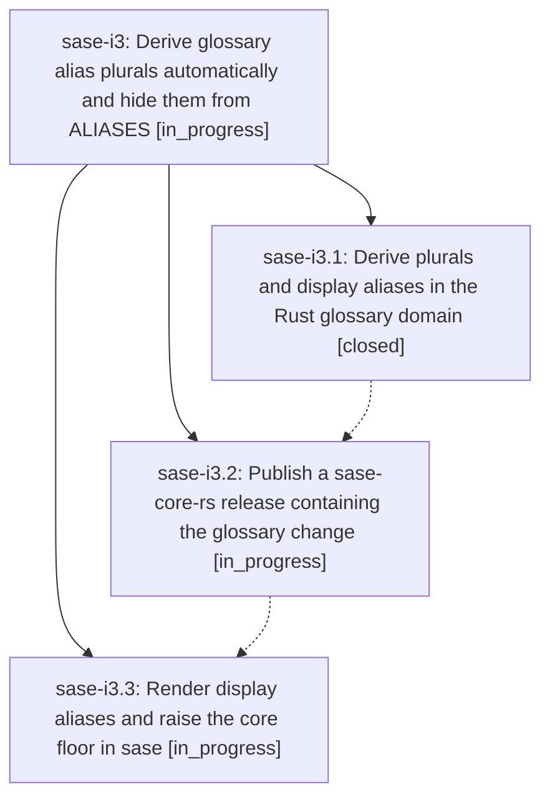

# Bead: sase-i3 — Derive glossary alias plurals automatically and hide them from ALIASES

[Bead Pages](../README.md) / sase-i3

**Status:** ◐ in_progress · **Type:** ▸ plan · **Tier:** epic
**Owner:** `bryanbugyi34@gmail.com` · **Created by:** [bbugyi200.athena.wa.f0](https://github.com/sase-org/sase--agents/blob/main/agents/bbugyi200.athena.wa.f0/README.md) · **Assignee:** `sase-i3.land`
**Created:** 2026-08-09 08:17:20 EDT
**Plan:** [202608/glossary\_alias\_plurals.md](https://github.com/sase-org/sase--plans/blob/main/202608/glossary_alias_plurals.md)

## Description

Glossary matching recognizes the plural form of every term and alias without it being configured, while the generated `ALIASES:` line lists only aliases the system cannot derive on its own and disappears entirely when nothing is left to list.

## Phases

| Bead | Title | Status | Size | Created | Agents | Commits |
|---|---|---|---|---|---:|---:|
| [sase-i3.1](sase-i3.1.md) | Derive plurals and display aliases in the Rust glossary domain | ✓ closed | medium | 2026-08-09 | 1 | 1 |
| [sase-i3.2](sase-i3.2.md) | Publish a sase-core-rs release containing the glossary change | ◐ in_progress | small | 2026-08-09 | 1 | 0 |
| [sase-i3.3](sase-i3.3.md) | Render display aliases and raise the core floor in sase | ◐ in_progress | medium | 2026-08-09 | 1 | 0 |

## Lineage

## Agents

| Agent | Bead | Commits |
|---|---|---:|
| [bbugyi200.athena.sase-i3.1](https://github.com/sase-org/sase--agents/blob/main/agents/bbugyi200.athena.sase-i3.1/README.md) | [sase-i3.1](sase-i3.1.md) | 1 |
| [bbugyi200.athena.sase-i3.2](https://github.com/sase-org/sase--agents/blob/main/agents/bbugyi200.athena.sase-i3.2/README.md) | [sase-i3.2](sase-i3.2.md) | 0 |
| [bbugyi200.athena.sase-i3.3](https://github.com/sase-org/sase--agents/blob/main/agents/bbugyi200.athena.sase-i3.3/README.md) | [sase-i3.3](sase-i3.3.md) | 0 |
| [bbugyi200.athena.sase-i3.land](https://github.com/sase-org/sase--agents/blob/main/agents/bbugyi200.athena.sase-i3.land/README.md) | [sase-i3](README.md) | 0 |

## Commits

| Repo | Commit | Subject | Bead | Committed |
|---|---|---|---|---|
| sase-core | [`sase-core@5c555dc`](https://github.com/sase-org/sase-core/commit/5c555dcda69367e31b64edc57d487f0b4a464b5c) | feat(glossary): derive plural aliases for matching | [sase-i3.1](sase-i3.1.md) | 2026-08-09 08:31:38 EDT |
