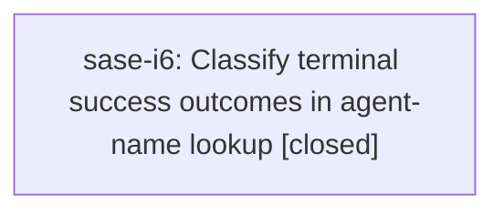

# Bead: sase-i6 — Classify terminal success outcomes in agent-name lookup

[Bead Pages](../README.md) / sase-i6

**Status:** ✓ closed · **Resolution:** done · **Type:** ◆ task
**Owner:** `bryanbugyi34@gmail.com` · **Created by:** [bbugyi200.athena.wi](https://github.com/sase-org/sase--agents/blob/main/families/bbugyi200.athena.wi.md) · **Assignee:** `sase-i6` · **Size:** small
**Created:** 2026-08-09 09:30:55 EDT · **Closed:** 2026-08-10 09:42:45 EDT

## Description

Approved wait-resolution plan 202608/wait_resolution_terminal_outcomes.md intentionally left src/sase/agent/names/_lookup_artifacts.py out of scope. That module still defines SUCCESS_OUTCOME = "completed", and lookup grouping/resolution call sites compare agent/clan/family members against that single value. Live done.json writers can emit successful terminal outcomes "noop", "epic_approved", and "plan_committed" as well as "completed". Impact: sase agent names and chat-from-name lookup can treat those finished successful agents as incomplete or omit them, even after wait resolution is fixed. Scope: introduce/use the shared done-outcome classification for agent-name lookup, keep plan_rejected semantics intentional for lookup callers, and add focused tests for noop, epic_approved, and plan_committed.

## Notes

[2026-08-10T13:10:51Z · ww] TRIAGE VERIFICATION 2026-08-10 (master 354d8c19f): STILL REPRODUCES. src/sase/agent/names/_lookup_artifacts.py:12 still defines SUCCESS_OUTCOME = "completed" as the single success value, so lookup grouping/resolution still misclassifies agents that finished with noop, epic_approved, or plan_committed. Kept as a top-seven task in the 2026-08-10 backlog triage.

[2026-08-10T13:42:45Z · sase-i6] Introduced is_success_outcome() in _lookup_artifacts.py using the shared sase.core.dismissed_agent_completion.WAIT_SUCCESS_OUTCOMES classification (completed/noop/epic_approved/plan_committed), and swapped it in for all SUCCESS_OUTCOME equality comparisons in _lookup_groups.py (AgentClan.is_complete, is_agent_family_complete, most_recent_completed_family_member), _lookup_resolution.py (resolve_resume_agent_name, resolve_wait_dependency), and agent_chat_from_name.py (_resolve_fork_source, _resolve_family_member_transcript). plan_rejected remains excluded, matching wait-resolution semantics. Added parametrized tests in tests/test_agent_names_lookup.py covering family/clan/bare-name success classification for noop, epic_approved, and plan_committed, plus a plan_rejected-stays-excluded regression. Verified: just install, just lint (ruff+mypy+symvision, exit 0), and targeted pytest runs — all 28 tests in test_agent_names_lookup.py pass, plus every test touching the changed files (test_agent_group_revival_e2e.py, test_family_member_relaunch.py, test_prompt_bar_xprompt_selector_requests.py, test_prompt_glossary_navigation.py, test_vcs_provider_vcs_log.py) pass with the change applied. Full just check ran 28324 tests with 10 failures; confirmed by stashing the diff and rerunning that all 10 (test_contract_manifest.py stale-manifest x2, test_run_pytest_main.py health-plugin ordering, and 7 others) reproduce identically on unmodified master, so none are caused by this change.

## Lineage

## Agents

| Agent | Bead | Commits |
|---|---|---:|
| [bbugyi200.athena.sase-i6](https://github.com/sase-org/sase--agents/blob/main/agents/bbugyi200.athena.sase-i6/README.md) | [sase-i6](README.md) | 1 |

## Commits

| Repo | Commit | Subject | Bead | Committed |
|---|---|---|---|---|
| sase | [`31ff3a3`](https://github.com/sase-org/sase/commit/31ff3a3ff8b65e3a17f5971690d9c97e9c20f2fa) | fix(agent-names): classify wait-success outcomes in lookup | [sase-i6](README.md) | 2026-08-10 09:43:48 EDT |
