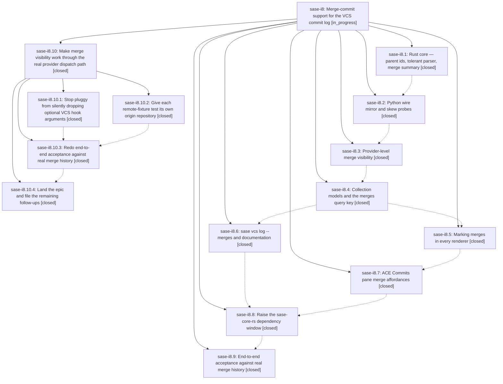

# Bead: sase-i8 — Merge-commit support for the VCS commit log

[Bead Pages](../README.md) / sase-i8

**Status:** ◐ in_progress · **Type:** ▸ plan · **Tier:** epic
**Owner:** `bryanbugyi34@gmail.com` · **Created by:** [bbugyi200.athena.wl](https://github.com/sase-org/sase--agents/blob/main/agents/bbugyi200.athena.wl/README.md) · **Assignee:** `sase-i8.land`
**Created:** 2026-08-09 09:42:59 EDT
**Plan:** [202608/merge\_commit\_support.md](https://github.com/sase-org/sase--plans/blob/main/202608/merge_commit_support.md)

## Description

Merge commits are first-class in every SASE commit-log surface: hidden by default so the timeline shows the commits a PR contained, revealable and unmistakably marked on demand, and browsable as a "what landed" view — with presence, counts, and diffs that stay truthful in every mode.

## Notes

[2026-08-09T17:24:57Z · sase-ie] DISCOVERED ISSUE: tests/test_vcs_provider_vcs_log.py::test_remote_log_ops_fetch_partition_and_union_log is a newly-reproducible flake failing the just check-full flake-baseline gate (tools/selection_health --fail-on-new-flake), exceeding tests/reproducible_flake_baseline.txt (effective-after 2026-08-08T19:56:29Z). Discovered 2026-08-09 while verifying unrelated bead sase-ie via 'just check-full'; the test itself (remote log fetch/partition/union across a bare-git provider) sits squarely in this epic's provider-level VCS log area (sase-i8.3 provider-level merge visibility landed recently, commit c58a0dfb6). Credible causal link, not just topical overlap -- worth checking whether the merge-visibility changes made this test's remote/partition/union assertions timing- or ordering-sensitive. Evidence: 'flake baseline gate: 1 reproducible flake(s) exceed tests/reproducible_flake_baseline.txt ... tests/test_vcs_provider_vcs_log.py::test_remote_log_ops_fetch_partition_and_union_log'.

[2026-08-09T17:55:21Z · sase-id] DISCOVERED ISSUE (independent reproduction): tests/test_vcs_provider_vcs_log.py::test_remote_log_ops_fetch_partition_and_union_log again failed the just check-full flake-baseline gate while verifying unrelated bead sase-id (folding four AMD/memory template config keys under memory:). All lint gates and the full 'just test' suite passed; only 'just selection-health --fail-on-new-flake' failed on this single reproducible flake, matching the DISCOVERED ISSUE already recorded here by sase-ie.

[2026-08-09T18:39:58Z · wo] DISCOVERED ISSUE: Independent recurrence during ACE post-write noninteractive verification on 2026-08-09. Full just test failed tests/test_vcs_provider_vcs_log.py::test_remote_log_ops_fetch_partition_and_union_log at git push -u origin main with exit status 1; rerunning the exact failed set serially made this test pass. This matches the existing provider-level VCS log failure note on this active epic and is unrelated to the post-write subprocess and skill-init changes under verification.

[2026-08-10T12:25:03Z · sase-ib.land] DISCOVERED ISSUE (independent reproduction): tests/test_vcs_provider_vcs_log.py::test_remote_log_ops_fetch_partition_and_union_log failed once in the full-suite fallback of `just check` at -n14 on 2026-08-09T17:30Z, then passed on a serial rerun and on focused xdist reruns of the same node. Recorded by phase bead sase-ib.6 (epic sase-ib) as a PROPOSED FOLLOW-UP; sase-ib.land confirms it is not caused by that epic -- sase-ib touched the suite gate's token arithmetic and the ACE settle helpers, neither of which this non-TUI VCS-provider test uses -- and is forwarding the evidence here rather than filing a duplicate task, since sase-ie, sase-id, and wo already recorded the same node against this epic.

[2026-08-10T14:09:51Z · sase-i8.10.3] ACCEPTANCE EVIDENCE (sase-i8.10.3): installed editable env with just install. Real primary repo has git rev-list --merges --count HEAD=101, --no-merges=11991, total=12092. CLI: sase vcs log -o -N --limit 0 --format json gives hide=11991/query.merges=hide/0 merges, only=101/query.merges=only/all merges, show=12092/query.merges=show/101 merges, so the partition law holds. Sampled first six -m only full_id values with git rev-list --parents -n1; all had two parents. Render checks: no-flag/oneline has no merge glyph column; -m only pretty/full/oneline renders ◆ merge rows and GitHub PR merges as #161/#158/#159 headlines; JSON exposes parent_ids, is_merge, and merge metadata. ACE executable checks: pytest tests/ace/tui/test_commits_pane_interactions.py::test_commits_cycle_merges_updates_query_and_recollects tests/ace/tui/test_commits_pane_rendering.py tests/ace/tui/modals/test_commit_view_modal.py::test_commit_view_modal_marks_merge_and_parents -q passed (23 passed); pytest -m visual tests/ace/tui/visual/test_ace_png_snapshots_commits.py::test_commits_merge_row_png_snapshot -q passed. .venv/bin/python tools/validate_sase_core_rs passed. just check-full passed fmt, markdown fmt, keep-sorted, ruff, mypy, pyscripts, test-waits, changelog, patch/stitch terminology, symvision, toobig, SASE validation, and committed plans, then failed in just test-cost with 7 IDs. Isolation rerun showed reproducible failures only in tests/test_contract_manifest.py::test_contract_manifest_matches_marker_selection, tests/test_contract_manifest.py::test_contract_set_manifest_entry_budget_has_no_hidden_headroom, and tests/test_run_pytest_main.py::test_main_cost_mode_arms_only_the_cost_recorder; the glossary/revival/ace-page-group IDs passed serially and under targeted xdist.

[2026-08-10T14:43:36Z · sase-i8.10.land] DISCOVERED ISSUE: Proposed by child phase sase-i8.10.4 during land triage. src/sase/vcs_provider/plugins/_git_query_ops.py::vcs_repo_stats still runs 'git rev-list --count HEAD' and 'git shortlog -sne HEAD' without --no-merges or a MergeVisibility policy. Once merge commits are first-class and squash-only history is no longer assumed, repository commit/contributor stats include merge commits and can disagree with the default merge-hidden commit-log slice. This is causally tied to active epic sase-i8's truthful-presence/counts goal; routed here via /sase_new_task, not filed as a standalone task.

[2026-08-10T14:43:58Z · sase-i8.10.land] DISCOVERED ISSUE: Proposed by child phase sase-i8.10.4 during land triage. src/sase/updates/incoming_commits.py::_fetch_git_incoming_commits counts a revision range with plain 'git rev-list --count' and lists it with plain 'git log', so incoming-update totals and rows include merge commits and expose no MergeVisibility choice. This is a second commit-listing surface that can disagree with the epic's default merge-hidden timeline. It is causally tied to active epic sase-i8; routed here via /sase_new_task, not filed as a standalone task.

## Phases

| Bead | Title | Status | Size | Created | Agents | Commits |
|---|---|---|---|---|---:|---:|
| [sase-i8.1](sase-i8.1.md) | Rust core — parent ids, tolerant parser, merge summary | ✓ closed | medium | 2026-08-09 | 1 | 1 |
| [sase-i8.2](sase-i8.2.md) | Python wire mirror and skew probes | ✓ closed | small | 2026-08-09 | 1 | 1 |
| [sase-i8.3](sase-i8.3.md) | Provider-level merge visibility | ✓ closed | medium | 2026-08-09 | 1 | 1 |
| [sase-i8.4](sase-i8.4.md) | Collection models and the merges query key | ✓ closed | medium | 2026-08-09 | 1 | 1 |
| [sase-i8.5](sase-i8.5.md) | Marking merges in every renderer | ✓ closed | medium | 2026-08-09 | 1 | 1 |
| [sase-i8.6](sase-i8.6.md) | sase vcs log --merges and documentation | ✓ closed | small | 2026-08-09 | 1 | 1 |
| [sase-i8.7](sase-i8.7.md) | ACE Commits pane merge affordances | ✓ closed | medium | 2026-08-09 | 1 | 1 |
| [sase-i8.8](sase-i8.8.md) | Raise the sase-core-rs dependency window | ✓ closed | small | 2026-08-09 | 1 | 1 |
| [sase-i8.9](sase-i8.9.md) | End-to-end acceptance against real merge history | ✓ closed | small | 2026-08-09 | 1 | 0 |

## Lineage

## Agents

| Agent | Bead | Commits |
|---|---|---:|
| [bbugyi200.athena.sase-i8.1](https://github.com/sase-org/sase--agents/blob/main/agents/bbugyi200.athena.sase-i8.1/README.md) | [sase-i8.1](sase-i8.1.md) | 1 |
| [bbugyi200.athena.sase-i8.10.1](https://github.com/sase-org/sase--agents/blob/main/agents/bbugyi200.athena.sase-i8.10.1/README.md) | [sase-i8.10.1](sase-i8.10.1.md) | 1 |
| [bbugyi200.athena.sase-i8.10.2](https://github.com/sase-org/sase--agents/blob/main/agents/bbugyi200.athena.sase-i8.10.2/README.md) | [sase-i8.10.2](sase-i8.10.2.md) | 1 |
| [bbugyi200.athena.sase-i8.10.3](https://github.com/sase-org/sase--agents/blob/main/agents/bbugyi200.athena.sase-i8.10.3/README.md) | [sase-i8.10.3](sase-i8.10.3.md) | 0 |
| [bbugyi200.athena.sase-i8.10.4](https://github.com/sase-org/sase--agents/blob/main/agents/bbugyi200.athena.sase-i8.10.4/README.md) | [sase-i8.10.4](sase-i8.10.4.md) | 0 |
| [bbugyi200.athena.sase-i8.10.land](https://github.com/sase-org/sase--agents/blob/main/agents/bbugyi200.athena.sase-i8.10.land/README.md) | [sase-i8.10](sase-i8.10.md) | 1 |
| [bbugyi200.athena.sase-i8.2](https://github.com/sase-org/sase--agents/blob/main/agents/bbugyi200.athena.sase-i8.2/README.md) | [sase-i8.2](sase-i8.2.md) | 1 |
| [bbugyi200.athena.sase-i8.3](https://github.com/sase-org/sase--agents/blob/main/agents/bbugyi200.athena.sase-i8.3/README.md) | [sase-i8.3](sase-i8.3.md) | 1 |
| [bbugyi200.athena.sase-i8.4](https://github.com/sase-org/sase--agents/blob/main/agents/bbugyi200.athena.sase-i8.4/README.md) | [sase-i8.4](sase-i8.4.md) | 1 |
| [bbugyi200.athena.sase-i8.5](https://github.com/sase-org/sase--agents/blob/main/agents/bbugyi200.athena.sase-i8.5/README.md) | [sase-i8.5](sase-i8.5.md) | 1 |
| [bbugyi200.athena.sase-i8.6](https://github.com/sase-org/sase--agents/blob/main/agents/bbugyi200.athena.sase-i8.6/README.md) | [sase-i8.6](sase-i8.6.md) | 1 |
| [bbugyi200.athena.sase-i8.7](https://github.com/sase-org/sase--agents/blob/main/agents/bbugyi200.athena.sase-i8.7/README.md) | [sase-i8.7](sase-i8.7.md) | 1 |
| [bbugyi200.athena.sase-i8.8](https://github.com/sase-org/sase--agents/blob/main/agents/bbugyi200.athena.sase-i8.8/README.md) | [sase-i8.8](sase-i8.8.md) | 1 |
| [bbugyi200.athena.sase-i8.9](https://github.com/sase-org/sase--agents/blob/main/agents/bbugyi200.athena.sase-i8.9/README.md) | [sase-i8.9](sase-i8.9.md) | 0 |
| [bbugyi200.athena.sase-i8.land](https://github.com/sase-org/sase--agents/blob/main/agents/bbugyi200.athena.sase-i8.land/README.md) | [sase-i8](README.md) | 0 |

## Commits

| Repo | Commit | Subject | Bead | Committed |
|---|---|---|---|---|
| sase-core | [`sase-core@459bbc6`](https://github.com/sase-org/sase-core/commit/459bbc68f3393739969d83a729eaeadb5b32fc6a) | feat(vcs-log): add parent ids and merge summaries | [sase-i8.1](sase-i8.1.md) | 2026-08-09 10:14:02 EDT |
| sase | [`f5fb724`](https://github.com/sase-org/sase/commit/f5fb72438ce5aa4dc18a00a5b003791699bc180a) | feat(vcs): mirror merge-commit parent ids in Python wire layer | [sase-i8.2](sase-i8.2.md) | 2026-08-09 10:53:22 EDT |
| sase | [`c58a0df`](https://github.com/sase-org/sase/commit/c58a0dfb6cf32188b5fb1ae166661f4abcda7dea) | feat(vcs): add merge visibility to provider logs | [sase-i8.3](sase-i8.3.md) | 2026-08-09 12:16:13 EDT |
| sase | [`8795cd2`](https://github.com/sase-org/sase/commit/8795cd2b2309c4d384a6f6ba40d727cee6e14e21) | feat(vcs-log): add merge visibility filters | [sase-i8.4](sase-i8.4.md) | 2026-08-09 13:18:14 EDT |
| sase | [`f62a046`](https://github.com/sase-org/sase/commit/f62a046073876b8e09a2f6128318ffece9273aa1) | feat(vcs): add merge filtering to log command | [sase-i8.6](sase-i8.6.md) | 2026-08-09 13:42:53 EDT |
| sase | [`77ee670`](https://github.com/sase-org/sase/commit/77ee67052e418c7825249cb95ca1f32fe55f6b40) | feat(vcs-log): mark merge commits in renderers | [sase-i8.5](sase-i8.5.md) | 2026-08-09 13:47:40 EDT |
| sase | [`c613822`](https://github.com/sase-org/sase/commit/c6138223bc86d8196812834ce76351f8f8f4df4f) | feat(ace): add commit merge visibility controls | [sase-i8.7](sase-i8.7.md) | 2026-08-09 14:25:10 EDT |
| sase | [`8ed11bb`](https://github.com/sase-org/sase/commit/8ed11bb80b6a218dcd49fed5529573e036bc32ca) | build(deps): raise sase-core-rs floor | [sase-i8.8](sase-i8.8.md) | 2026-08-10 07:46:04 EDT |
| sase | [`6d131aa`](https://github.com/sase-org/sase/commit/6d131aa7b4df28d10211d4a6ee6df84ac173e9fc) | fix(vcs): forward optional VCS hook arguments | [sase-i8.10.1](sase-i8.10.1.md) | 2026-08-10 08:49:32 EDT |
| sase | [`e9e414e`](https://github.com/sase-org/sase/commit/e9e414e2f5a55ba3a79e1b5cd0239e1749d51792) | test(vcs-log): give each remote-fixture test its own bare origin path | [sase-i8.10.2](sase-i8.10.2.md) | 2026-08-10 09:38:06 EDT |
| sase--plans | [`sase--plans@e1205bb`](https://github.com/sase-org/sase--plans/commit/e1205bb419d139babc47bdde2e213dcdc5e58edf) | docs(plan): mark sase-i8.10 complete | [sase-i8.10](sase-i8.10.md) | 2026-08-10 10:50:53 EDT |
