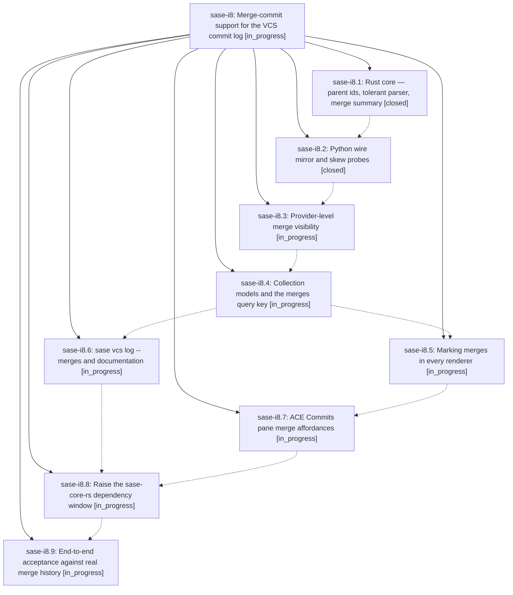

# Bead: sase-i8 — Merge-commit support for the VCS commit log

[Bead Pages](../README.md) / sase-i8

**Status:** ◐ in_progress · **Type:** ▸ plan · **Tier:** epic
**Owner:** `bryanbugyi34@gmail.com` · **Created by:** [bbugyi200.athena.wl](https://github.com/sase-org/sase--agents/blob/main/agents/bbugyi200.athena.wl/README.md) · **Assignee:** `sase-i8.land`
**Created:** 2026-08-09 09:42:59 EDT
**Plan:** [202608/merge\_commit\_support.md](https://github.com/sase-org/sase--plans/blob/main/202608/merge_commit_support.md)

## Description

Merge commits are first-class in every SASE commit-log surface: hidden by default so the timeline shows the commits a PR contained, revealable and unmistakably marked on demand, and browsable as a "what landed" view — with presence, counts, and diffs that stay truthful in every mode.

## Phases

| Bead | Title | Status | Size | Created | Agents | Commits |
|---|---|---|---|---|---:|---:|
| [sase-i8.1](sase-i8.1.md) | Rust core — parent ids, tolerant parser, merge summary | ✓ closed | medium | 2026-08-09 | 1 | 1 |
| [sase-i8.2](sase-i8.2.md) | Python wire mirror and skew probes | ✓ closed | small | 2026-08-09 | 1 | 1 |
| [sase-i8.3](sase-i8.3.md) | Provider-level merge visibility | ◐ in_progress | medium | 2026-08-09 | 1 | 0 |
| [sase-i8.4](sase-i8.4.md) | Collection models and the merges query key | ◐ in_progress | medium | 2026-08-09 | 1 | 0 |
| [sase-i8.5](sase-i8.5.md) | Marking merges in every renderer | ◐ in_progress | medium | 2026-08-09 | 1 | 0 |
| [sase-i8.6](sase-i8.6.md) | sase vcs log --merges and documentation | ◐ in_progress | small | 2026-08-09 | 1 | 0 |
| [sase-i8.7](sase-i8.7.md) | ACE Commits pane merge affordances | ◐ in_progress | medium | 2026-08-09 | 1 | 0 |
| [sase-i8.8](sase-i8.8.md) | Raise the sase-core-rs dependency window | ◐ in_progress | small | 2026-08-09 | 1 | 0 |
| [sase-i8.9](sase-i8.9.md) | End-to-end acceptance against real merge history | ◐ in_progress | small | 2026-08-09 | 1 | 0 |

## Lineage

## Agents

| Agent | Bead | Commits |
|---|---|---:|
| [bbugyi200.athena.sase-i8.1](https://github.com/sase-org/sase--agents/blob/main/agents/bbugyi200.athena.sase-i8.1/README.md) | [sase-i8.1](sase-i8.1.md) | 1 |
| [bbugyi200.athena.sase-i8.2](https://github.com/sase-org/sase--agents/blob/main/agents/bbugyi200.athena.sase-i8.2/README.md) | [sase-i8.2](sase-i8.2.md) | 1 |
| [bbugyi200.athena.sase-i8.3](https://github.com/sase-org/sase--agents/blob/main/agents/bbugyi200.athena.sase-i8.3/README.md) | [sase-i8.3](sase-i8.3.md) | 0 |
| [bbugyi200.athena.sase-i8.4](https://github.com/sase-org/sase--agents/blob/main/agents/bbugyi200.athena.sase-i8.4/README.md) | [sase-i8.4](sase-i8.4.md) | 0 |
| [bbugyi200.athena.sase-i8.5](https://github.com/sase-org/sase--agents/blob/main/agents/bbugyi200.athena.sase-i8.5/README.md) | [sase-i8.5](sase-i8.5.md) | 0 |
| [bbugyi200.athena.sase-i8.6](https://github.com/sase-org/sase--agents/blob/main/agents/bbugyi200.athena.sase-i8.6/README.md) | [sase-i8.6](sase-i8.6.md) | 0 |
| [bbugyi200.athena.sase-i8.7](https://github.com/sase-org/sase--agents/blob/main/agents/bbugyi200.athena.sase-i8.7/README.md) | [sase-i8.7](sase-i8.7.md) | 0 |
| [bbugyi200.athena.sase-i8.8](https://github.com/sase-org/sase--agents/blob/main/agents/bbugyi200.athena.sase-i8.8/README.md) | [sase-i8.8](sase-i8.8.md) | 0 |
| [bbugyi200.athena.sase-i8.9](https://github.com/sase-org/sase--agents/blob/main/agents/bbugyi200.athena.sase-i8.9/README.md) | [sase-i8.9](sase-i8.9.md) | 0 |
| [bbugyi200.athena.sase-i8.land](https://github.com/sase-org/sase--agents/blob/main/agents/bbugyi200.athena.sase-i8.land/README.md) | [sase-i8](README.md) | 0 |

## Commits

| Repo | Commit | Subject | Bead | Committed |
|---|---|---|---|---|
| sase-core | [`sase-core@459bbc6`](https://github.com/sase-org/sase-core/commit/459bbc68f3393739969d83a729eaeadb5b32fc6a) | feat(vcs-log): add parent ids and merge summaries | [sase-i8.1](sase-i8.1.md) | 2026-08-09 10:14:02 EDT |
| sase | [`f5fb724`](https://github.com/sase-org/sase/commit/f5fb72438ce5aa4dc18a00a5b003791699bc180a) | feat(vcs): mirror merge-commit parent ids in Python wire layer | [sase-i8.2](sase-i8.2.md) | 2026-08-09 10:53:22 EDT |
