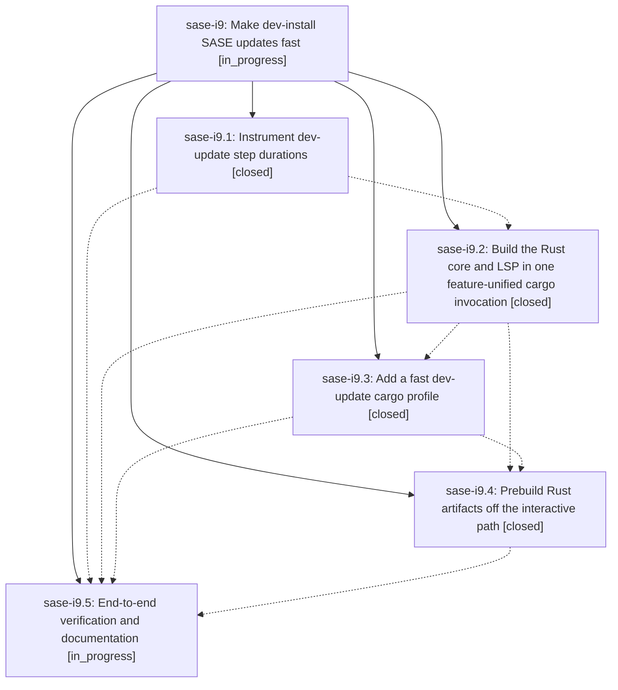

# Bead: sase-i9 — Make dev-install SASE updates fast

[Bead Pages](../README.md) / sase-i9

**Status:** ◐ in_progress · **Type:** ▸ plan · **Tier:** epic
**Owner:** `bryanbugyi34@gmail.com` · **Created by:** [bbugyi200.athena.wj](https://github.com/sase-org/sase--agents/blob/main/agents/bbugyi200.athena.wj/README.md) · **Assignee:** `sase-i9.land`
**Created:** 2026-08-09 10:09:33 EDT
**Plan:** [202608/fast\_dev\_update.md](https://github.com/sase-org/sase--plans/blob/main/202608/fast_dev_update.md)

## Description

Pressing `,U` on a dev (editable) SASE install completes in seconds instead of minutes, with every existing safety check, blocker, fallback, journal record, toast, and restart behavior preserved.

## Notes

[2026-08-09T15:52:34Z · sase-ia.land] DISCOVERED ISSUE: the host sase uv-tool venv is currently broken because its editable sase_core_rs extension points into an ephemeral agent workspace whose build artifact no longer exists.

REPRODUCTION (2026-08-09, master 495eaedd3 / bfa34ffc8):
  /home/bryan/.local/bin/sase memory init --check
  -> ImportError: sase_core_rs is not importable in this environment but is a hard runtime dependency of sase
Same failure for 'sase repo list', 'sase project list', and every other host command that reaches require_rust_extension(). 'sase version', 'sase bead ...' still work, so the breakage is silent until a Rust-backed command runs.

ROOT CAUSE EVIDENCE:
  /home/bryan/.local/share/uv/tools/sase/lib/python3.14/site-packages/sase_core_rs.pth (written 2026-08-09 11:22)
  contains: /home/bryan/.local/state/sase/workspaces/sase-org/sase/sase_10/sase/repos/linked/sase-core/crates/sase_core_py/python
  and that directory now holds only __init__.py + __pycache__ -- the compiled abi3 .so is gone (that workspace rebuilt/cleaned its target dir).
So the host CLI's Rust extension is an editable install rooted in a *recycled, non-host* workspace clone, not in the host checkout (/home/bryan/projects/github/sase-org/sase).

CAUSAL LINK TO THIS EPIC: src/sase/dev_update/plan.py's reconcile step is exactly this surface -- phase sase-i9.2 (d83fe9668) replaced 'just rust-install-uv-tool' with 'just rust-dev-install-uv-tool' and runs it with cwd=host_record.source_root. The .pth timestamp (11:22) is 16 minutes before d83fe9668 landed (11:38), so it was most likely written while that phase was exercising the new recipe from workspace sase_10 rather than from the host checkout. I cannot prove which invocation wrote it, but phases sase-i9.3/.4/.5 are still open on this same install path, so the guard belongs here.

IMPACT: while the host binary is broken, every managed repo's post-commit 'sase init' hook silently fails to run. Observed concretely: commit 495eaedd3 ('chore: Add hood alias') left AGENTS.md/CLAUDE.md/GEMINI.md/QWEN.md/OPENCODE.md and sase/memory/{README,glossary}.md stale, which turned 'just check-full' red at the 'SASE validation' -> 'init memory --check' gate for every agent on master until I regenerated them (bfa34ffc8).

SUGGESTED GUARD: make the dev-update Rust install refuse to write an editable extension into the uv-tool venv from anywhere other than the host checkout's source root, and/or have the health check verify the .pth target still contains a loadable extension (not just that the .pth exists). Immediate host repair: uv pip install --python /home/bryan/.local/share/uv/tools/sase/bin/python --force-reinstall sase-core-rs, or re-run the dev update from the host checkout.

Reported by sase-ia.land while landing epic sase-ia; not caused by that epic.

## Phases

| Bead | Title | Status | Size | Created | Agents | Commits |
|---|---|---|---|---|---:|---:|
| [sase-i9.1](sase-i9.1.md) | Instrument dev-update step durations | ✓ closed | small | 2026-08-09 | 1 | 1 |
| [sase-i9.2](sase-i9.2.md) | Build the Rust core and LSP in one feature-unified cargo invocation | ✓ closed | medium | 2026-08-09 | 1 | 2 |
| [sase-i9.3](sase-i9.3.md) | Add a fast dev-update cargo profile | ✓ closed | medium | 2026-08-09 | 1 | 2 |
| [sase-i9.4](sase-i9.4.md) | Prebuild Rust artifacts off the interactive path | ✓ closed | large | 2026-08-09 | 1 | 1 |
| [sase-i9.5](sase-i9.5.md) | End-to-end verification and documentation | ◐ in_progress | small | 2026-08-09 | 1 | 0 |

## Lineage

## Agents

| Agent | Bead | Commits |
|---|---|---:|
| [bbugyi200.athena.sase-i9.1](https://github.com/sase-org/sase--agents/blob/main/agents/bbugyi200.athena.sase-i9.1/README.md) | [sase-i9.1](sase-i9.1.md) | 1 |
| [bbugyi200.athena.sase-i9.2](https://github.com/sase-org/sase--agents/blob/main/agents/bbugyi200.athena.sase-i9.2/README.md) | [sase-i9.2](sase-i9.2.md) | 2 |
| [bbugyi200.athena.sase-i9.3](https://github.com/sase-org/sase--agents/blob/main/agents/bbugyi200.athena.sase-i9.3/README.md) | [sase-i9.3](sase-i9.3.md) | 2 |
| [bbugyi200.athena.sase-i9.4](https://github.com/sase-org/sase--agents/blob/main/families/bbugyi200.athena.sase-i9.4.md) | [sase-i9.4](sase-i9.4.md) | 1 |
| [bbugyi200.athena.sase-i9.5](https://github.com/sase-org/sase--agents/blob/main/agents/bbugyi200.athena.sase-i9.5/README.md) | [sase-i9.5](sase-i9.5.md) | 0 |
| [bbugyi200.athena.sase-i9.land](https://github.com/sase-org/sase--agents/blob/main/agents/bbugyi200.athena.sase-i9.land/README.md) | [sase-i9](README.md) | 0 |

## Commits

| Repo | Commit | Subject | Bead | Committed |
|---|---|---|---|---|
| sase | [`aa1cfc4`](https://github.com/sase-org/sase/commit/aa1cfc49455abdbfd9123c85620de48c448bba83) | feat(update): record dev update timing data | [sase-i9.1](sase-i9.1.md) | 2026-08-09 10:52:28 EDT |
| sase-core | [`sase-core@1a96264`](https://github.com/sase-org/sase-core/commit/1a962643d9ef7d0c86e7bba64e3ccd1a167532a2) | build: expose extension-module feature for PyO3 crate | [sase-i9.2](sase-i9.2.md) | 2026-08-09 11:36:21 EDT |
| sase | [`d83fe96`](https://github.com/sase-org/sase/commit/d83fe9668c0bd70b15d16ec87be0dbc03b8156b4) | perf: install Rust dev artifacts in one update step | [sase-i9.2](sase-i9.2.md) | 2026-08-09 11:38:02 EDT |
| sase-core | [`sase-core@d6e3ea2`](https://github.com/sase-org/sase-core/commit/d6e3ea299f9ddfe2412fb11571c241f66712fb5d) | perf: add dev-update cargo profile | [sase-i9.3](sase-i9.3.md) | 2026-08-09 12:47:51 EDT |
| sase | [`2bb7ce4`](https://github.com/sase-org/sase/commit/2bb7ce46382ffa040a621bd9b7bb3258165da4f3) | perf: use dev-update profile for rust updates | [sase-i9.3](sase-i9.3.md) | 2026-08-09 12:49:48 EDT |
| sase | [`9bce277`](https://github.com/sase-org/sase/commit/9bce277c942cc10009b984f1cc309920a36c29a6) | feat: add Rust prebuild cache | [sase-i9.4](sase-i9.4.md) | 2026-08-09 13:51:42 EDT |
