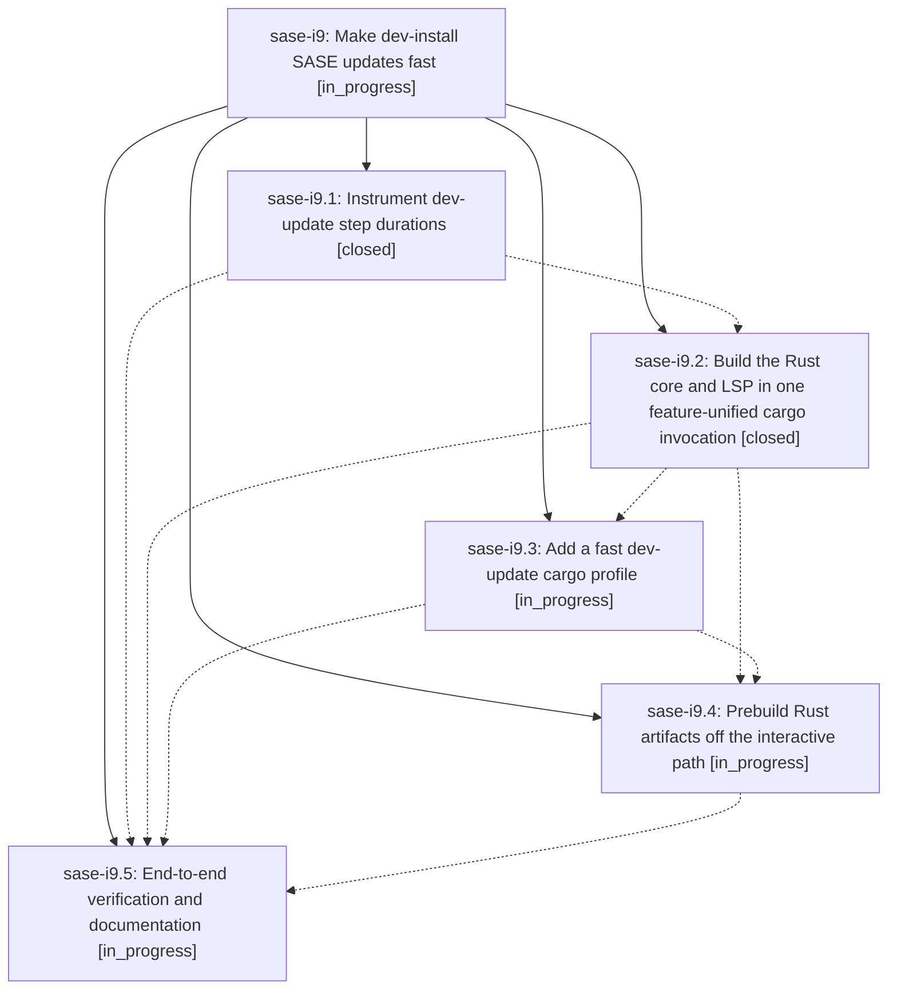

# Bead: sase-i9 — Make dev-install SASE updates fast

[Bead Pages](../README.md) / sase-i9

**Status:** ◐ in_progress · **Type:** ▸ plan · **Tier:** epic
**Owner:** `bryanbugyi34@gmail.com` · **Created by:** [bbugyi200.athena.wj](https://github.com/sase-org/sase--agents/blob/main/agents/bbugyi200.athena.wj/README.md) · **Assignee:** `sase-i9.land`
**Created:** 2026-08-09 10:09:33 EDT
**Plan:** [202608/fast\_dev\_update.md](https://github.com/sase-org/sase--plans/blob/main/202608/fast_dev_update.md)

## Description

Pressing `,U` on a dev (editable) SASE install completes in seconds instead of minutes, with every existing safety check, blocker, fallback, journal record, toast, and restart behavior preserved.

## Phases

| Bead | Title | Status | Size | Created | Agents | Commits |
|---|---|---|---|---|---:|---:|
| [sase-i9.1](sase-i9.1.md) | Instrument dev-update step durations | ✓ closed | small | 2026-08-09 | 1 | 1 |
| [sase-i9.2](sase-i9.2.md) | Build the Rust core and LSP in one feature-unified cargo invocation | ✓ closed | medium | 2026-08-09 | 1 | 1 |
| [sase-i9.3](sase-i9.3.md) | Add a fast dev-update cargo profile | ◐ in_progress | medium | 2026-08-09 | 1 | 0 |
| [sase-i9.4](sase-i9.4.md) | Prebuild Rust artifacts off the interactive path | ◐ in_progress | large | 2026-08-09 | 1 | 0 |
| [sase-i9.5](sase-i9.5.md) | End-to-end verification and documentation | ◐ in_progress | small | 2026-08-09 | 1 | 0 |

## Lineage

## Agents

| Agent | Bead | Commits |
|---|---|---:|
| [bbugyi200.athena.sase-i9.1](https://github.com/sase-org/sase--agents/blob/main/agents/bbugyi200.athena.sase-i9.1/README.md) | [sase-i9.1](sase-i9.1.md) | 1 |
| [bbugyi200.athena.sase-i9.2](https://github.com/sase-org/sase--agents/blob/main/agents/bbugyi200.athena.sase-i9.2/README.md) | [sase-i9.2](sase-i9.2.md) | 1 |
| [bbugyi200.athena.sase-i9.3](https://github.com/sase-org/sase--agents/blob/main/agents/bbugyi200.athena.sase-i9.3/README.md) | [sase-i9.3](sase-i9.3.md) | 0 |
| [bbugyi200.athena.sase-i9.4](https://github.com/sase-org/sase--agents/blob/main/agents/bbugyi200.athena.sase-i9.4/README.md) | [sase-i9.4](sase-i9.4.md) | 0 |
| [bbugyi200.athena.sase-i9.5](https://github.com/sase-org/sase--agents/blob/main/agents/bbugyi200.athena.sase-i9.5/README.md) | [sase-i9.5](sase-i9.5.md) | 0 |
| [bbugyi200.athena.sase-i9.land](https://github.com/sase-org/sase--agents/blob/main/agents/bbugyi200.athena.sase-i9.land/README.md) | [sase-i9](README.md) | 0 |

## Commits

| Repo | Commit | Subject | Bead | Committed |
|---|---|---|---|---|
| sase | [`aa1cfc4`](https://github.com/sase-org/sase/commit/aa1cfc49455abdbfd9123c85620de48c448bba83) | feat(update): record dev update timing data | [sase-i9.1](sase-i9.1.md) | 2026-08-09 10:52:28 EDT |
| sase-core | [`sase-core@1a96264`](https://github.com/sase-org/sase-core/commit/1a962643d9ef7d0c86e7bba64e3ccd1a167532a2) | build: expose extension-module feature for PyO3 crate | [sase-i9.2](sase-i9.2.md) | 2026-08-09 11:36:21 EDT |
