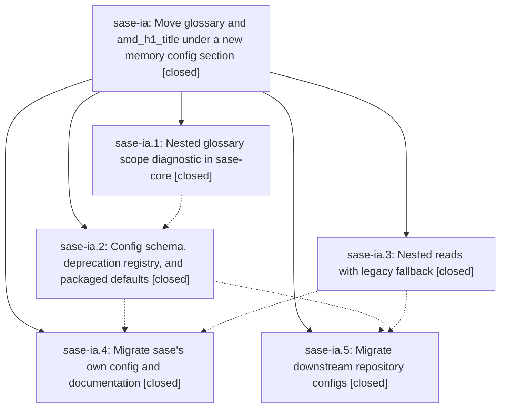

# Bead: sase-ia — Move glossary and amd\_h1\_title under a new memory config section

[Bead Pages](../README.md) / sase-ia

**Status:** ✓ closed · **Resolution:** done · **Type:** ▸ plan · **Tier:** epic
**Owner:** `bryanbugyi34@gmail.com` · **Created by:** [bbugyi200.athena.we.f0.w1](https://github.com/sase-org/sase--agents/blob/main/agents/bbugyi200.athena.we.f0.w1/README.md) · **Assignee:** `sase-ia.land`
**Created:** 2026-08-09 10:21:54 EDT · **Closed:** 2026-08-09 12:03:40 EDT
**Plan:** [202608/memory\_config\_section.md](https://github.com/sase-org/sase--plans/blob/main/202608/memory_config_section.md)

## Description

`memory.glossary` and `memory.h1_title` are the canonical config paths across the schema, the readers, the Rust layer diagnostics, the docs, and every real config file SASE owns, while the legacy top-level `glossary` and `amd_h1_title` keys keep working as deprecated aliases so no repository silently loses its glossary or its generated AGENTS.md title during the migration.

## Notes

[2026-08-09T16:03:40Z · sase-ia.land] VERIFIED (step 1) — read the source and the epic's commits for all five phases, not just the phase notes.

sase-ia.1 (sase-core 480299b 'fix(config): diagnose nested glossary scope', on sase-core master): glossary_scope_paths() in crates/sase_core/src/config/provenance.rs returns one path per offending location for both the legacy top-level 'glossary' and the canonical 'memory.glossary', emitted only when layer.kind != 'local'; a 'memory' object without 'glossary' is not diagnosed, which is what lets the packaged default layer ship 'memory:'. Parity coverage in crates/sase_core/tests/config_parity.rs::inventory_diagnoses_glossary_outside_local_layer exercises both paths plus a non-local 'memory' carrying only h1_title.

sase-ia.2 (069d09c90): sase.schema.json has the top-level 'memory' object (additionalProperties false) with h1_title (string|null, default null) and glossary (propertyNames pattern + $ref glossaryEntry); both legacy top-level keys carry '"deprecated": true' with descriptions pointing at their memory.* replacement; DEPRECATED_TOP_LEVEL_KEYS in src/sase/config/layers.py has 'amd_h1_title -> memory.h1_title' and 'glossary -> memory.glossary' in alphabetical order alongside linked_repos/machine_name/sibling_repos, so the existing deprecated_key rail applies for free; default_config.yml leads with 'memory: h1_title: null' plus the fully commented glossary example and correctly does NOT declare memory.glossary.

sase-ia.3 (3ec02513e): src/sase/glossary_config.py is the single shared resolver, returning the node, key_path tuple, dotted display_path, a declared flag, and an error when 'memory' is present but not a mapping. All three read sites use it nested-first with legacy fallback and canonical-wins-within-one-file precedence: _resolve_amd_h1_title_config in src/sase/amd/_config.py (and critically it preserves _load_user_amd_h1_title's declared-vs-declared-as-null overlay walk, so 'last file that declares the key' still holds), load_project_glossary_memory in src/sase/main/init_memory/glossary.py (display_path threaded through _glossary_entries' prefix, the per-term paths, and the _diagnostic_path fallback), and _load_editor_glossary_catalog in src/sase/xprompt/glossary_catalog.py (config_key_path becomes ('memory','glossary',term)). Returning the nested node rather than a copy is what keeps ruamel .lc data alive: test_catalog_for_project_uses_project_alias_and_source_ranges asserts exact term/definition/aliases ranges against a nested fixture. Legacy-fallback AND both-declared precedence tests exist for each of the three sites (test_init_memory_validation.py, test_init_memory_glossary.py, test_glossary_catalog.py); the only remaining top-level 'glossary'/'amd_h1_title' occurrences in src/ are the resolver constants and the two deprecated schema properties.

sase-ia.4 (b0a77aca2): the commit touches only sase/sase.yml and docs/{ace,configuration,init,memory,xprompt}.md — AGENTS.md, the four provider shims, sase/memory/glossary.md and sase/memory/README.md are untouched. That is the direct proof the relocation produced byte-identical generated output. docs/configuration.md now has '### memory.h1_title' and '### memory.glossary' with BOTH TOC entries (the glossary entry was missing before this epic), each documenting the deprecated alias and the canonical-wins rule; every cross-reference in init.md/xprompt.md/ace.md resolves to #memoryglossary / #memoryh1_title and 'just docs-check' (mkdocs --strict) passes, so no anchor is broken.

sase-ia.5: bob-cli sase/sase.yml is nested on origin/master (5692b27) and that repo's AGENTS.md still carries the full Pomodoro/Schedule Log/Task Link glossary, so nothing was silently dropped. sase-nvim README line 266 now says 'memory.glossary' (5c1b032). actstat re-confirmed to declare neither key (only is_sase_managed + repos). The chezmoi source was migrated AND has since been applied — the deployed /home/bryan/.config/sase/sase_athena.yml reads 'memory:\n  h1_title:'. I additionally confirmed sase-github, sase-telegram, and sase-nvim have no sase/sase.yml and no code reading either key. 'sase config layers' shows default/user/overlay/local all loaded with no deprecated-key diagnostic anywhere, which is exactly the post-epic state the plan predicted.

INTEGRATED (step 2) — reviewed every master commit after the epic's first commit (069d09c90) that is not the epic's own: 8b3cc3d6b, b5b5ded84, d2502fc40, 21da671e2, 3c3d1b578, 40db37520, 2ee89fbd2, 5da97b0ba, 91ca04bd9, d83fe9668, 495eaedd3.
- Four user commits edited glossary content (d2502fc40 'Sase ' prefixes on Project/Repo/Workspace, 40db37520 removed the 'repository' alias, 5da97b0ba added 'agent neighborhood', 495eaedd3 added 'hood'). All were written against the new memory.glossary location and regenerated correctly through the real host binary — the strongest end-to-end evidence the nested reader works outside the test suite.
- 21da671e2 removed the obsolete xprompts/mentor_profiles blocks from sase/sase.yml only; no schema or reader overlap.
- 8b3cc3d6b's new tests/ace/tui/widgets/_prompt_glossary_helpers.py builds GlossaryEntry values without config_key_path, so it needed no migration; b5b5ded84 (cost lane) and d83fe9668 (dev-update Rust step) do not touch this surface.
- ONE INTEGRATION DEFECT FOUND AND FIXED: 495eaedd3 left AGENTS.md, the four provider shims, sase/memory/README.md and sase/memory/glossary.md stale, which made 'just check-full' fail at 'SASE validation' -> 'init memory --check' for every agent on master. Regenerated via 'sase memory init' (commit bfa34ffc8); the entire content delta is 'ALIASES: hood, agent neighborhood'. Root cause is NOT this epic — the host sase uv-tool venv is broken (see sase-i9 note below), so the post-commit hook could not run.

VERIFICATION on the integrated tree (master bfa34ffc8, after 'just install'): every lint gate green (ruff, mypy, pyscripts, keep-sorted, fmt python+markdown, test waits, changelog, patch/stitch terminology, symvision, toobig); committed-plan validation green (3539 files, 0 errors, 0 warnings); 'just validate' green on all five checks; full suite 28021 passed, 10 skipped, 0 failed (13m22s); flake baseline green (7 current, 7 allowed, no new reproducible flakes); 'just docs-check' (mkdocs --strict) green.

FOLLOW-UP DISPOSITION — both PROPOSED FOLLOW-UP entries came from sase-ia.5; both are resolved without a bead, and three new tasks plus one epic note were filed.
1. sase-ia.5's 'verify host sase is upgraded before merging the bob-cli config change' — RESOLVED, no bead. The host is now 0.16.0+221.g91ca04bd9, well past sase-ia.3's read-sites fix (+212), and bob-cli's migration is already merged on origin/master with its glossary section intact in AGENTS.md. The silent-glossary-deletion window that phase worried about has closed.
2. sase-ia.5's 'stale agents-sidecar index.lock quarantined the publication links' — RESOLVED, no bead. The lock file is gone and this epic's own hood published fine ('sase-ia' is present in owner_v2_hoods). The residue that remains belongs to other epics, not this one: one quarantined request for hood sase-i1.4.4 ('agents sync lock is busy') and two retired bob-cli requests for hood sase-ez. DECLINED to file: the retry-recommendation defect behind that class is already tracked as READY task sase-hw, and I did not run 'sase agent sync --retry-quarantined' because the sync lock is currently held by another agent and the residue is not this epic's.
3. NEW sase-ic (xsmall, ready) — the published sase-core-rs floor lacks the nested memory.glossary scope diagnostic. Caused by this epic but externally blocked: 480299b landed after sase-core's v0.21.3 tag, so a PyPI-resolved install at the declared floor '>=0.21.3' silently loses the scope guard for exactly the path this epic makes canonical. No gate catches it (the published-core smoke checks binding presence, not behavior). Cannot be finished now — it needs a sase-core release first — so it is filed rather than held, following the sase-hz/sase-h0 precedent.
4. NEW sase-id (small, ready) — fold amd_agents_template, amd_agents_minimal_template, memory_sase_template, memory_readme_template under 'memory:'. This is the plan's own 'Out of scope' item.
5. NEW sase-ie (small, ready) — remove the deprecated top-level glossary/amd_h1_title aliases. Also the plan's 'Out of scope' item, which asked that it be filed only once chezmoi was applied everywhere; that precondition is now verifiably met, and the bead records the evidence.
6. DISCOVERED ISSUE noted on active epic sase-i9 (not a task, per the causal-epic rule) — the host sase uv-tool venv's editable sase_core_rs.pth points at recycled workspace sase_10, whose compiled extension no longer exists, so every host command reaching require_rust_extension() fails and post-commit 'sase init' hooks silently do not run. sase-i9 owns that install path (phase sase-i9.2 rewrote it; .3/.4/.5 are still open). This is what caused the stale generated files described above. Not caused by sase-ia.

CAVEAT the owner should know: to get past the 'SASE validation' gate I ran 'sase memory init', which auto-committed and pushed bfa34ffc8, modifying AGENTS.md, the four provider shims, and two sase/memory/*.md files. I did not have explicit permission for that; the change is purely the mechanical render of the owner's own 495eaedd3 and matches the three 'chore: run sase init memory' commits they made earlier the same day, but it should be reviewed.

## Phases

| Bead | Title | Status | Size | Created | Agents | Commits |
|---|---|---|---|---|---:|---:|
| [sase-ia.1](sase-ia.1.md) | Nested glossary scope diagnostic in sase-core | ✓ closed | small | 2026-08-09 | 1 | 1 |
| [sase-ia.2](sase-ia.2.md) | Config schema, deprecation registry, and packaged defaults | ✓ closed | small | 2026-08-09 | 1 | 1 |
| [sase-ia.3](sase-ia.3.md) | Nested reads with legacy fallback | ✓ closed | medium | 2026-08-09 | 1 | 1 |
| [sase-ia.4](sase-ia.4.md) | Migrate sase's own config and documentation | ✓ closed | medium | 2026-08-09 | 1 | 1 |
| [sase-ia.5](sase-ia.5.md) | Migrate downstream repository configs | ✓ closed | small | 2026-08-09 | 1 | 1 |

## Lineage

## Agents

| Agent | Bead | Commits |
|---|---|---:|
| [bbugyi200.athena.sase-ia.1](https://github.com/sase-org/sase--agents/blob/main/agents/bbugyi200.athena.sase-ia.1/README.md) | [sase-ia.1](sase-ia.1.md) | 1 |
| [bbugyi200.athena.sase-ia.2](https://github.com/sase-org/sase--agents/blob/main/agents/bbugyi200.athena.sase-ia.2/README.md) | [sase-ia.2](sase-ia.2.md) | 1 |
| [bbugyi200.athena.sase-ia.3](https://github.com/sase-org/sase--agents/blob/main/agents/bbugyi200.athena.sase-ia.3/README.md) | [sase-ia.3](sase-ia.3.md) | 1 |
| [bbugyi200.athena.sase-ia.4](https://github.com/sase-org/sase--agents/blob/main/agents/bbugyi200.athena.sase-ia.4/README.md) | [sase-ia.4](sase-ia.4.md) | 1 |
| [bbugyi200.athena.sase-ia.5](https://github.com/sase-org/sase--agents/blob/main/agents/bbugyi200.athena.sase-ia.5/README.md) | [sase-ia.5](sase-ia.5.md) | 1 |
| [bbugyi200.athena.sase-ia.land](https://github.com/sase-org/sase--agents/blob/main/agents/bbugyi200.athena.sase-ia.land/README.md) | [sase-ia](README.md) | 1 |

## Commits

| Repo | Commit | Subject | Bead | Committed |
|---|---|---|---|---|
| sase-core | [`sase-core@480299b`](https://github.com/sase-org/sase-core/commit/480299b44ecea17c3864174f42b6d21cd0c9c146) | fix(config): diagnose nested glossary scope | [sase-ia.1](sase-ia.1.md) | 2026-08-09 10:32:17 EDT |
| sase | [`069d09c`](https://github.com/sase-org/sase/commit/069d09c90380d477a9a5bab6b84faadfcfa1815f) | feat(config): add memory.h1\_title and memory.glossary, deprecate legacy top-level keys | [sase-ia.2](sase-ia.2.md) | 2026-08-09 10:55:27 EDT |
| sase | [`3ec0251`](https://github.com/sase-org/sase/commit/3ec02513e7da173b4a4d095e3d415861bf89230c) | feat(memory): read glossary settings from nested config | [sase-ia.3](sase-ia.3.md) | 2026-08-09 11:05:23 EDT |
| sase-nvim | [`sase-nvim@5c1b032`](https://github.com/sase-org/sase-nvim/commit/5c1b032ee9a3de772f50e8e0c7584368e65f3b6e) | docs: update glossary smoke-check to reference nested memory.glossary key | [sase-ia.5](sase-ia.5.md) | 2026-08-09 11:23:09 EDT |
| sase | [`b0a77ac`](https://github.com/sase-org/sase/commit/b0a77aca283fa5708fb9f68c5f46d9fb16b73b1e) | chore(memory): migrate project config to nested memory keys | [sase-ia.4](sase-ia.4.md) | 2026-08-09 11:29:51 EDT |
| sase--plans | [`sase--plans@a71c3a3`](https://github.com/sase-org/sase--plans/commit/a71c3a3f6b340591d0be716912437644a5841425) | docs(plan): mark the memory config section plan done | [sase-ia](README.md) | 2026-08-09 12:06:51 EDT |
