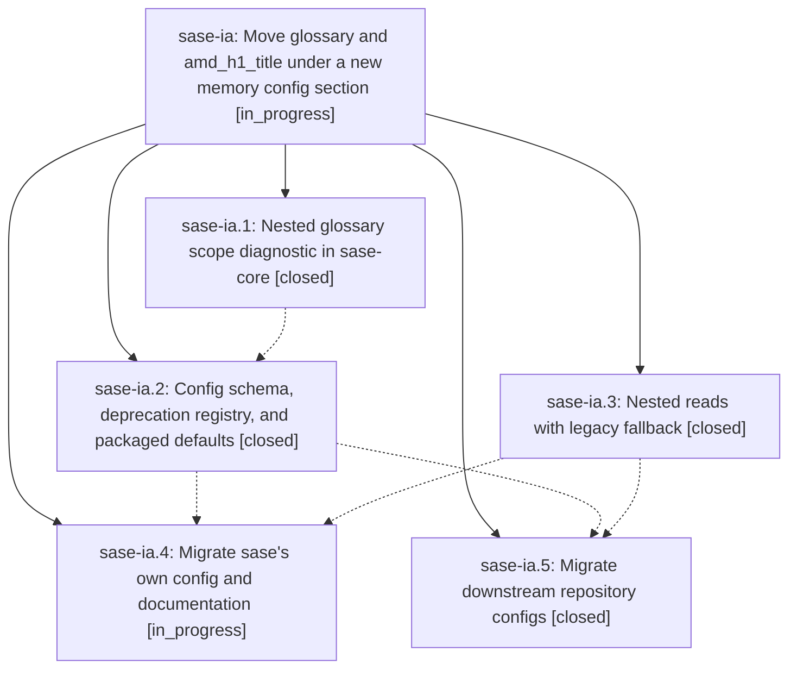

# Bead: sase-ia — Move glossary and amd\_h1\_title under a new memory config section

[Bead Pages](../README.md) / sase-ia

**Status:** ◐ in_progress · **Type:** ▸ plan · **Tier:** epic
**Owner:** `bryanbugyi34@gmail.com` · **Created by:** [bbugyi200.athena.we.f0.w1](https://github.com/sase-org/sase--agents/blob/main/agents/bbugyi200.athena.we.f0.w1/README.md) · **Assignee:** `sase-ia.land`
**Created:** 2026-08-09 10:21:54 EDT
**Plan:** [202608/memory\_config\_section.md](https://github.com/sase-org/sase--plans/blob/main/202608/memory_config_section.md)

## Description

`memory.glossary` and `memory.h1_title` are the canonical config paths across the schema, the readers, the Rust layer diagnostics, the docs, and every real config file SASE owns, while the legacy top-level `glossary` and `amd_h1_title` keys keep working as deprecated aliases so no repository silently loses its glossary or its generated AGENTS.md title during the migration.

## Phases

| Bead | Title | Status | Size | Created | Agents | Commits |
|---|---|---|---|---|---:|---:|
| [sase-ia.1](sase-ia.1.md) | Nested glossary scope diagnostic in sase-core | ✓ closed | small | 2026-08-09 | 1 | 1 |
| [sase-ia.2](sase-ia.2.md) | Config schema, deprecation registry, and packaged defaults | ✓ closed | small | 2026-08-09 | 1 | 1 |
| [sase-ia.3](sase-ia.3.md) | Nested reads with legacy fallback | ✓ closed | medium | 2026-08-09 | 1 | 1 |
| [sase-ia.4](sase-ia.4.md) | Migrate sase's own config and documentation | ◐ in_progress | medium | 2026-08-09 | 1 | 0 |
| [sase-ia.5](sase-ia.5.md) | Migrate downstream repository configs | ✓ closed | small | 2026-08-09 | 1 | 2 |

## Lineage

## Agents

| Agent | Bead | Commits |
|---|---|---:|
| [bbugyi200.athena.sase-ia.1](https://github.com/sase-org/sase--agents/blob/main/agents/bbugyi200.athena.sase-ia.1/README.md) | [sase-ia.1](sase-ia.1.md) | 1 |
| [bbugyi200.athena.sase-ia.2](https://github.com/sase-org/sase--agents/blob/main/agents/bbugyi200.athena.sase-ia.2/README.md) | [sase-ia.2](sase-ia.2.md) | 1 |
| [bbugyi200.athena.sase-ia.3](https://github.com/sase-org/sase--agents/blob/main/agents/bbugyi200.athena.sase-ia.3/README.md) | [sase-ia.3](sase-ia.3.md) | 1 |
| [bbugyi200.athena.sase-ia.4](https://github.com/sase-org/sase--agents/blob/main/agents/bbugyi200.athena.sase-ia.4/README.md) | [sase-ia.4](sase-ia.4.md) | 0 |
| [bbugyi200.athena.sase-ia.5](https://github.com/sase-org/sase--agents/blob/main/agents/bbugyi200.athena.sase-ia.5/README.md) | [sase-ia.5](sase-ia.5.md) | 2 |
| [bbugyi200.athena.sase-ia.land](https://github.com/sase-org/sase--agents/blob/main/agents/bbugyi200.athena.sase-ia.land/README.md) | [sase-ia](README.md) | 0 |

## Commits

| Repo | Commit | Subject | Bead | Committed |
|---|---|---|---|---|
| sase-core | [`sase-core@480299b`](https://github.com/sase-org/sase-core/commit/480299b44ecea17c3864174f42b6d21cd0c9c146) | fix(config): diagnose nested glossary scope | [sase-ia.1](sase-ia.1.md) | 2026-08-09 10:32:17 EDT |
| sase | [`069d09c`](https://github.com/sase-org/sase/commit/069d09c90380d477a9a5bab6b84faadfcfa1815f) | feat(config): add memory.h1\_title and memory.glossary, deprecate legacy top-level keys | [sase-ia.2](sase-ia.2.md) | 2026-08-09 10:55:27 EDT |
| sase | [`3ec0251`](https://github.com/sase-org/sase/commit/3ec02513e7da173b4a4d095e3d415861bf89230c) | feat(memory): read glossary settings from nested config | [sase-ia.3](sase-ia.3.md) | 2026-08-09 11:05:23 EDT |
| chezmoi | [`chezmoi@6a8d49c`](https://github.com/bbugyi200/dotfiles/commit/6a8d49c9f692280a2bd2c0abd45cf3ad5df8d465) | feat(config): nest amd\_h1\_title under memory.h1\_title in athena config | [sase-ia.5](sase-ia.5.md) | 2026-08-09 11:20:42 EDT |
| sase-nvim | [`sase-nvim@5c1b032`](https://github.com/sase-org/sase-nvim/commit/5c1b032ee9a3de772f50e8e0c7584368e65f3b6e) | docs: update glossary smoke-check to reference nested memory.glossary key | [sase-ia.5](sase-ia.5.md) | 2026-08-09 11:23:09 EDT |
