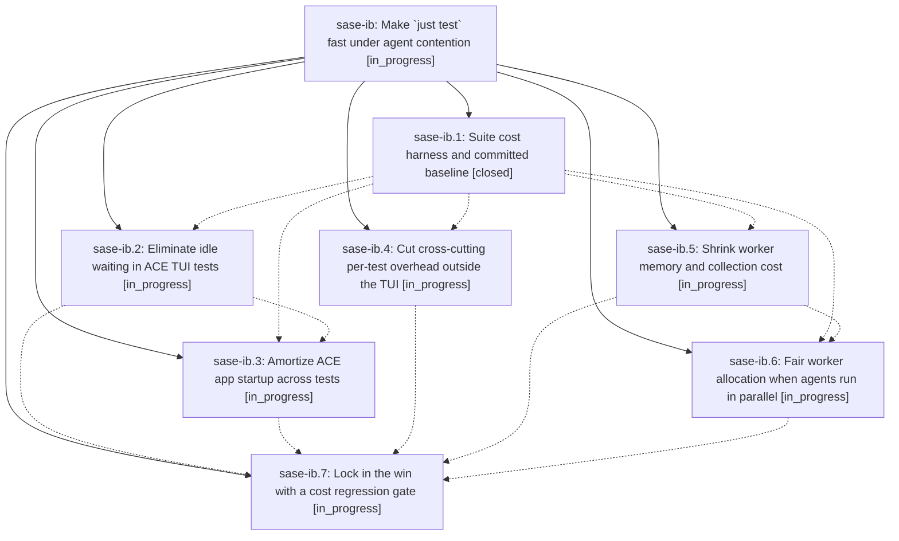

# Bead: sase-ib — Make \`just test\` fast under agent contention

[Bead Pages](../README.md) / sase-ib

**Status:** ◐ in_progress · **Type:** ▸ plan · **Tier:** epic
**Owner:** `bryanbugyi34@gmail.com` · **Created by:** [bbugyi200.athena.wk](https://github.com/sase-org/sase--agents/blob/main/agents/bbugyi200.athena.wk/README.md) · **Assignee:** `sase-ib.land`
**Created:** 2026-08-09 10:29:40 EDT
**Plan:** [202608/fast\_test\_suite\_1.md](https://github.com/sase-org/sase--plans/blob/main/202608/fast_test_suite_1.md)

## Description

`just test` runs the same 27,978 tests in roughly half the CPU-seconds and a fraction of the wall clock it costs today, on an idle host and — especially — when several SASE agents run it concurrently, with no test deleted, skipped, re-marked `slow`, or weakened, and with no increase in host CPU or memory pressure.

## Phases

| Bead | Title | Status | Size | Created | Agents | Commits |
|---|---|---|---|---|---:|---:|
| [sase-ib.1](sase-ib.1.md) | Suite cost harness and committed baseline | ✓ closed | medium | 2026-08-09 | 1 | 1 |
| [sase-ib.2](sase-ib.2.md) | Eliminate idle waiting in ACE TUI tests | ◐ in_progress | large | 2026-08-09 | 1 | 0 |
| [sase-ib.3](sase-ib.3.md) | Amortize ACE app startup across tests | ◐ in_progress | large | 2026-08-09 | 1 | 0 |
| [sase-ib.4](sase-ib.4.md) | Cut cross-cutting per-test overhead outside the TUI | ◐ in_progress | medium | 2026-08-09 | 1 | 0 |
| [sase-ib.5](sase-ib.5.md) | Shrink worker memory and collection cost | ◐ in_progress | medium | 2026-08-09 | 1 | 0 |
| [sase-ib.6](sase-ib.6.md) | Fair worker allocation when agents run in parallel | ◐ in_progress | medium | 2026-08-09 | 1 | 0 |
| [sase-ib.7](sase-ib.7.md) | Lock in the win with a cost regression gate | ◐ in_progress | small | 2026-08-09 | 1 | 0 |

## Lineage

## Agents

| Agent | Bead | Commits |
|---|---|---:|
| [bbugyi200.athena.sase-ib.1](https://github.com/sase-org/sase--agents/blob/main/agents/bbugyi200.athena.sase-ib.1/README.md) | [sase-ib.1](sase-ib.1.md) | 1 |
| [bbugyi200.athena.sase-ib.2](https://github.com/sase-org/sase--agents/blob/main/agents/bbugyi200.athena.sase-ib.2/README.md) | [sase-ib.2](sase-ib.2.md) | 0 |
| [bbugyi200.athena.sase-ib.3](https://github.com/sase-org/sase--agents/blob/main/agents/bbugyi200.athena.sase-ib.3/README.md) | [sase-ib.3](sase-ib.3.md) | 0 |
| [bbugyi200.athena.sase-ib.4](https://github.com/sase-org/sase--agents/blob/main/agents/bbugyi200.athena.sase-ib.4/README.md) | [sase-ib.4](sase-ib.4.md) | 0 |
| [bbugyi200.athena.sase-ib.5](https://github.com/sase-org/sase--agents/blob/main/agents/bbugyi200.athena.sase-ib.5/README.md) | [sase-ib.5](sase-ib.5.md) | 0 |
| [bbugyi200.athena.sase-ib.6](https://github.com/sase-org/sase--agents/blob/main/agents/bbugyi200.athena.sase-ib.6/README.md) | [sase-ib.6](sase-ib.6.md) | 0 |
| [bbugyi200.athena.sase-ib.7](https://github.com/sase-org/sase--agents/blob/main/agents/bbugyi200.athena.sase-ib.7/README.md) | [sase-ib.7](sase-ib.7.md) | 0 |
| [bbugyi200.athena.sase-ib.land](https://github.com/sase-org/sase--agents/blob/main/agents/bbugyi200.athena.sase-ib.land/README.md) | [sase-ib](README.md) | 0 |

## Commits

| Repo | Commit | Subject | Bead | Committed |
|---|---|---|---|---|
| sase | [`b5b5ded`](https://github.com/sase-org/sase/commit/b5b5ded84d919cdd885938bbef4f896ae44a5634) | test: add suite cost attribution lane | [sase-ib.1](sase-ib.1.md) | 2026-08-09 11:23:25 EDT |
