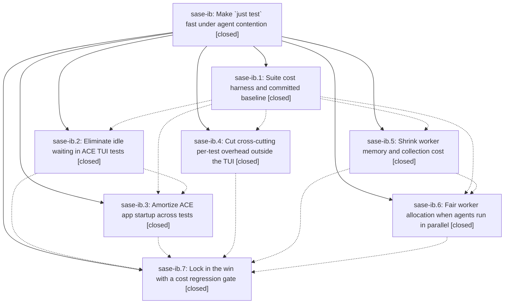

# Bead: sase-ib — Make \`just test\` fast under agent contention

[Bead Pages](../README.md) / sase-ib

**Status:** ✓ closed · **Resolution:** done · **Type:** ▸ plan · **Tier:** epic
**Owner:** `bryanbugyi34@gmail.com` · **Created by:** [bbugyi200.athena.wk](https://github.com/sase-org/sase--agents/blob/main/agents/bbugyi200.athena.wk/README.md) · **Assignee:** `sase-ib.land`
**Created:** 2026-08-09 10:29:40 EDT · **Closed:** 2026-08-10 08:51:38 EDT
**Plan:** [202608/fast\_test\_suite\_1.md](https://github.com/sase-org/sase--plans/blob/main/202608/fast_test_suite_1.md)

## Description

`just test` runs the same 27,978 tests in roughly half the CPU-seconds and a fraction of the wall clock it costs today, on an idle host and — especially — when several SASE agents run it concurrently, with no test deleted, skipped, re-marked `slow`, or weakened, and with no increase in host CPU or memory pressure.

## Notes

[2026-08-09T22:08:45Z · sase-i9.land] DISCOVERED ISSUE: 12-13 ACE TUI tests fail order-dependently on clean master, and 3 async tests hang the scoped suite forever. Found by sase-i9.land while landing epic sase-i9; confirmed NOT caused by sase-i9 (reproduced with that epic's diff stashed, tree clean at 4f54489af).

REPRODUCTION A (order-dependent failures, serial, no xdist):
  .venv/bin/python -m pytest tests/ace/tui/test_agents_onboarding.py tests/ace/tui/test_changespecs_onboarding.py tests/ace/tui/test_footer_visibility.py tests/ace/tui/test_agents_panel_fold_mounted.py tests/ace/tui/test_agent_metadata_search.py -q -p no:randomly
  -> 12 failed, 24 passed in 28.63s
Failing nodes: test_agents_onboarding.py::{test_agents_onboarding_visible_after_empty_load_direct_agents_tab, test_agents_onboarding_visible_for_hidden_only_workflow, test_agents_onboarding_reappears_after_last_visible_agent_disappears}; test_changespecs_onboarding.py::{test_patches_onboarding_visible_after_empty_startup, test_patches_onboarding_visible_when_saved_queries_exist, test_patches_onboarding_visible_when_specs_are_filtered_out, test_patches_onboarding_reappears_after_last_patch_disappears, test_patches_onboarding_ignores_saved_query_cache_invalidates}; test_footer_visibility.py::{test_custom_footer_status_visible_in_normal_one_line_state, test_leader_footer_final_grid_row_visible}; test_agents_panel_fold_mounted.py::test_mounted_clan_fold_chords_zoom_and_patch_isolation; test_agent_metadata_search.py::test_inline_metadata_search_commit_repeat_q_and_passthrough. A 13th, test_agents_onboarding_visible_after_empty_load_tab_switch, also failed in the wider 60-file scoped selection (13 failed, 613 passed).

KEY EVIDENCE -- it is pollution, not a deterministic break: every one of these passes when run alone. 'pytest tests/ace/tui/test_footer_visibility.py::test_leader_footer_final_grid_row_visible' passes; running just that 2-test MODULE fails it; running the 5 modules together fails 12. So shared ACE app/page state leaks across tests within and between modules. This is a serial, non-xdist reproduction, so it is NOT the sase-ct/sase-h8 parallel flake class.

REPRODUCTION B (hard hang): 'just check' in workspace sase_10 wedged at 99% for 40+ min and never exited. py-spy on the 6 xdist workers: 3 stuck in MainThread at pytest_asyncio/plugin.py:905 -> asyncio run_until_complete -> selectors.py:452 select(), i.e. an async test awaiting something that never resolves; the xdist master sat in dsession.py:154 queue.get forever. Hung worker locals show the funcargs include the '_test_llm_bin' fixture (tests/conftest.py). Leaked threads visible in idle workers: 'sase-ace-task-mirror', 'sase-tui-toast-log-writer'. There is no per-test timeout, so this hangs the suite indefinitely rather than failing.

WHY THIS EPIC: phases sase-ib.2 (cfe18d7f0, 'make ACE TUI waits event-driven') and sase-ib.3 (44bf25f84, 'amortize ACE test app startup', which added src/sase/ace/testing/ace_page_group.py + _stylesheet_cache.py and the AcePageGroup shared-app checkout) are the only recent changes to ACE TUI test app lifecycle and wait semantics, which is exactly the surface both symptoms implicate. CAVEAT -- I did NOT bisect, so attribution is circumstantial: note that tests/ace/tui/ace_page_group_files.txt currently lists only test_vim_normal_key_containment.py, so the failing modules are not yet on AcePageGroup, which points more at sase-ib.2's event-driven waits (or the leaked background threads) than at the shared-app checkout. sase-ib.7 ('Lock in the win with a cost regression gate') is still open and is the natural place to add both an isolation-pollution check and a per-test timeout so a wedged async test fails instead of hanging. If sase-ib.land bisects this to a commit outside this epic, please reassign.

IMPACT: 'just check'/'just check-full' cannot go green for any agent on master, and the hang burns a full agent slot until killed.

[2026-08-10T12:00:23Z · toobig-2a.split_file.src.sase.dev_update.prebuild.0] DISCOVERED ISSUE: Independent recurrence on 2026-08-10 during the full-suite escalation for an unrelated dev_update/prebuild.py split. The governed xdist run reached 99% with 28,154 passes, then made no progress for over six minutes; py-spy showed multiple workers stuck at pytest_asyncio/plugin.py:905 -> asyncio run_until_complete -> selectors.py:452 select(), and another worker retained multiple idle sase-ace-task-mirror threads. This matches the existing hard-hang signature on this epic. Before interruption, the run also reproduced the already-recorded serial/order-pollution failures in agent onboarding, changespec onboarding, footer visibility, mounted navigation, and agent metadata search. The refactor's 48 focused tests pass and none of the 24 displayed failures touch dev_update.

[2026-08-10T12:02:43Z · toobig-2a.split_file.src.sase.dev_update.prebuild.0] SUPPLEMENTARY EVIDENCE: All 10 additional TUI nodes that failed before the 99% hang pass in fresh one-node pytest processes (agent-group revival x2; artifacts beads navigation; artifacts commits/bugs/plans/non-PR navigation x4; prompt glossary navigation; plugin action modal scrolling; commits timeline rendering). This confirms the displayed TUI failures are suite-order/shared-state pollution rather than deterministic regressions in those features or the unrelated prebuild refactor.

[2026-08-10T12:50:49Z · sase-ik.land] DISCOVERED ISSUE (proposed by sase-ik.3; independently reproduced by sase-ik.land): phase sase-ik.3 recorded the prompt-highlighting visual file timing out existing cases on pending prompt-catalog:0 while its new wrapped snapshot passed focused, plus a full just test lane non-terminal beyond 12 minutes. Landing reproduction on 2026-08-10 ran governed just test-cost with four workers under host contention: it reached 99% with 26 failures / 28,168 passes, then all four workers were stuck in pytest_asyncio run_until_complete -> selectors.select with leaked sase-ace-task-mirror/toast-writer threads; interrupted at 14:46. The full lane failed test_k_on_glossary_term_pushes_glossary_preview_card, while today’s focused 58-test glossary/ACE suite passed that exact node. This exactly corroborates the active epic’s existing async-hang/shared-state-pollution issue and is not caused by glossary epic sase-ik; duplicate umbrella evidence was also added to sase-ct.

[2026-08-10T12:51:38Z · sase-ib.land] Verified all 7 phases (deliverables present in tree, commits b5b5ded84/cfe18d7f0/44bf25f84/98d95848a/35d2d51f9/2e55ed330/ee9603d31) and every child note, then root-caused and fixed the two defects this epic caused and its phases had recorded as unexplained.

CAUSE 1 (this bead's DISCOVERED ISSUE: 12-13 order-dependent ACE TUI failures): sase-ib.3's fast stylesheet cache deepcopied `rules` and `rules_map` in two separate calls. `RuleSet` hashes by identity and `Stylesheet.apply` narrows `rules` by membership in a set built from `rules_map`, so a hydrated stylesheet matched ZERO rules and every ACE app after the first in a worker booted with no CSS at all. Fixed by copying both halves in one deepcopy; regression test asserts indexed rule ids are a subset of the rule-list ids and that cached and freshly parsed apps yield identical widget geometry.

CAUSE 2 (the hard hang): sase-ib.2's settle barrier awaited `MessagePump.wait_for_refresh()`, which discards the `post_message` result and awaits its event unconditionally. A closed pump leaves that waiter with nothing to wake it and there is no per-test timeout, so the suite wedges instead of failing. Fixed with a pump-state check plus a bounded 15s backstop; 2 tests.

CAUSE 3: sase-ib.7 filed test_revive_agent_modal ctrl+k as an unrelated deterministic break. It is epic work: the epic's faster settle stopped masking a bare `pilot.pause()` over a worker/`asyncio.to_thread` page load. Both bare pauses replaced with end-state waits.

INTEGRATION with post-epic commits: (a) sase-ib.4 added tests/main/parser_cli_helpers.py::parse_sase_args; 59ea423c6 landed afterward and added 11 new full `create_parser()` builds in tests/test_bead/test_cli_list.py -- converted all 35 sites there. (b) sase-ib.7 switched `just check-full` from `just test` to `just test-cost`, silently removing the landing gate from the selection-health failure store because `cost` was not in FULL_LANE_MODES; added HEALTH_RECORDING_MODES so the cost lane records failures while staying out of TIMINGS_RECORDING_MODES (its probe taxes exactly the durations that table is for), plus a test and docs.

VERIFIED: `just lint` green on all 11 gates. This bead's REPRODUCTION A now passes 36/36 (was 12 failed / 24 passed). tests/ace (8659 nodes, xdist -n4) completes in 431s with NO hang. Focused tests for every changed file pass (101). `just check` passes every lint gate and SASE validation and then fails only at validate-committed-plans on 202608/new_task_recent_task_sweep.md missing `size` -- a pre-existing break from sase-il.3, corroborated on epic sase-il, not this epic's. The one ACE failure, test_following_a_live_store_row_bypasses_the_mtime_cache[success-True], is the already-filed sase-ii and passes in a fresh serial process (+1 recorded). The full governed lane could not be run: it escalates (selection-tooling) and three peer agents held all 32 worker tokens.

FOLLOW-UPS: sase-ib.4 subprocess cost-bucket split -> new task sase-ip (medium, ready). sase-ib.6 VCS-log flake -> recorded on active epic sase-i8. sase-ib.7 contract-manifest breakage -> recorded on active epic sase-ij. sase-ib.7 ctrl+k modal failure and full-lane ACE failures/hang -> declined as separate tasks; both epic-caused and fixed here. sase-ib.7 fmt-md-check and memory-README drift proposals -> declined as no longer reproducing (0c2d5dd71 fixed it; `fmt (markdown)` and `SASE validation` both pass), noted on sase-if/sase-ig/sase-ih.

## Phases

| Bead | Title | Status | Size | Created | Agents | Commits |
|---|---|---|---|---|---:|---:|
| [sase-ib.1](sase-ib.1.md) | Suite cost harness and committed baseline | ✓ closed | medium | 2026-08-09 | 1 | 1 |
| [sase-ib.2](sase-ib.2.md) | Eliminate idle waiting in ACE TUI tests | ✓ closed | large | 2026-08-09 | 1 | 1 |
| [sase-ib.3](sase-ib.3.md) | Amortize ACE app startup across tests | ✓ closed | large | 2026-08-09 | 1 | 1 |
| [sase-ib.4](sase-ib.4.md) | Cut cross-cutting per-test overhead outside the TUI | ✓ closed | medium | 2026-08-09 | 1 | 1 |
| [sase-ib.5](sase-ib.5.md) | Shrink worker memory and collection cost | ✓ closed | medium | 2026-08-09 | 1 | 1 |
| [sase-ib.6](sase-ib.6.md) | Fair worker allocation when agents run in parallel | ✓ closed | medium | 2026-08-09 | 1 | 1 |
| [sase-ib.7](sase-ib.7.md) | Lock in the win with a cost regression gate | ✓ closed | small | 2026-08-09 | 1 | 1 |

## Lineage

## Agents

| Agent | Bead | Commits |
|---|---|---:|
| [bbugyi200.athena.sase-ib.1](https://github.com/sase-org/sase--agents/blob/main/agents/bbugyi200.athena.sase-ib.1/README.md) | [sase-ib.1](sase-ib.1.md) | 1 |
| [bbugyi200.athena.sase-ib.2](https://github.com/sase-org/sase--agents/blob/main/families/bbugyi200.athena.sase-ib.2.md) | [sase-ib.2](sase-ib.2.md) | 1 |
| [bbugyi200.athena.sase-ib.3](https://github.com/sase-org/sase--agents/blob/main/families/bbugyi200.athena.sase-ib.3.md) | [sase-ib.3](sase-ib.3.md) | 1 |
| [bbugyi200.athena.sase-ib.4](https://github.com/sase-org/sase--agents/blob/main/agents/bbugyi200.athena.sase-ib.4/README.md) | [sase-ib.4](sase-ib.4.md) | 1 |
| [bbugyi200.athena.sase-ib.5](https://github.com/sase-org/sase--agents/blob/main/agents/bbugyi200.athena.sase-ib.5/README.md) | [sase-ib.5](sase-ib.5.md) | 1 |
| [bbugyi200.athena.sase-ib.6](https://github.com/sase-org/sase--agents/blob/main/agents/bbugyi200.athena.sase-ib.6/README.md) | [sase-ib.6](sase-ib.6.md) | 1 |
| [bbugyi200.athena.sase-ib.7](https://github.com/sase-org/sase--agents/blob/main/agents/bbugyi200.athena.sase-ib.7/README.md) | [sase-ib.7](sase-ib.7.md) | 1 |
| [bbugyi200.athena.sase-ib.land](https://github.com/sase-org/sase--agents/blob/main/agents/bbugyi200.athena.sase-ib.land/README.md) | [sase-ib](README.md) | 1 |

## Commits

| Repo | Commit | Subject | Bead | Committed |
|---|---|---|---|---|
| sase | [`b5b5ded`](https://github.com/sase-org/sase/commit/b5b5ded84d919cdd885938bbef4f896ae44a5634) | test: add suite cost attribution lane | [sase-ib.1](sase-ib.1.md) | 2026-08-09 11:23:25 EDT |
| sase | [`98d9584`](https://github.com/sase-org/sase/commit/98d95848a6d7a8e278ab0686a51aaa9d74c65eb1) | perf: reduce repeated non-TUI test overhead | [sase-ib.4](sase-ib.4.md) | 2026-08-09 12:27:30 EDT |
| sase | [`35d2d51`](https://github.com/sase-org/sase/commit/35d2d51f9a84d02c75eed244f39e867853520836) | perf: reduce fast test collection footprint | [sase-ib.5](sase-ib.5.md) | 2026-08-09 13:09:23 EDT |
| sase | [`cfe18d7`](https://github.com/sase-org/sase/commit/cfe18d7f0de46080e1a5b9e509845261e543b946) | perf(test): make ACE TUI waits event-driven | [sase-ib.2](sase-ib.2.md) | 2026-08-09 13:22:25 EDT |
| sase | [`2e55ed3`](https://github.com/sase-org/sase/commit/2e55ed33011088281f658b53978d1a799da209dc) | fix(test): share default pytest worker tokens fairly | [sase-ib.6](sase-ib.6.md) | 2026-08-09 13:49:07 EDT |
| sase | [`44bf25f`](https://github.com/sase-org/sase/commit/44bf25f84fecc2ee32c0c6fc8cf58a642f0f632b) | perf(ace): amortize ACE test app startup | [sase-ib.3](sase-ib.3.md) | 2026-08-09 14:35:04 EDT |
| sase | [`ee9603d`](https://github.com/sase-org/sase/commit/ee9603d31e67a10f54b3a13fbf88e7cd55158572) | test: add suite cost regression budgets | [sase-ib.7](sase-ib.7.md) | 2026-08-10 07:52:38 EDT |
| sase | [`354d8c1`](https://github.com/sase-org/sase/commit/354d8c19f9aac646448b58ab6259d7333ba1f9f1) | fix(ace): apply cached stylesheets and bound the settle barrier | [sase-ib](README.md) | 2026-08-10 08:53:27 EDT |
