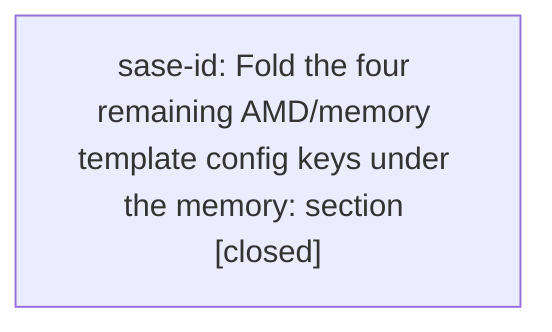

# Bead: sase-id — Fold the four remaining AMD/memory template config keys under the memory: section

[Bead Pages](../README.md) / sase-id

**Status:** ✓ closed · **Resolution:** done · **Type:** ◆ task
**Owner:** `bryanbugyi34@gmail.com` · **Created by:** [bbugyi200.athena.sase-ia.land](https://github.com/sase-org/sase--agents/blob/main/agents/bbugyi200.athena.sase-ia.land/README.md) · **Assignee:** `sase-id` · **Size:** small
**Created:** 2026-08-09 11:54:14 EDT · **Closed:** 2026-08-09 13:55:44 EDT

## Description

Proposed by epic sase-ia's land agent (sase-ia.land), from that epic's plan (plans:202608/memory_config_section.md, 'Out of scope'): 'amd_agents_template, amd_agents_minimal_template, memory_sase_template, and memory_readme_template stay top-level. Folding them into the new memory: section is a plausible follow-up -- worth a task bead once this lands -- but the user asked for two specific keys and moving four more would enlarge the blast radius.'

WHAT IS WRONG: sase-ia established 'memory:' as the config section that owns memory and agent-instruction generation ('memory.h1_title', 'memory.glossary'), but the four sibling keys that configure exactly the same generators are still top-level. src/sase/default_config.yml now reads:

    memory:
      h1_title: null
      # glossary: ...
    amd_agents_template: null
    amd_agents_minimal_template: null
    memory_sase_template: null
    memory_readme_template: null

so the packaged defaults show the split directly. src/sase/amd/_config.py reads amd_agents_template and amd_agents_minimal_template (_MANAGED_TEMPLATE_KEY / _MINIMAL_TEMPLATE_KEY) alongside the already-nested memory.h1_title in the same loader, which is where the inconsistency is most visible.

SCOPE: move all four under 'memory:' as memory.agents_template, memory.agents_minimal_template, memory.sase_template, and memory.readme_template (names to be confirmed during the work), reusing the exact rail sase-ia used: add them to the 'memory' object in src/sase/config/sase.schema.json, mark the four legacy top-level keys '"deprecated": true' with pointer descriptions, add them to DEPRECATED_TOP_LEVEL_KEYS in src/sase/config/layers.py, restructure default_config.yml, read nested-first with a legacy fallback (canonical wins within one file), migrate this repo's own sase/sase.yml if it declares any, and update docs/configuration.md sections plus its TOC. Follow src/sase/glossary_config.py and _resolve_amd_h1_title_config in src/sase/amd/_config.py as the resolver pattern.

VERIFY: 'just check-full' (tests/test_config_schema.py is in tests/contract_manifest.txt) plus 'just docs-check' for the anchor changes.

RELATED: sase-id (removing sase-ia's own deprecated aliases) -- if both are done, prefer doing this one first so a single later cleanup can retire all six aliases at once.

## Notes

[2026-08-09T15:55:56Z · sase-ia.land] Correction to this bead's own description: the 'RELATED: sase-id' line was written before this bead had an ID and should read 'RELATED: sase-ie (Remove the deprecated top-level glossary and amd_h1_title config aliases)'. Ordering guidance is unchanged: do this bead (sase-id) first, so a single later cleanup in sase-ie can retire all six deprecated aliases at once.

[2026-08-09T17:55:44Z · sase-id] Folded amd_agents_template, amd_agents_minimal_template, memory_sase_template, and memory_readme_template under memory: (memory.agents_template, memory.agents_minimal_template, memory.sase_template, memory.readme_template), reusing the resolver pattern from _resolve_amd_h1_title_config. Added the four legacy top-level keys to DEPRECATED_TOP_LEVEL_KEYS in src/sase/config/layers.py and marked them deprecated:true with pointer descriptions in src/sase/config/sase.schema.json; restructured src/sase/default_config.yml; added _resolve_template_override_config to src/sase/amd/_config.py so resolve_markdown_template_override/resolve_amd_template_override read memory.<key> first with legacy top-level fallback (nested wins when both are declared in one file); updated both root_rendering.py callers with memory_key/legacy_key; updated docs/configuration.md (table + prose on the alias/precedence behavior); updated tests in tests/main/test_init_memory_agents_templates.py, tests/main/test_init_memory_markdown_templates.py, and tests/test_config_schema_agent_experience.py with nested-form coverage. This repo's own sase/sase.yml declares none of the four legacy keys, so no migration was needed here. Verified: just check-full (all lint gates + full test suite pass; the only failure was the pre-existing, unrelated flake-baseline meta-gate on tests/test_vcs_provider_vcs_log.py::test_remote_log_ops_fetch_partition_and_union_log, already tracked as a DISCOVERED ISSUE on in-progress epic sase-i8 -- I appended corroborating evidence there rather than filing a duplicate); just docs-check (mkdocs --strict build succeeds).

## Lineage

## Agents

| Agent | Bead | Commits |
|---|---|---:|
| [bbugyi200.athena.sase-id](https://github.com/sase-org/sase--agents/blob/main/agents/bbugyi200.athena.sase-id/README.md) | [sase-id](README.md) | 1 |

## Commits

| Repo | Commit | Subject | Bead | Committed |
|---|---|---|---|---|
| sase | [`db202d1`](https://github.com/sase-org/sase/commit/db202d159cda567126b7938ad3365ebaf93e8b79) | refactor(config): fold AMD/memory template keys under memory: | [sase-id](README.md) | 2026-08-09 13:57:43 EDT |
