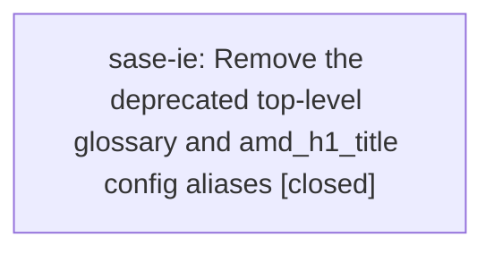

# Bead: sase-ie — Remove the deprecated top-level glossary and amd\_h1\_title config aliases

[Bead Pages](../README.md) / sase-ie

**Status:** ✓ closed · **Resolution:** done · **Type:** ◆ task
**Owner:** `bryanbugyi34@gmail.com` · **Created by:** [bbugyi200.athena.sase-ia.land](https://github.com/sase-org/sase--agents/blob/main/agents/bbugyi200.athena.sase-ia.land/README.md) · **Assignee:** `sase-ie` · **Size:** small
**Created:** 2026-08-09 11:55:18 EDT · **Closed:** 2026-08-09 13:26:07 EDT

## Description

Proposed by epic sase-ia's land agent (sase-ia.land), from that epic's plan (plans:202608/memory_config_section.md, 'Out of scope'): 'Removing the deprecated aliases. That should become a follow-up task bead filed after the chezmoi change is applied on every machine, so the aliases have actually gone unused.'

CONTEXT: sase-ia moved 'glossary' -> 'memory.glossary' and 'amd_h1_title' -> 'memory.h1_title', keeping both legacy top-level keys working as deprecated aliases so no repo silently lost its glossary or its generated AGENTS.md title mid-migration.

THE PRECONDITION IS NOW MET (verified 2026-08-09 by sase-ia.land):
  - sase's own sase/sase.yml uses memory.h1_title + memory.glossary.
  - bob-cli's sase/sase.yml uses memory.glossary (origin/master 5692b27).
  - actstat declares neither key.
  - The chezmoi source file home/dot_config/sase/sase_athena.yml was migrated AND has been applied: the deployed /home/bryan/.config/sase/sase_athena.yml now reads 'memory:\n  h1_title: ...'.
  - 'sase config layers' reports no deprecated-key diagnostics for any loaded layer.
  - home/dot_config/sase/sase.yml and sase_kellys_mbp.yml declare neither key.
So no config SASE knows about still uses either alias. Before removing, re-confirm the same on any machine other than athena that has a deployed ~/.config/sase overlay.

SCOPE: drop 'amd_h1_title' and 'glossary' from DEPRECATED_TOP_LEVEL_KEYS in src/sase/config/layers.py; remove the two deprecated top-level properties from src/sase/config/sase.schema.json (keeping the glossaryEntry definition, which memory.glossary uses); delete the legacy branches from _resolve_amd_h1_title_config in src/sase/amd/_config.py and resolve_glossary_config in src/sase/glossary_config.py (LEGACY_GLOSSARY_CONFIG_KEY_PATH and the top-level fallback), simplifying the resolvers to the nested path only; drop the now-dead legacy-fallback and precedence tests (tests/main/test_init_memory_validation.py::test_memory_plan_reads_legacy_amd_title_as_fallback and ::test_memory_plan_prefers_memory_h1_title_over_legacy_amd_title, tests/main/test_init_memory_glossary.py::test_memory_plan_legacy_top_level_glossary_still_generates and ::test_memory_plan_prefers_memory_glossary_over_legacy_top_level, tests/xprompt/test_glossary_catalog.py::test_catalog_legacy_top_level_glossary_still_loads and ::test_catalog_prefers_memory_glossary_over_legacy_top_level, the legacy cases in tests/test_config_schema.py and tests/test_config_schema_agent_experience.py, and the legacy layer in tests/test_config_inventory.py); update the deprecation notes in docs/configuration.md (around lines 452 and 517); and drop the legacy branch from glossary_scope_paths() in sase-core's crates/sase_core/src/config/provenance.rs plus its parity coverage (open sase-core with /sase_repo).

Consider whether a removed key should become an UNSUPPORTED_TOP_LEVEL_KEYS entry rather than silently ignored, so a not-yet-migrated third-party config gets a loud diagnostic instead of a quietly missing glossary -- that silent-failure mode is the exact reason sase-ia kept the aliases in the first place.

VERIFY: 'just check-full' plus 'just docs-check'; 'cargo test -p sase_core --test config_parity' in sase-core.

RELATED: sase-id folds four more keys (amd_agents_template, amd_agents_minimal_template, memory_sase_template, memory_readme_template) under memory:. If both are scheduled, do sase-id first so one cleanup can retire all six aliases together.

## Notes

[2026-08-09T17:26:07Z · sase-ie] Removed the deprecated top-level amd_h1_title and glossary config aliases (precondition verified pre-existing: no known config still used them). Dropped amd_h1_title/glossary from DEPRECATED_TOP_LEVEL_KEYS and added them to UNSUPPORTED_TOP_LEVEL_KEYS in src/sase/config/layers.py so a stale config now gets a loud diagnostic instead of silent legacy support; removed the two deprecated top-level schema properties from sase.schema.json (kept glossaryEntry); deleted the legacy branches from _resolve_amd_h1_title_config (src/sase/amd/_config.py) and resolve_glossary_config (src/sase/glossary_config.py, including LEGACY_GLOSSARY_CONFIG_KEY_PATH); removed the now-dead legacy-fallback/precedence tests in tests/main/test_init_memory_validation.py, tests/main/test_init_memory_glossary.py, tests/xprompt/test_glossary_catalog.py, tests/test_config_schema.py, tests/test_config_schema_agent_experience.py, and tests/test_config_inventory.py; updated the deprecation notes in docs/configuration.md; and dropped the legacy top-level glossary branch from glossary_scope_paths() plus its parity test in sase-core's crates/sase_core/src/config/provenance.rs and crates/sase_core/tests/config_parity.rs. Verified: cargo test -p sase_core --test config_parity (20 passed); just check-full (all lint gates + full test suite pass -- the only failure was the unrelated flake-baseline meta-gate on tests/test_vcs_provider_vcs_log.py::test_remote_log_ops_fetch_partition_and_union_log, which I traced to VCS-provider-log code and recorded as a DISCOVERED ISSUE on the causally-linked in-progress epic sase-i8 rather than treating as blocking here); just docs-check (mkdocs --strict build succeeds).

## Lineage

## Agents

| Agent | Bead | Commits |
|---|---|---:|
| [bbugyi200.athena.sase-ie](https://github.com/sase-org/sase--agents/blob/main/agents/bbugyi200.athena.sase-ie/README.md) | [sase-ie](README.md) | 1 |

## Commits

| Repo | Commit | Subject | Bead | Committed |
|---|---|---|---|---|
| sase | [`cc5894a`](https://github.com/sase-org/sase/commit/cc5894a06d78979f91f9311d1c49b4b566f079e8) | feat!: remove deprecated top-level amd\_h1\_title and glossary config aliases | [sase-ie](README.md) | 2026-08-09 13:27:28 EDT |
