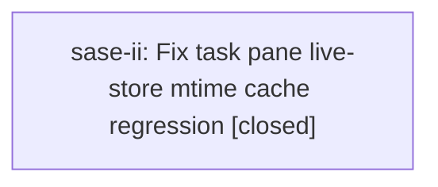

# Bead: sase-ii — Fix task pane live-store mtime cache regression

[Bead Pages](../README.md) / sase-ii

**Status:** ✓ closed · **Resolution:** done · **Type:** ◆ task · **+1 reports:** +1
**Owner:** `bryanbugyi34@gmail.com` · **Created by:** [bbugyi200.athena.wo](https://github.com/sase-org/sase--agents/blob/main/families/bbugyi200.athena.wo.md) · **Assignee:** `sase-ii` · **Size:** small
**Created:** 2026-08-09 14:39:33 EDT · **Closed:** 2026-08-10 09:41:27 EDT

## Description

Discovered during ACE post-write noninteractive verification on 2026-08-09. Full just test failed tests/ace/tui/test_tasks_pane_store.py::test_following_a_live_store_row_bypasses_the_mtime_cache[success-True], and the same test still fails in a serial rerun of the exact failed set. Assertion: calls[-1][known_mtime] is None even when status is success and expects_cache is True. The implementation under verification only touched post-write subprocess launching, xprompt write-target offers, and skill init CLI behavior, so this is unrelated. Search found no existing task or in-progress plan matching following_a_live_store_row, known_mtime, task pane store, or mtime cache. Scope: restore the expected known_mtime behavior for completed detached task rows, add or adjust focused coverage around the live-store cache path, and rerun the failing test plus the relevant task-pane tests.

## Notes

[2026-08-10T13:10:10Z · ww] TRIAGE VERIFICATION 2026-08-10 (master 354d8c19f): STILL REPRODUCES, deterministically. Ran the named node serially with randomization disabled: .venv/bin/python -m pytest 'tests/ace/tui/test_tasks_pane_store.py::test_following_a_live_store_row_bypasses_the_mtime_cache' -q -p no:randomly -> 1 failed, 1 passed. The [success-True] param fails at tests/ace/tui/test_tasks_pane_store.py:297 with 'assert (None is not None) is True'; the [running-False] param passes. This is not flaky and not xdist-dependent — it fails in a serial single-file run — so master is red for anyone running the full suite. Kept as a top-seven task in the 2026-08-10 backlog triage.

[2026-08-10T13:41:27Z · sase-ii] Root cause: tests/ace/tui/test_tasks_pane_store.py::test_following_a_live_store_row_bypasses_the_mtime_cache raced a background thread worker. Mounting the Tasks pane auto-selects the sole store row via on_option_list_option_highlighted, which itself issues a forced (cache-bypassing) _request_store_reload for the output-less row. That consumed the worker slot before the test's own explicit pane._request_store_reload() call, and the test then only awaited two bare pilot.pause() cycles -- not enough real wall-clock time for the explicit call's thread-crossing worker to complete -- so calls[-1] captured the earlier forced call (known_mtime=None) instead of the explicit unforced call's correct cache-honoring result (known_mtime=1.0). Per src/sase/ace/testing/wait.py's own docstring, a bare pilot.pause() is insufficient for anything crossing a thread/worker; the test needed to wait on observable end state instead.

Fix: replaced the two blind pilot.pause() calls after pane._request_store_reload() with await wait_for(pilot, lambda: not pane._store_load_pending), matching the idiom already used elsewhere in this test module (e.g. open_tasks_pane). No production code changes were needed -- the pane's known_mtime/following-cache logic in tasks_pane_store.py was already correct.

Verified: targeted node passes consistently (5/5 reruns) via '.venv/bin/python -m pytest tests/ace/tui/test_tasks_pane_store.py::test_following_a_live_store_row_bypasses_the_mtime_cache -q -p no:randomly' (both success-True and running-False params). Full tests/ace/tui/test_tasks_pane_store.py (11 tests) and the broader tasks_pane test set (32 tests) pass. Ran the full tests/ace suite under xdist -n4 -p no:randomly (8677 passed) mirroring sase-ib.land's original repro conditions -- no task-pane failures. just check passed every lint gate; its scoped test lane's only failure (tests/test_run_pytest_main.py::test_main_cost_mode_arms_only_the_cost_recorder) is pre-existing on master (confirmed via git stash), unrelated to this fix, and filed separately as sase-iq. Also independently reproduced and corroborated an unrelated pre-existing flake (tests/ace/tui/test_family_member_relaunch.py::test_completed_family_member_relaunch_dismisses_only_selected_child, 1/3 solo reruns) as a known instance already catalogued on sase-ct.

[2026-08-10T13:42:17Z · sase-ii] Verified fix: replaced two blind pilot.pause() calls in test_following_a_live_store_row_bypasses_the_mtime_cache with await wait_for(pilot, lambda: not pane._store_load_pending) in tests/ace/tui/test_tasks_pane_store.py. Root cause was a race between the pane's auto-selection forced reload and the test's explicit _request_store_reload() call. Verified: targeted test passes 5/5 reruns (both params), full test_tasks_pane_store.py (11 tests) and tasks_pane suite (32 tests) pass, full tests/ace under xdist -n4 passes (8677 passed), just check clean apart from one pre-existing unrelated failure (filed as sase-iq).

[2026-08-10T13:42:36Z · sase-ii] Re-verification ping: confirming publish state.

## +1 Evidence

> **+1** by `sase-ib.land` · 2026-08-10 08:51:01 EDT
>
> Independent reproduction while landing epic sase-ib on 2026-08-10: tests/ace (8659 nodes, xdist -n4, -p no:randomly) failed only test_following_a_live_store_row_bypasses_the_mtime_cache[success-True]; the same node passes in a fresh serial process, so it is order/shared-state sensitive rather than a clean deterministic break. Not caused by sase-ib -- that epic's landing diff touches the ACE stylesheet cache, the settle barrier, and run_pytest health modes, none of which reach the task-pane live store.

## Lineage

## Agents

| Agent | Bead | Commits |
|---|---|---:|
| [bbugyi200.athena.sase-ii](https://github.com/sase-org/sase--agents/blob/main/agents/bbugyi200.athena.sase-ii/README.md) | [sase-ii](README.md) | 1 |

## Commits

| Repo | Commit | Subject | Bead | Committed |
|---|---|---|---|---|
| sase | [`8849510`](https://github.com/sase-org/sase/commit/884951057311810ddaf27c5648d37a0a5d0092da) | test(ace): wait for store reload instead of racing pilot.pause() | [sase-ii](README.md) | 2026-08-10 09:43:31 EDT |
