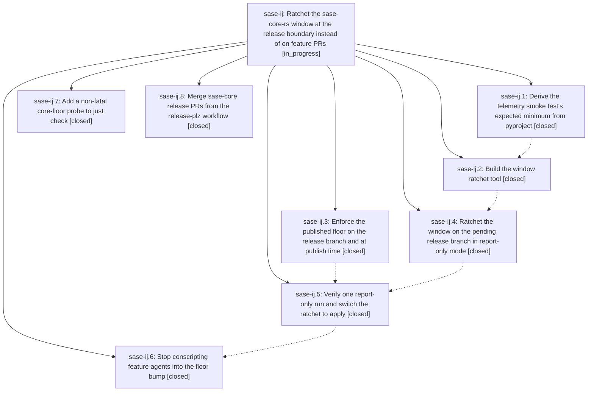

# Bead: sase-ij — Ratchet the sase-core-rs window at the release boundary instead of on feature PRs

[Bead Pages](../README.md) / sase-ij

**Status:** ◐ in_progress · **Type:** ▸ plan · **Tier:** epic
**Owner:** `bryanbugyi34@gmail.com` · **Created by:** [bbugyi200.athena.wq](https://github.com/sase-org/sase--agents/blob/main/agents/bbugyi200.athena.wq/README.md) · **Assignee:** `sase-ij.land`
**Created:** 2026-08-09 15:17:19 EDT
**Plan:** [202608/core\_window\_ratchet.md](https://github.com/sase-org/sase--plans/blob/main/202608/core_window_ratchet.md)

## Description

A feature agent can call a newly landed sase-core binding or behavior without editing pyproject.toml, uv.lock, or a version literal, and without waiting on a core release; the published-floor invariant is enforced once, mechanically, on the pending sase release instead of ~1.2 times a day by a dedicated agent.

## Notes

[2026-08-10T12:00:56Z · toobig-2a.split_file.src.sase.dev_update.prebuild.0] DISCOVERED ISSUE: The full-suite escalation for an unrelated dev_update/prebuild.py refactor independently found tests/test_contract_manifest.py::{test_contract_manifest_matches_marker_selection,test_contract_set_manifest_entry_budget_has_no_hidden_headroom} failing deterministically. collect_contract_files now includes tests/test_probe_core_floor_tool.py, added by this epic's phase sase-ij.7, but tests/contract_manifest.txt still omits it and the 36-entry budget was not re-curated; the current selected set has 37 entries. This is causally linked to the active core-window-ratchet epic rather than the prebuild split.

[2026-08-10T12:24:29Z · sase-ib.land] DISCOVERED ISSUE: tests/test_contract_manifest.py fails deterministically on master (ee9603d31), blocking `just check` / `just check-full` for every agent. Phase sase-ij.7 (f43d6e4fe) added tests/test_probe_core_floor_tool.py with `pytestmark = pytest.mark.contract` but did not run `just refresh-contract-manifest` or update the entry budget. Two failures: (1) test_contract_manifest_matches_marker_selection -- marker selection now yields 37 files including tests/test_probe_core_floor_tool.py while tests/contract_manifest.txt still lists 36 without it; (2) test_contract_set_manifest_entry_budget_has_no_hidden_headroom -- refreshing the manifest alone then trips the 36-entry _MANIFEST_ENTRY_BUDGET cap, whose failure message requires re-curating the contract set by value per second and updating the cap plus its measured-cost comment per plans/202608/test_suite_tier1.md. Reproduced by sase-ib.land at ee9603d31 with a clean tree (`.venv/bin/python -m pytest tests/test_contract_manifest.py -q -p no:randomly` -> 2 failed, 1 passed); first reported by phase sase-ib.7 as a PROPOSED FOLLOW-UP. Left unfixed while landing epic sase-ib because the budget bump is a deliberate curation decision this epic owns, not a mechanical refresh.

## Phases

| Bead | Title | Status | Size | Created | Agents | Commits |
|---|---|---|---|---|---:|---:|
| [sase-ij.1](sase-ij.1.md) | Derive the telemetry smoke test's expected minimum from pyproject | ✓ closed | small | 2026-08-09 | 1 | 1 |
| [sase-ij.2](sase-ij.2.md) | Build the window ratchet tool | ✓ closed | medium | 2026-08-09 | 1 | 1 |
| [sase-ij.3](sase-ij.3.md) | Enforce the published floor on the release branch and at publish time | ✓ closed | medium | 2026-08-09 | 1 | 1 |
| [sase-ij.4](sase-ij.4.md) | Ratchet the window on the pending release branch in report-only mode | ✓ closed | medium | 2026-08-09 | 1 | 1 |
| [sase-ij.5](sase-ij.5.md) | Verify one report-only run and switch the ratchet to apply | ✓ closed | small | 2026-08-09 | 1 | 1 |
| [sase-ij.6](sase-ij.6.md) | Stop conscripting feature agents into the floor bump | ✓ closed | small | 2026-08-09 | 1 | 1 |
| [sase-ij.7](sase-ij.7.md) | Add a non-fatal core-floor probe to just check | ✓ closed | medium | 2026-08-09 | 1 | 1 |
| [sase-ij.8](sase-ij.8.md) | Merge sase-core release PRs from the release-plz workflow | ✓ closed | small | 2026-08-09 | 1 | 2 |

## Lineage

## Agents

| Agent | Bead | Commits |
|---|---|---:|
| [bbugyi200.athena.sase-ij.1](https://github.com/sase-org/sase--agents/blob/main/agents/bbugyi200.athena.sase-ij.1/README.md) | [sase-ij.1](sase-ij.1.md) | 1 |
| [bbugyi200.athena.sase-ij.2](https://github.com/sase-org/sase--agents/blob/main/agents/bbugyi200.athena.sase-ij.2/README.md) | [sase-ij.2](sase-ij.2.md) | 1 |
| [bbugyi200.athena.sase-ij.3](https://github.com/sase-org/sase--agents/blob/main/agents/bbugyi200.athena.sase-ij.3/README.md) | [sase-ij.3](sase-ij.3.md) | 1 |
| [bbugyi200.athena.sase-ij.4](https://github.com/sase-org/sase--agents/blob/main/agents/bbugyi200.athena.sase-ij.4/README.md) | [sase-ij.4](sase-ij.4.md) | 1 |
| [bbugyi200.athena.sase-ij.5](https://github.com/sase-org/sase--agents/blob/main/agents/bbugyi200.athena.sase-ij.5/README.md) | [sase-ij.5](sase-ij.5.md) | 1 |
| [bbugyi200.athena.sase-ij.6](https://github.com/sase-org/sase--agents/blob/main/agents/bbugyi200.athena.sase-ij.6/README.md) | [sase-ij.6](sase-ij.6.md) | 1 |
| [bbugyi200.athena.sase-ij.7](https://github.com/sase-org/sase--agents/blob/main/agents/bbugyi200.athena.sase-ij.7/README.md) | [sase-ij.7](sase-ij.7.md) | 1 |
| [bbugyi200.athena.sase-ij.8](https://github.com/sase-org/sase--agents/blob/main/agents/bbugyi200.athena.sase-ij.8/README.md) | [sase-ij.8](sase-ij.8.md) | 2 |
| [bbugyi200.athena.sase-ij.land](https://github.com/sase-org/sase--agents/blob/main/agents/bbugyi200.athena.sase-ij.land/README.md) | [sase-ij](README.md) | 0 |

## Commits

| Repo | Commit | Subject | Bead | Committed |
|---|---|---|---|---|
| sase-core | [`sase-core@735a01b`](https://github.com/sase-org/sase-core/commit/735a01b35143a5208af83451af31996a325fd755) | ci(release-plz): auto-merge release PRs once checks pass | [sase-ij.8](sase-ij.8.md) | 2026-08-09 15:31:05 EDT |
| sase | [`755987f`](https://github.com/sase-org/sase/commit/755987ff5b42418f6d411eec7373ce524184a0b3) | test: derive telemetry smoke core floor from pyproject | [sase-ij.1](sase-ij.1.md) | 2026-08-09 15:33:31 EDT |
| sase | [`48d5bcd`](https://github.com/sase-org/sase/commit/48d5bcdf1e9c59a9a6dea498e3eb7a08b1c1a7d8) | ci: enforce published core floor in release workflows | [sase-ij.3](sase-ij.3.md) | 2026-08-09 15:42:12 EDT |
| sase-core | [`sase-core@443f1aa`](https://github.com/sase-org/sase-core/commit/443f1aa16994eb840c032e99df449170f22c722e) | fix(release-plz): set GH\_REPO in the merge job's gh commands | [sase-ij.8](sase-ij.8.md) | 2026-08-09 15:44:57 EDT |
| sase | [`f43d6e4`](https://github.com/sase-org/sase/commit/f43d6e4fea2423cea0e164962e4d86ffaea12aee) | feat(check): add advisory core floor probe | [sase-ij.7](sase-ij.7.md) | 2026-08-09 15:49:17 EDT |
| sase | [`ca2dbcb`](https://github.com/sase-org/sase/commit/ca2dbcb0fd8d4fee7a9df8f449a943a5683f8d70) | feat: add core window ratchet tool | [sase-ij.2](sase-ij.2.md) | 2026-08-09 16:15:34 EDT |
| sase | [`dfa07fb`](https://github.com/sase-org/sase/commit/dfa07fb48e7c215c6470ea9364b9f118a62bd50e) | ci: reconcile release metadata on pending branch | [sase-ij.4](sase-ij.4.md) | 2026-08-09 16:30:31 EDT |
| sase | [`419a81b`](https://github.com/sase-org/sase/commit/419a81b7b5530e700cb176acf2a888ba3c267e19) | ci: apply release metadata ratchet | [sase-ij.5](sase-ij.5.md) | 2026-08-09 16:48:00 EDT |
| sase | [`0968318`](https://github.com/sase-org/sase/commit/0968318b17a35e13e539758191cc4ff8f2511478) | ci: retire published-core-minimum-smoke now enforced at release boundary | [sase-ij.6](sase-ij.6.md) | 2026-08-10 09:17:02 EDT |
