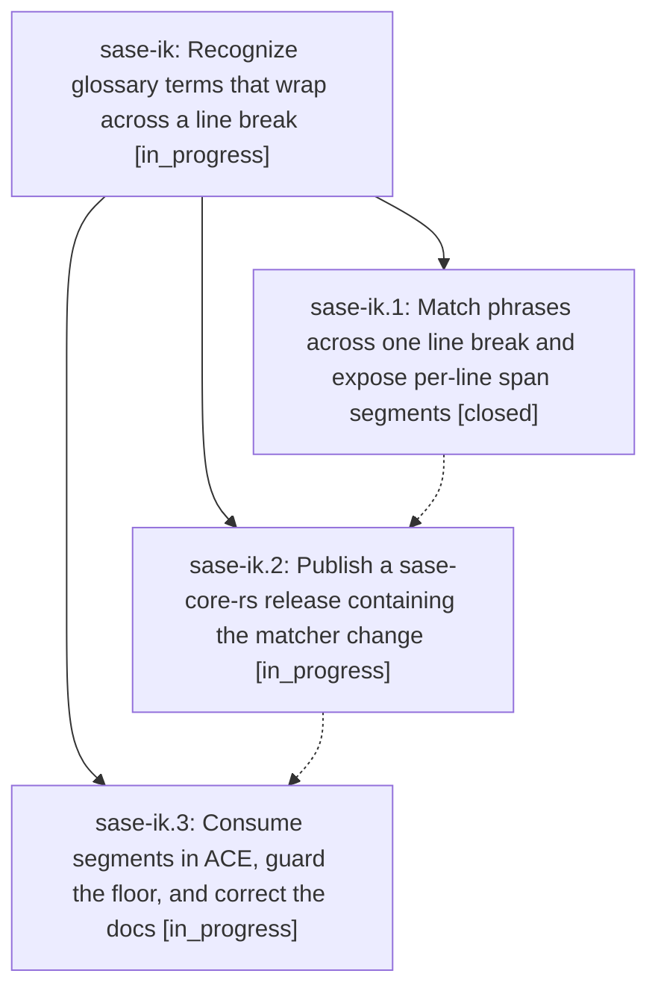

# Bead: sase-ik — Recognize glossary terms that wrap across a line break

[Bead Pages](../README.md) / sase-ik

**Status:** ◐ in_progress · **Type:** ▸ plan · **Tier:** epic
**Owner:** `bryanbugyi34@gmail.com` · **Created by:** [bbugyi200.athena.ws](https://github.com/sase-org/sase--agents/blob/main/agents/bbugyi200.athena.ws/README.md) · **Assignee:** `sase-ik.land`
**Created:** 2026-08-09 15:53:20 EDT
**Plan:** [202608/glossary\_line\_break\_matching.md](https://github.com/sase-org/sase--plans/blob/main/202608/glossary_line_break_matching.md)

## Description

A multiword glossary term stays recognized when a line break falls between its words, so it is highlighted, previewable, and jumpable in ACE and in LSP-backed editors exactly as it is when it fits on one line.

## Phases

| Bead | Title | Status | Size | Created | Agents | Commits |
|---|---|---|---|---|---:|---:|
| [sase-ik.1](sase-ik.1.md) | Match phrases across one line break and expose per-line span segments | ✓ closed | medium | 2026-08-09 | 1 | 1 |
| [sase-ik.2](sase-ik.2.md) | Publish a sase-core-rs release containing the matcher change | ◐ in_progress | small | 2026-08-09 | 1 | 0 |
| [sase-ik.3](sase-ik.3.md) | Consume segments in ACE, guard the floor, and correct the docs | ◐ in_progress | medium | 2026-08-09 | 1 | 0 |

## Lineage

## Agents

| Agent | Bead | Commits |
|---|---|---:|
| [bbugyi200.athena.sase-ik.1](https://github.com/sase-org/sase--agents/blob/main/agents/bbugyi200.athena.sase-ik.1/README.md) | [sase-ik.1](sase-ik.1.md) | 1 |
| [bbugyi200.athena.sase-ik.2](https://github.com/sase-org/sase--agents/blob/main/agents/bbugyi200.athena.sase-ik.2/README.md) | [sase-ik.2](sase-ik.2.md) | 0 |
| [bbugyi200.athena.sase-ik.3](https://github.com/sase-org/sase--agents/blob/main/agents/bbugyi200.athena.sase-ik.3/README.md) | [sase-ik.3](sase-ik.3.md) | 0 |
| [bbugyi200.athena.sase-ik.land](https://github.com/sase-org/sase--agents/blob/main/agents/bbugyi200.athena.sase-ik.land/README.md) | [sase-ik](README.md) | 0 |

## Commits

| Repo | Commit | Subject | Bead | Committed |
|---|---|---|---|---|
| sase-core | [`sase-core@4012af5`](https://github.com/sase-org/sase-core/commit/4012af5b871a9550210f87e9af133259b430bdcc) | feat(glossary): match phrases across line breaks | [sase-ik.1](sase-ik.1.md) | 2026-08-09 16:21:30 EDT |
