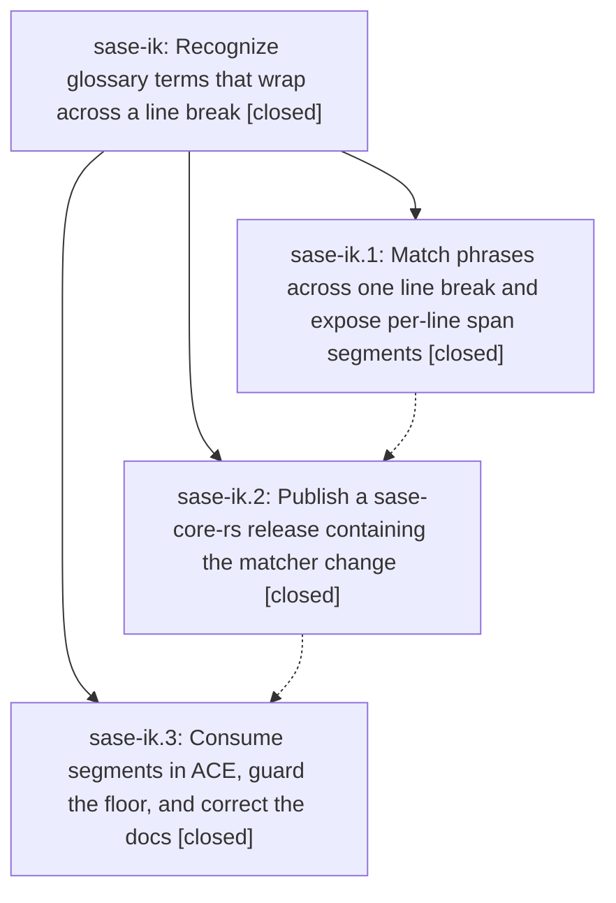

# Bead: sase-ik — Recognize glossary terms that wrap across a line break

[Bead Pages](../README.md) / sase-ik

**Status:** ✓ closed · **Resolution:** done · **Type:** ▸ plan · **Tier:** epic
**Owner:** `bryanbugyi34@gmail.com` · **Created by:** [bbugyi200.athena.ws](https://github.com/sase-org/sase--agents/blob/main/agents/bbugyi200.athena.ws/README.md) · **Assignee:** `sase-ik.land`
**Created:** 2026-08-09 15:53:20 EDT · **Closed:** 2026-08-10 08:55:30 EDT
**Plan:** [202608/glossary\_line\_break\_matching.md](https://github.com/sase-org/sase--plans/blob/main/202608/glossary_line_break_matching.md)

## Description

A multiword glossary term stays recognized when a line break falls between its words, so it is highlighted, previewable, and jumpable in ACE and in LSP-backed editors exactly as it is when it fits on one line.

## Notes

[2026-08-10T12:55:30Z · sase-ik.land] LAND VERIFIED. Reviewed the epic and every child note, the linked plan, core commit 4012af5b871a9550210f87e9af133259b430bdcc, Python/ACE commit 12af4fefe097d6c2bfea9e8f636609aad03aa612, and current source/tests. Core implements single-line-break phrase gaps, trimmed per-line segments, continuation lookup, block/literal boundaries, and per-segment LSP tokens; Python strictly consumes segments, normalizes preview/link text, highlights/navigation work on continuation words, docs match the contract, and CI smokes the published floor. Release v0.22.0 contains the core commit and its fresh PyPI wheel passed the glossary smoke; current floor 0.23.0 also passed the smoke and published-minimum validation. Fresh verification: local just install; focused Python/ACE/CI suite 58 passed; cargo test --workspace glossary and cargo test --workspace passed; wrapped PNG snapshot passed in the full visual file and alone; git diff --check and all repo worktrees clean. Post-start integration review covered the new release-boundary core-window ratchet and later 0.23 floor: phase 3 correctly adds this smoke to both published-minimum and release-floor CI lanes, uses the already-ratcheted >=0.23.0,<0.24.0 window, and no later commit touches or duplicates the glossary paths. Follow-ups from sase-ik.3: generated memory README drift is the exact resolved task sase-i7 and current sase validate is green, so it was not reopened; visual prompt-catalog timeouts and stale full-xdist tail share the existing sase-ct/sase-ib root, so one +1 was added to sase-ct and causal evidence was noted on active epic sase-ib. Current reproduction: full visual file failed 18/21 on pending prompt-catalog:0 while the wrapped snapshot passed; governed just test-cost reached 26 failures/28168 passes then all four workers stuck in pytest_asyncio and was interrupted at 14:46, while the focused glossary suite passed. No new duplicate task was created. An unrelated post-start committed-plan failure (new_task_recent_task_sweep.md missing mandatory tale size) was recorded as a DISCOVERED ISSUE on causal active epic sase-il; it is why just check-full stops after all lint and SASE validation gates. No unresolved issue is caused by sase-ik, so the epic closes done without force.

[2026-08-10T12:57:29Z · sase-ik.land] Verified all epic and child notes, commits, current source, releases, focused Python/ACE tests, the full Rust workspace, later dependency-floor and CI integration, and post-close Symvision; routed unrelated follow-ups to sase-i7, sase-ct, sase-ib, and sase-il; marked the linked plan done.

## Phases

| Bead | Title | Status | Size | Created | Agents | Commits |
|---|---|---|---|---|---:|---:|
| [sase-ik.1](sase-ik.1.md) | Match phrases across one line break and expose per-line span segments | ✓ closed | medium | 2026-08-09 | 1 | 1 |
| [sase-ik.2](sase-ik.2.md) | Publish a sase-core-rs release containing the matcher change | ✓ closed | small | 2026-08-09 | 1 | 0 |
| [sase-ik.3](sase-ik.3.md) | Consume segments in ACE, guard the floor, and correct the docs | ✓ closed | medium | 2026-08-09 | 1 | 1 |

## Lineage

## Agents

| Agent | Bead | Commits |
|---|---|---:|
| [bbugyi200.athena.sase-ik.1](https://github.com/sase-org/sase--agents/blob/main/agents/bbugyi200.athena.sase-ik.1/README.md) | [sase-ik.1](sase-ik.1.md) | 1 |
| [bbugyi200.athena.sase-ik.2](https://github.com/sase-org/sase--agents/blob/main/agents/bbugyi200.athena.sase-ik.2/README.md) | [sase-ik.2](sase-ik.2.md) | 0 |
| [bbugyi200.athena.sase-ik.3](https://github.com/sase-org/sase--agents/blob/main/agents/bbugyi200.athena.sase-ik.3/README.md) | [sase-ik.3](sase-ik.3.md) | 1 |
| [bbugyi200.athena.sase-ik.land](https://github.com/sase-org/sase--agents/blob/main/agents/bbugyi200.athena.sase-ik.land/README.md) | [sase-ik](README.md) | 1 |

## Commits

| Repo | Commit | Subject | Bead | Committed |
|---|---|---|---|---|
| sase-core | [`sase-core@4012af5`](https://github.com/sase-org/sase-core/commit/4012af5b871a9550210f87e9af133259b430bdcc) | feat(glossary): match phrases across line breaks | [sase-ik.1](sase-ik.1.md) | 2026-08-09 16:21:30 EDT |
| sase | [`12af4fe`](https://github.com/sase-org/sase/commit/12af4fefe097d6c2bfea9e8f636609aad03aa612) | feat(glossary): consume wrapped match segments in ACE | [sase-ik.3](sase-ik.3.md) | 2026-08-10 08:17:14 EDT |
| sase--plans | [`sase--plans@cbf4a6e`](https://github.com/sase-org/sase--plans/commit/cbf4a6e84286a2e516e01bdfdbe0af14d563084c) | docs(plans): mark glossary line-break epic done | [sase-ik](README.md) | 2026-08-10 08:58:50 EDT |
