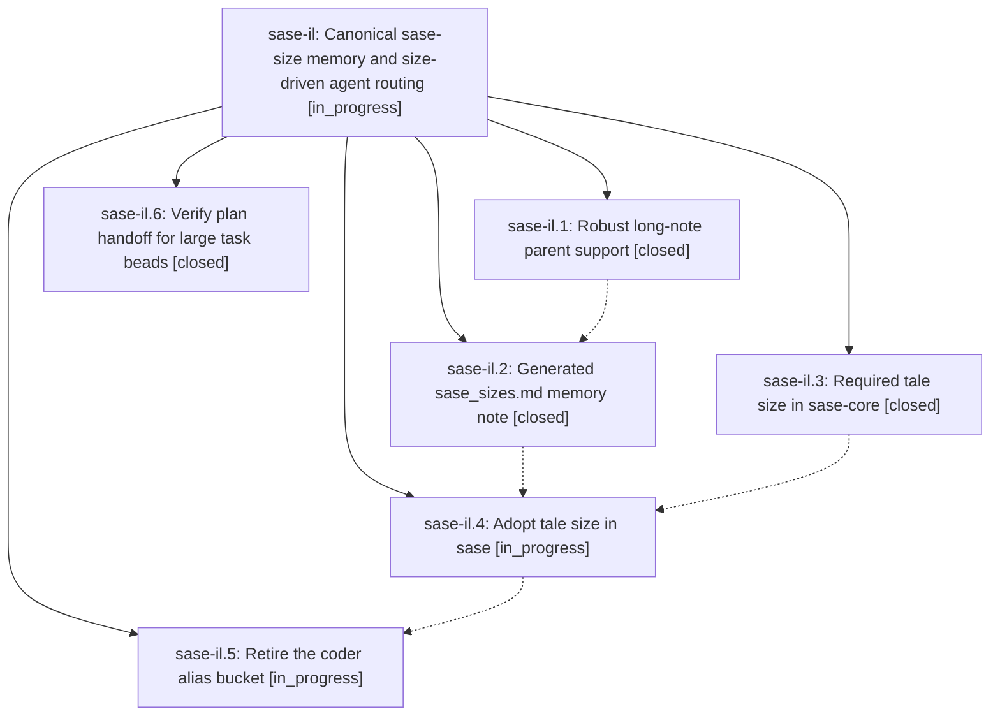

# Bead: sase-il — Canonical sase-size memory and size-driven agent routing

[Bead Pages](../README.md) / sase-il

**Status:** ◐ in_progress · **Type:** ▸ plan · **Tier:** epic
**Owner:** `bryanbugyi34@gmail.com` · **Created by:** [bbugyi200.athena.wt](https://github.com/sase-org/sase--agents/blob/main/agents/bbugyi200.athena.wt/README.md) · **Assignee:** `sase-il.land`
**Created:** 2026-08-09 16:43:06 EDT
**Plan:** [202608/sase\_sizes\_memory.md](https://github.com/sase-org/sase--plans/blob/main/202608/sase_sizes_memory.md)

## Description

One generated long-term memory note owns every sase-size instruction, tale plans carry a validated `size`, and coder follow-ups route through the size-specific phase-worker aliases instead of the retired coder alias bucket.

## Phases

| Bead | Title | Status | Size | Created | Agents | Commits |
|---|---|---|---|---|---:|---:|
| [sase-il.1](sase-il.1.md) | Robust long-note parent support | ✓ closed | medium | 2026-08-09 | 1 | 1 |
| [sase-il.2](sase-il.2.md) | Generated sase\_sizes.md memory note | ✓ closed | medium | 2026-08-09 | 1 | 1 |
| [sase-il.3](sase-il.3.md) | Required tale size in sase-core | ✓ closed | medium | 2026-08-09 | 1 | 3 |
| [sase-il.4](sase-il.4.md) | Adopt tale size in sase | ◐ in_progress | medium | 2026-08-09 | 1 | 0 |
| [sase-il.5](sase-il.5.md) | Retire the coder alias bucket | ◐ in_progress | large | 2026-08-09 | 1 | 0 |
| [sase-il.6](sase-il.6.md) | Verify plan handoff for large task beads | ✓ closed | small | 2026-08-09 | 1 | 1 |

## Lineage

## Agents

| Agent | Bead | Commits |
|---|---|---:|
| [bbugyi200.athena.sase-il.1](https://github.com/sase-org/sase--agents/blob/main/agents/bbugyi200.athena.sase-il.1/README.md) | [sase-il.1](sase-il.1.md) | 1 |
| [bbugyi200.athena.sase-il.2](https://github.com/sase-org/sase--agents/blob/main/agents/bbugyi200.athena.sase-il.2/README.md) | [sase-il.2](sase-il.2.md) | 1 |
| [bbugyi200.athena.sase-il.3](https://github.com/sase-org/sase--agents/blob/main/agents/bbugyi200.athena.sase-il.3/README.md) | [sase-il.3](sase-il.3.md) | 3 |
| [bbugyi200.athena.sase-il.4](https://github.com/sase-org/sase--agents/blob/main/agents/bbugyi200.athena.sase-il.4/README.md) | [sase-il.4](sase-il.4.md) | 0 |
| [bbugyi200.athena.sase-il.5](https://github.com/sase-org/sase--agents/blob/main/agents/bbugyi200.athena.sase-il.5/README.md) | [sase-il.5](sase-il.5.md) | 0 |
| [bbugyi200.athena.sase-il.6](https://github.com/sase-org/sase--agents/blob/main/agents/bbugyi200.athena.sase-il.6/README.md) | [sase-il.6](sase-il.6.md) | 1 |
| [bbugyi200.athena.sase-il.land](https://github.com/sase-org/sase--agents/blob/main/agents/bbugyi200.athena.sase-il.land/README.md) | [sase-il](README.md) | 0 |

## Commits

| Repo | Commit | Subject | Bead | Committed |
|---|---|---|---|---|
| sase | [`2f71b6b`](https://github.com/sase-org/sase/commit/2f71b6bc4d5ee19ea44bc7afbad605bc99abe7d5) | test: cover plan handoff in task launch path | [sase-il.6](sase-il.6.md) | 2026-08-09 17:26:10 EDT |
| sase | [`f21c8d8`](https://github.com/sase-org/sase/commit/f21c8d8504cb60788aba13dcb4c0f28081662c3b) | feat(memory): support long-note parent metadata | [sase-il.1](sase-il.1.md) | 2026-08-09 17:34:01 EDT |
| sase-core | [`sase-core@3c10a0c`](https://github.com/sase-org/sase-core/commit/3c10a0cb7b8a222503440760f946b2cdfef15beb) | feat!: require tale size in core plan validation | [sase-il.3](sase-il.3.md) | 2026-08-09 17:41:09 EDT |
| sase--plans | [`sase--plans@97845e6`](https://github.com/sase-org/sase--plans/commit/97845e6e0c04dc551b67e2cf275da9a5bfb4f330) | chore(plans): backfill tale sizes for committed plans | [sase-il.3](sase-il.3.md) | 2026-08-09 17:42:23 EDT |
| sase | [`46fbdc0`](https://github.com/sase-org/sase/commit/46fbdc07a158cb4f97ce2c70913dd146fb6b0cc8) | feat!: require tale size in SASE plan validation | [sase-il.3](sase-il.3.md) | 2026-08-09 17:43:43 EDT |
| sase | [`f42a68c`](https://github.com/sase-org/sase/commit/f42a68c074088ec05e1a804659e2abc54a2c458d) | feat(memory): generate SASE size guidance note | [sase-il.2](sase-il.2.md) | 2026-08-10 07:47:42 EDT |
