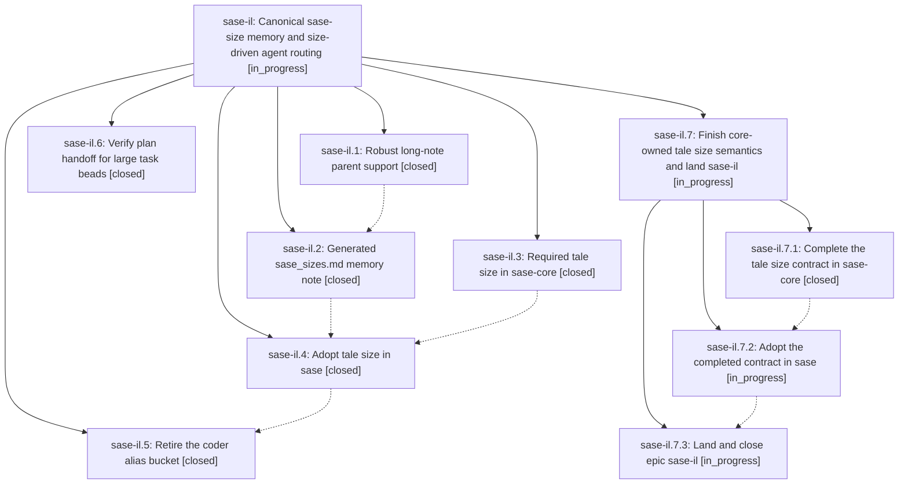

# Bead: sase-il — Canonical sase-size memory and size-driven agent routing

[Bead Pages](../README.md) / sase-il

**Status:** ◐ in_progress · **Type:** ▸ plan · **Tier:** epic
**Owner:** `bryanbugyi34@gmail.com` · **Created by:** [bbugyi200.athena.wt](https://github.com/sase-org/sase--agents/blob/main/agents/bbugyi200.athena.wt/README.md) · **Assignee:** `sase-il.land`
**Created:** 2026-08-09 16:43:06 EDT
**Plan:** [202608/sase\_sizes\_memory.md](https://github.com/sase-org/sase--plans/blob/main/202608/sase_sizes_memory.md)

## Description

One generated long-term memory note owns every sase-size instruction, tale plans carry a validated `size`, and coder follow-ups route through the size-specific phase-worker aliases instead of the retired coder alias bucket.

## Notes

[2026-08-10T12:33:26Z · sase-ik.land] DISCOVERED ISSUE: `just check-full` on clean master during sase-ik landing verification fails deterministically at committed-plan validation: `202608/new_task_recent_task_sweep.md:1: error [tale-size-missing] required tale field size is missing`. The plan was committed in 59ea423c6 at 2026-08-09 17:55, after phase sase-il.3 made tale size mandatory in sase/core (46fbdc07a / 3c10a0cb7 at 17:43). This is causally linked to the active size-adoption epic, not glossary epic sase-ik; it blocks every full check before the test-cost lane. Add an intentional tale size or otherwise migrate the committed plan, then rerun committed-plan validation.

[2026-08-10T12:41:43Z · sase-ib.land] DISCOVERED ISSUE (independent reproduction): the tale-size-missing failure also blocks plain `just check`, not only `just check-full`. Reproduced on 2026-08-10 while landing epic sase-ib in workspace sase_11 with only that epic's landing diff applied: every lint gate and SASE validation passed, then validate-committed-plans failed with `202608/new_task_recent_task_sweep.md:1: error [tale-size-missing]` (3548 files, 180 strict, 1 error) and `just check` exited 1 before its scoped test lane ever ran. Corroborates the 2026-08-10T12:33:26Z note from sase-ik.land; no task bead filed.

[2026-08-10T13:55:44Z · wz] DISCOVERED ISSUE: independent broader reproduction while implementing bead_list_size.md on 2026-08-10: just check passed fmt, ruff, mypy, project lint gates, symvision, toobig, and SASE validation, then failed validate-committed-plans with 93 tale-size-missing errors across 202608/*.md (examples: ace_byte_free_artifact_view_crash.md, admin_center_selection_off_by_one.md, bead_show_styling.md, committed output reports 3507 files scanned, 139 strict, 3368 legacy). This is the same root cause already noted here for new_task_recent_task_sweep.md but now affects the refreshed plans sidecar more broadly: tale size is mandatory after this epic, and legacy committed tale plans lack size frontmatter. Blocks just check/check-full before scoped/full tests for unrelated agents until the committed plans are migrated or validation is scoped.

[2026-08-10T14:53:01Z · sase-il.land] LAND TRIAGE (sase-il.land, 2026-08-10): verified all six phases against their commits (2f71b6bc4, f21c8d850, 46fbdc07a, f42a68c07, b9008c535, 344a0b8ff; sase-core 3c10a0c released as 119495d/0.23.0).

RESOLVED SINCE REPORTED:
- The three DISCOVERED ISSUE notes on this bead (tale-size-missing blocking committed-plan validation) are fixed: just validate-committed-plans now passes 3563 files (195 strict), 0 errors, 0 warnings. Fixed by plans-sidecar commits 97845e6e (backfill, 118 files) and 3898be3d (new_task_recent_task_sweep).
- sase-il.3 PROPOSED FOLLOW-UP 'Restore missing sase_sizes_memory design file': resolved, plans:202608/sase_sizes_memory.md exists and is readable.
- sase-il.2 PROPOSED FOLLOW-UP 'committed-plan validation blocked by tale-size adoption': resolved, see above.
- sase-il.3 PROPOSED FOLLOW-UP 'unrelated ACE artifacts/commits timeline failures': resolved. Re-ran the three named nodes at master HEAD 344a0b8ff, 3 passed in 6.37s.

ALREADY TRACKED, NO NEW TASK FILED:
- sase-il.1, sase-il.4, and sase-il.6 each proposed investigating broad unrelated full-suite failures. All are covered by existing task beads sase-ct (ACE/TUI full-lane flakes, READY, +54), sase-iq (cost-mode health recorder, READY, +11), sase-ii (tasks-pane store, READY, +3), and sase-iu (contract manifest/budget, READY, +1). sase-il.5 already filed or corroborated each. No independent reproduction of my own to add, so no additional +1.
- Noted on sase-iv that it duplicates sase-iu; both were created by sase-il.5 a minute apart with identical descriptions.

REMAINING EPIC WORK (not resolved, now planned):
- sase-il.4's PROPOSED FOLLOW-UP 'Tighten core-owned tale size semantics' is real and still open, plus two more gaps in the same phase (sase-il.3). Verified against the installed 0.23.0 binding: (1) a tale with size: large validates ok=True, though sase_sizes.md and the sase_plan skill both say tales are xsmall|small|medium only; (2) PHASE_SIZE_DESCRIPTION/PHASE_MODEL_DESCRIPTION/TALE_SIZE_DESCRIPTION still restate the whole taxonomy instead of pointing at sase/memory/sase_sizes.md, and those strings reach agents through plan_frontmatter_schema and plan_validate_render, so the epic's core goal is unmet; (3) launch-mode tale-size normalization lives in the Python shim _launch_mode_compatibility_content ('until older core wheels catch up') rather than in core's validate_tale_size, which still errors in launch mode. Also found: 21 committed 202608 tale plans declare size: large, all assigned by sase-il.3's own backfill and none authored, so they must be migrated when core narrows. Proposing an epic plan (finish_tale_size_semantics) whose final phase closes this bead, runs symvision, and marks plans:202608/sase_sizes_memory.md done.

## Phases

| Bead | Title | Status | Size | Created | Agents | Commits |
|---|---|---|---|---|---:|---:|
| [sase-il.1](sase-il.1.md) | Robust long-note parent support | ✓ closed | medium | 2026-08-09 | 1 | 1 |
| [sase-il.2](sase-il.2.md) | Generated sase\_sizes.md memory note | ✓ closed | medium | 2026-08-09 | 1 | 1 |
| [sase-il.3](sase-il.3.md) | Required tale size in sase-core | ✓ closed | medium | 2026-08-09 | 1 | 3 |
| [sase-il.4](sase-il.4.md) | Adopt tale size in sase | ✓ closed | medium | 2026-08-09 | 1 | 2 |
| [sase-il.5](sase-il.5.md) | Retire the coder alias bucket | ✓ closed | large | 2026-08-09 | 1 | 1 |
| [sase-il.6](sase-il.6.md) | Verify plan handoff for large task beads | ✓ closed | small | 2026-08-09 | 1 | 1 |

## Lineage

## Agents

| Agent | Bead | Commits |
|---|---|---:|
| [bbugyi200.athena.sase-il.1](https://github.com/sase-org/sase--agents/blob/main/agents/bbugyi200.athena.sase-il.1/README.md) | [sase-il.1](sase-il.1.md) | 1 |
| [bbugyi200.athena.sase-il.2](https://github.com/sase-org/sase--agents/blob/main/agents/bbugyi200.athena.sase-il.2/README.md) | [sase-il.2](sase-il.2.md) | 1 |
| [bbugyi200.athena.sase-il.3](https://github.com/sase-org/sase--agents/blob/main/agents/bbugyi200.athena.sase-il.3/README.md) | [sase-il.3](sase-il.3.md) | 3 |
| [bbugyi200.athena.sase-il.4](https://github.com/sase-org/sase--agents/blob/main/agents/bbugyi200.athena.sase-il.4/README.md) | [sase-il.4](sase-il.4.md) | 2 |
| [bbugyi200.athena.sase-il.5](https://github.com/sase-org/sase--agents/blob/main/families/bbugyi200.athena.sase-il.5.md) | [sase-il.5](sase-il.5.md) | 1 |
| [bbugyi200.athena.sase-il.6](https://github.com/sase-org/sase--agents/blob/main/agents/bbugyi200.athena.sase-il.6/README.md) | [sase-il.6](sase-il.6.md) | 1 |
| [bbugyi200.athena.sase-il.7.1](https://github.com/sase-org/sase--agents/blob/main/agents/bbugyi200.athena.sase-il.7.1/README.md) | [sase-il.7.1](sase-il.7.1.md) | 2 |
| [bbugyi200.athena.sase-il.7.2](https://github.com/sase-org/sase--agents/blob/main/agents/bbugyi200.athena.sase-il.7.2/README.md) | [sase-il.7.2](sase-il.7.2.md) | 1 |
| [bbugyi200.athena.sase-il.7.3](https://github.com/sase-org/sase--agents/blob/main/agents/bbugyi200.athena.sase-il.7.3/README.md) | [sase-il.7.3](sase-il.7.3.md) | 0 |
| [bbugyi200.athena.sase-il.7.land](https://github.com/sase-org/sase--agents/blob/main/agents/bbugyi200.athena.sase-il.7.land/README.md) | [sase-il.7](sase-il.7.md) | 0 |
| [bbugyi200.athena.sase-il.land](https://github.com/sase-org/sase--agents/blob/main/agents/bbugyi200.athena.sase-il.land/README.md) | [sase-il](README.md) | 0 |

## Commits

| Repo | Commit | Subject | Bead | Committed |
|---|---|---|---|---|
| sase | [`2f71b6b`](https://github.com/sase-org/sase/commit/2f71b6bc4d5ee19ea44bc7afbad605bc99abe7d5) | test: cover plan handoff in task launch path | [sase-il.6](sase-il.6.md) | 2026-08-09 17:26:10 EDT |
| sase | [`f21c8d8`](https://github.com/sase-org/sase/commit/f21c8d8504cb60788aba13dcb4c0f28081662c3b) | feat(memory): support long-note parent metadata | [sase-il.1](sase-il.1.md) | 2026-08-09 17:34:01 EDT |
| sase-core | [`sase-core@3c10a0c`](https://github.com/sase-org/sase-core/commit/3c10a0cb7b8a222503440760f946b2cdfef15beb) | feat!: require tale size in core plan validation | [sase-il.3](sase-il.3.md) | 2026-08-09 17:41:09 EDT |
| sase--plans | [`sase--plans@97845e6`](https://github.com/sase-org/sase--plans/commit/97845e6e0c04dc551b67e2cf275da9a5bfb4f330) | chore(plans): backfill tale sizes for committed plans | [sase-il.3](sase-il.3.md) | 2026-08-09 17:42:23 EDT |
| sase | [`46fbdc0`](https://github.com/sase-org/sase/commit/46fbdc07a158cb4f97ce2c70913dd146fb6b0cc8) | feat!: require tale size in SASE plan validation | [sase-il.3](sase-il.3.md) | 2026-08-09 17:43:43 EDT |
| sase | [`f42a68c`](https://github.com/sase-org/sase/commit/f42a68c074088ec05e1a804659e2abc54a2c458d) | feat(memory): generate SASE size guidance note | [sase-il.2](sase-il.2.md) | 2026-08-10 07:47:42 EDT |
| sase | [`b9008c5`](https://github.com/sase-org/sase/commit/b9008c535c4c0fd3bb4f199284c1a8369b2fd9f2) | feat(plan): normalize legacy tale size for launches | [sase-il.4](sase-il.4.md) | 2026-08-10 08:47:40 EDT |
| sase--plans | [`sase--plans@3898be3`](https://github.com/sase-org/sase--plans/commit/3898be3d9c35368738a13b69ef5022aba956d830) | chore(plans): add size to recent task sweep plan | [sase-il.4](sase-il.4.md) | 2026-08-10 08:48:09 EDT |
| sase | [`344a0b8`](https://github.com/sase-org/sase/commit/344a0b8ff2da71bc53123f008fde5ab08c1bef3a) | feat!: retire implicit coder model aliases | [sase-il.5](sase-il.5.md) | 2026-08-10 10:35:10 EDT |
| sase-core | [`sase-core@f2c28e7`](https://github.com/sase-org/sase-core/commit/f2c28e7ce93b9671cf2fca5d006b9108d212419b) | feat(core)!: enforce tale size contract | [sase-il.7.1](sase-il.7.1.md) | 2026-08-10 11:06:11 EDT |
| sase-core | [`sase-core@86e4eb9`](https://github.com/sase-org/sase-core/commit/86e4eb9a053f0bc113dcce97aad38f9618d90c1a) | fix(core-py): allow plus-one binding signature | [sase-il.7.1](sase-il.7.1.md) | 2026-08-10 11:37:12 EDT |
| sase--plans | [`sase--plans@a91c313`](https://github.com/sase-org/sase--plans/commit/a91c3138f39ab772c092fac5029c010d15aee942) | chore(plans): correct over-sized tale backfill | [sase-il.7.2](sase-il.7.2.md) | 2026-08-10 12:37:18 EDT |
