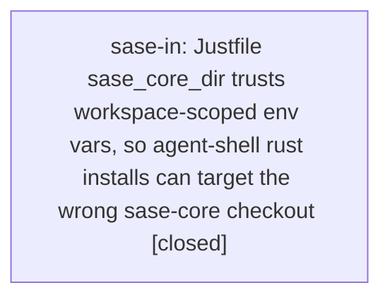

# Bead: sase-in — Justfile sase\_core\_dir trusts workspace-scoped env vars, so agent-shell rust installs can target the wrong sase-core checkout

[Bead Pages](../README.md) / sase-in

**Status:** ✓ closed · **Resolution:** done · **Type:** ◆ task
**Owner:** `bryanbugyi34@gmail.com` · **Created by:** [bbugyi200.athena.sase-i9.land](https://github.com/sase-org/sase--agents/blob/main/agents/bbugyi200.athena.sase-i9.land/README.md) · **Assignee:** `sase-in` · **Size:** medium
**Created:** 2026-08-09 17:24:23 EDT · **Closed:** 2026-08-10 09:50:04 EDT

## Description

Recorded as a DISCOVERED ISSUE on epic sase-i9 (by sase-ia.land) and given its concrete mechanism by phase sase-i9.5. Landing sase-i9 confirmed the mechanism is pre-existing and broader than dev-update, so it is filed here rather than fixed inside that epic.

MECHANISM (Justfile:24):
  sase_core_dir := env_var_or_default("SASE_CORE_DIR", env_var_or_default("SASE_LINKED_REPO_SASE_CORE_DIR", env_var_or_default("SASE_SIBLING_REPO_SASE_CORE_DIR", env_var_or_default("SASE_SIBLING_REPO_CORE_DIR", fallback_sase_core_dir))))
Every SASE-launched agent process exports SASE_LINKED_REPO_SASE_CORE_DIR and SASE_SIBLING_REPO_SASE_CORE_DIR pointing at its own ephemeral workspace clone. Re-confirmed 2026-08-09 in workspace sase_10 by dumping env: both resolve to
  /home/bryan/.local/state/sase/workspaces/sase-org/sase/sase_10/sase/repos/linked/sase-core
So any 'just rust-install', 'just rust-install-uv-tool', 'just rust-dev-install', or 'just rust-dev-install-uv-tool' invoked from an agent shell builds sase_core_rs from that workspace clone even when cwd is correctly set to the real host checkout, because those two variables outrank the relative-path default. The env vars are not workspace-aware and predate the sase-i9 recipes (Justfile history: f72bdec19 -> 80d0ce218 -> b0f316ab7 -> 1114961b4), so 'just install' and every other recipe that reads sase_core_dir share the exposure.

OBSERVED IMPACT (2026-08-09): the host uv-tool venv's editable sase_core_rs.pth was written pointing into a numbered agent workspace clone
  .../workspaces/sase-org/sase/sase_10/sase/repos/linked/sase-core/crates/sase_core_py/python
and broke silently once that workspace rebuilt/cleaned its target dir and the abi3 .so disappeared. Every host command reaching require_rust_extension() then failed with 'sase_core_rs is not importable in this environment but is a hard runtime dependency of sase' -- 'sase memory init --check', 'sase repo list', 'sase project list' -- while 'sase version' and 'sase bead ...' kept working, so the breakage was invisible until a Rust-backed command ran. Because the post-commit 'sase init' hook is one of those commands, commit 495eaedd3 left AGENTS.md/CLAUDE.md/GEMINI.md/QWEN.md/OPENCODE.md and sase/memory/{README,glossary}.md stale and turned 'just check-full' red at the 'SASE validation' -> 'init memory --check' gate for every agent on master until they were regenerated (bfa34ffc8).

A later real ',U' in ~/.sase/logs/dev_update.jsonl (2026-08-09T12:48:31-04:00) shows the sase-core-rs package plan entry's git_root pointing at that same ephemeral workspace path even though the reconcile command's cwd was the host source root, reproducing the class after the first incident.

CURRENT STATE: the host is healthy again -- the .pth now reads /home/bryan/projects/github/sase-org/sase-core/crates/sase_core_py/python, the abi3 .so is present, and 'sase_core_rs' imports as 0.21.3 in the uv-tool venv (verified 2026-08-09 while landing sase-i9). The gap itself is still open.

SCOPE (pick one or both; the choice is a design decision, which is why sase-i9's land agent did not guard it inline):
  1. Make the resolution authoritative rather than ambient: have recipes that install into a venv derive the core checkout from that install's own source root (SASE_LINKED_REPO_SASE_CORE_PRIMARY_DIR is already exported alongside the workspace path and holds the host checkout), or refuse to write an editable extension into a venv whose owning source root does not match.
  2. Scrub SASE_LINKED_REPO_SASE_CORE_DIR / SASE_SIBLING_REPO_SASE_CORE_DIR (and the legacy SASE_SIBLING_REPO_CORE_DIR) when just runs with cwd outside the workspace that exported them.
Also consider making the dev-update rust_health_check verify the .pth target still resolves to a loadable extension, not just that the import happens to work at install time, so a later workspace recycle is caught.

Verification for whoever takes this must not be done by running the real rust install from an agent shell without the guard in place -- that is the exact action that corrupted the host venv.

## Notes

[2026-08-10T13:10:21Z · ww] TRIAGE VERIFICATION 2026-08-10 (master 354d8c19f): MECHANISM CONFIRMED LIVE from inside an agent shell (workspace sase_11). Justfile:24 still reads sase_core_dir := env_var_or_default("SASE_CORE_DIR", env_var_or_default("SASE_LINKED_REPO_SASE_CORE_DIR", ...)), and this agent process exports SASE_LINKED_REPO_SASE_CORE_DIR=SASE_SIBLING_REPO_SASE_CORE_DIR=/home/bryan/.local/state/sase/workspaces/sase-org/sase/sase_11/sase/repos/linked/sase-core. With SASE_CORE_DIR unset, any just rust-* recipe run here resolves to the ephemeral workspace clone. The authoritative value the fix can use is present alongside it: SASE_LINKED_REPO_SASE_CORE_PRIMARY_DIR=/home/bryan/projects/github/sase-org/sase-core. Kept as a top-seven task in the 2026-08-10 backlog triage. Verification caveat from the bead still applies: do NOT test by running a real rust install from an agent shell without the guard in place.

[2026-08-10T13:50:04Z · sase-in] Implemented workspace-aware Justfile sase_core_dir resolution and the selector mirror. Verified: just install completed after the guard and built from the current workspace linked checkout; just fmt-py passed; just test tests/test_justfile_sase_core_dir.py tests/test_justfile_lint.py passed 51 tests; manual just --evaluate checks showed current workspace env resolves to the current linked checkout and stale linked/sibling env from another checkout resolves to SASE_LINKED_REPO_SASE_CORE_PRIMARY_DIR. just check passed fmt/lint/SASE validation/committed-plan gates, then escalated the scoped lane to the full suite and failed on unrelated tracked blockers; recorded duplicate evidence on sase-iq and sase-ct and an active-epic note on sase-ij.

[2026-08-10T13:51:55Z · sase-in] Verified just install passed; focused resolver tests passed; manual stale-env just --evaluate check selected the primary checkout; just check passed lint and SASE validation gates before unrelated tracked full-suite blockers.

## Lineage

## Agents

| Agent | Bead | Commits |
|---|---|---:|
| [bbugyi200.athena.sase-in](https://github.com/sase-org/sase--agents/blob/main/agents/bbugyi200.athena.sase-in/README.md) | [sase-in](README.md) | 1 |

## Commits

| Repo | Commit | Subject | Bead | Committed |
|---|---|---|---|---|
| sase | [`9fddbbe`](https://github.com/sase-org/sase/commit/9fddbbe7705bbd13775f477e13998a5780e07e13) | fix: ignore stale sase-core workspace env vars | [sase-in](README.md) | 2026-08-10 09:53:04 EDT |
