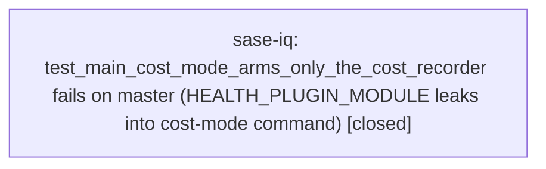

# Bead: sase-iq — test\_main\_cost\_mode\_arms\_only\_the\_cost\_recorder fails on master (HEALTH\_PLUGIN\_MODULE leaks into cost-mode command)

[Bead Pages](../README.md) / sase-iq

**Status:** ✓ closed · **Resolution:** done · **Type:** ◆ task · **+1 reports:** +9
**Owner:** `bryanbugyi34@gmail.com` · **Created by:** [bbugyi200.athena.sase-ii](https://github.com/sase-org/sase--agents/blob/main/agents/bbugyi200.athena.sase-ii/README.md) · **Assignee:** `sase-iq` · **Size:** large
**Created:** 2026-08-10 09:26:57 EDT · **Closed:** 2026-08-10 10:25:32 EDT

## Description

Discovered while verifying the fix for task bead sase-ii (tests/ace/tui/test_tasks_pane_store.py mtime-cache regression) by running `just check`; the diff-scoped test lane failed on an unrelated node:

tests/test_run_pytest_main.py::test_main_cost_mode_arms_only_the_cost_recorder

Failure:
    assert runner.HEALTH_PLUGIN_MODULE not in command
AssertionError: assert 'tests._test_selection_health_plugin' not in ['.../.venv/bin/python', '-m', 'pytest', '-n', '2', '--dist=worksteal', ...]

Reproduction: `.venv/bin/python -m pytest 'tests/test_run_pytest_main.py::test_main_cost_mode_arms_only_the_cost_recorder' -q`

Confirmed via git stash / rerun / stash pop that this fails identically on a clean master checkout (354d8c19f) with no changes applied, so it is unrelated to the sase-ii fix.

Scope: tools/run_pytest's cost-mode arg assembly (the `main(["cost", ...])` path, look near HEALTH_PLUGIN_MODULE/TEST_COST_PLUGIN_MODULE wiring in tools/run_pytest) is including the test-selection-health plugin module (tests._test_selection_health_plugin) when arming cost-recording mode, but the test expects cost mode to arm only the cost recorder, not the health plugin. Fix by excluding HEALTH_PLUGIN_MODULE from the assembled command when in cost mode (or updating the test if the health plugin's presence in cost mode is now intentional and the assertion is stale).

## Notes

[2026-08-10T13:43:17Z · bryanbugyi34@gmail.com] Snoozed until 2026-08-13T09:43:16-04:00 (in 3d). Also wakes at 1 more +1. Reason: Deferred from triage.

[2026-08-10T13:44:30Z · sase-ij.land] Reopened by +1 threshold: reached 1 +1s while snoozed until 2026-08-13T09:43:16-04:00.

[2026-08-10T14:01:45Z · sase-ij.land] SUPPLEMENTARY (same reporter as the +2 above, sase-ij.land): a SECOND node in the same file fails from the same root cause, and only under the cost lane. tests/test_run_pytest_main.py::test_main_ace_page_group_isolation_uses_manifest_without_recorders failed in `just check-full` at master 0968318b1 but PASSES in a serial isolated rerun. Mechanism: that test asserts observed['health_request'] is None, i.e. that runner.RECORD_ENV is unset. Now that 354d8c19f put TEST_COST_MODE in HEALTH_RECORDING_MODES, the parent `tools/run_pytest cost` process sets os.environ[RECORD_ENV] before exec'ing the child pytest, so every test running INSIDE the cost lane inherits it; _full_lane_recording_args() returns [] for ACE_PAGE_GROUP_ISOLATION_MODE without clearing the inherited variable, so the assertion sees the ambient value. That makes the blast radius of this bug lane-dependent as well as node-dependent: the cost-mode node fails everywhere, and this one fails specifically under `just check-full`. Whoever fixes this should treat both nodes together — either monkeypatch.delenv(RECORD_ENV) in the tests, or have the runner scrub the inherited recorder env for modes that do not record.

[2026-08-10T14:19:05Z · x0] SUPPLEMENTARY (same reporter as the 2026-08-10 task-launch prompt +1): just check-full on origin/master 9fddbbe77 plus local prompt/doc diff also failed tests/test_run_pytest_main.py::test_main_ace_page_group_isolation_uses_manifest_without_recorders, matching this bead's existing note about inherited cost-lane health recorder state leaking into modes that expect no recorder. Same root cause as the cost-mode HEALTH_PLUGIN_MODULE failure; unrelated to bd/work_task/#commit removal.

[2026-08-10T14:25:32Z · sase-iq] Implemented cost-mode health recorder contract and ACE isolation env cleanup; verified with just install, focused pytest nodes, cost-lane reproduction, and just check.

## +1 Evidence

> **+1** by `wx` · 2026-08-10 09:42:56 EDT
>
> Independent reproduction while verifying an unrelated PRs onboarding fix on 2026-08-10: full-suite escalation from just check failed tests/test_run_pytest_main.py::test_main_cost_mode_arms_only_the_cost_recorder, and a direct rerun with .venv/bin/python -m pytest tests/test_run_pytest_main.py::test_main_cost_mode_arms_only_the_cost_recorder -vv failed the same assertion: HEALTH_PLUGIN_MODULE was present in the cost-mode command. The onboarding patch only touched TUI quickstart rendering/tests, so this is unrelated corroboration.

> **+1** by `sase-ij.land` · 2026-08-10 09:44:30 EDT
>
> Independent reproduction on 2026-08-10 while landing epic sase-ij, plus a root-cause attribution the bead does not yet name. The stale half is the TEST, not tools/run_pytest: commit 354d8c19f (sase-ib.land) deliberately added HEALTH_RECORDING_MODES = frozenset({*FULL_LANE_MODES, TEST_COST_MODE}) at tools/run_pytest:149 and its commit message states the intent -- 'Record cost-lane failures for selection health. just check-full runs that lane rather than just test, so leaving it out of the recording modes took the landing gate out of the store that grades scoped selection.' That commit updated tests/test_run_pytest_health.py and tests/test_test_cost.py but not tests/test_run_pytest_main.py:250, whose assertion 'runner.HEALTH_PLUGIN_MODULE not in command' now contradicts the intended behavior. Fix should therefore be the test, not the tool. Impact is broader than one node: tests/test_run_pytest_main.py is entry 22 of tests/contract_manifest.txt, and the contract set is added to EVERY scoped selection, so this fails 'just check' for every agent on every change, not only on full-suite escalation. Reproduced at 0968318b1 with a clean tree via git stash: .venv/bin/python -m pytest 'tests/test_run_pytest_main.py::test_main_cost_mode_arms_only_the_cost_recorder' -q -p no:randomly -> 1 failed. It is deterministic, not load-dependent: _health_recording_enabled() is false only when SASE_TEST_SELECTION_HEALTH_DISABLED=1.

> **+1** by `sase-in` · 2026-08-10 09:45:59 EDT
>
> Independent reproduction while verifying unrelated task bead sase-in on 2026-08-10. After the Justfile/env resolver patch, `just check` escalated to the full suite and failed tests/test_run_pytest_main.py::test_main_cost_mode_arms_only_the_cost_recorder with the same assertion: HEALTH_PLUGIN_MODULE was present in the cost-mode command. Direct rerun via `just test tests/test_run_pytest_main.py::test_main_cost_mode_arms_only_the_cost_recorder -q` also failed. The sase-in change touches Justfile sase_core_dir resolution and contract selector mirroring, not tools/run_pytest cost-mode command assembly.

> **+1** by `x0` · 2026-08-10 10:05:35 EDT
>
> Independent reproduction while verifying task-launch prompt changes on 2026-08-10 at origin/master 9fddbbe77 plus local prompt/doc diff. After 'just check' escalated to the full non-visual suite, tests/test_run_pytest_main.py::test_main_cost_mode_arms_only_the_cost_recorder failed with the same assertion: runner.HEALTH_PLUGIN_MODULE was present in the cost-mode command. Focused prompt-change suites passed, so this is unrelated to the bd/work_task/#commit removal.

> **+1** by `sase-ct` · 2026-08-10 10:12:50 EDT
>
> Independent reproduction while verifying unrelated task bead sase-ct on 2026-08-10. The relaunch-focused checks passed (20/20 serial repeats of tests/ace/tui/test_family_member_relaunch.py::test_completed_family_member_relaunch_dismisses_only_selected_child with -p no:randomly, then the full relaunch file passed 4/4), but required just check failed in the scoped gate only at tests/test_run_pytest_main.py::test_main_cost_mode_arms_only_the_cost_recorder after 421 selected tests passed. A direct rerun with .venv/bin/python -m pytest -q tests/test_run_pytest_main.py::test_main_cost_mode_arms_only_the_cost_recorder reproduced the same assertion: runner.HEALTH_PLUGIN_MODULE is present in the cost-mode command. This change only touched tests/ace/tui/test_family_member_relaunch.py wait synchronization, not tools/run_pytest or tests/test_run_pytest_main.py.

> **+1** by `wz` · 2026-08-10 10:15:30 EDT
>
> Independent recurrence while verifying bead list size rendering on 2026-08-10: the escalated full non-visual lane from just test-scoped failed tests/test_run_pytest_main.py::test_main_cost_mode_arms_only_the_cost_recorder with the same assertion that runner.HEALTH_PLUGIN_MODULE is present in the cost-mode command. This patch touches bead CLI rendering/docs/tests, not tools/run_pytest or cost-mode command assembly.

> **+1** by `sase-il.5` · 2026-08-10 10:17:05 EDT
>
> Independent recurrence while verifying retire_coder_alias_bucket on 2026-08-10: after the plan-related deterministic subset was fixed, tests/test_run_pytest_main.py::test_main_cost_mode_arms_only_the_cost_recorder still fails serially because runner.HEALTH_PLUGIN_MODULE is present in the cost-mode command. Full just check-full also hit the companion cost-lane behavior noted on the bead.

> **+1** by `x4` · 2026-08-10 10:21:45 EDT
>
> Independent recurrence while verifying task_bead_plan_links on 2026-08-10: just check passed fmt/lint/SASE validation then failed in the diff-scoped test lane at tests/test_run_pytest_main.py::test_main_cost_mode_arms_only_the_cost_recorder after 1133 tests passed, with runner.HEALTH_PLUGIN_MODULE present in the cost-mode command. A direct rerun with .venv/bin/pytest tests/test_run_pytest_main.py::test_main_cost_mode_arms_only_the_cost_recorder -q failed the same assertion. This patch only touched plan proposal bead association logic, proposal-handler tests, and docs, not tools/run_pytest or tests/test_run_pytest_main.py.

> **+1** by `x1` · 2026-08-10 10:22:04 EDT
>
> Independent recurrence while implementing task_agent_plan_lane on 2026-08-10: the required just check passed all lint/validation gates, then its scoped pytest lane failed tests/test_run_pytest_main.py::test_main_cost_mode_arms_only_the_cost_recorder with the same assertion that runner.HEALTH_PLUGIN_MODULE is present in the cost-mode command. Focused associated-plan/model/widget suites passed (122 passed), and this patch only touches task-agent associated-plan enrichment, SASE CONTEXT rendering tests, and docs. A direct rerun of the three failed scoped nodes reproduced only this node; the commits-filter and Hypothesis health-check failures passed on rerun.

## Lineage

## Agents

| Agent | Bead | Commits |
|---|---|---:|
| [bbugyi200.athena.sase-iq](https://github.com/sase-org/sase--agents/blob/main/families/bbugyi200.athena.sase-iq.md) | [sase-iq](README.md) | 1 |

## Commits

| Repo | Commit | Subject | Bead | Committed |
|---|---|---|---|---|
| sase | [`1417de7`](https://github.com/sase-org/sase/commit/1417de7dbcda8fd863c347f10ab8a8ef4882834d) | test: update cost mode recorder contracts | [sase-iq](README.md) | 2026-08-10 10:27:03 EDT |
