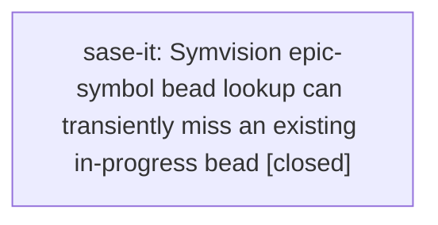

# Bead: sase-it — Symvision epic-symbol bead lookup can transiently miss an existing in-progress bead

[Bead Pages](../README.md) / sase-it

**Status:** ✓ closed · **Resolution:** done · **Type:** ◆ task · **+1 reports:** +1
**Owner:** `bryanbugyi34@gmail.com` · **Created by:** [bbugyi200.athena.x2](https://github.com/sase-org/sase--agents/blob/main/families/bbugyi200.athena.x2.md) · **Assignee:** `sase-it` · **Size:** large
**Created:** 2026-08-10 10:17:12 EDT · **Closed:** 2026-08-10 10:57:54 EDT

## Description

During unrelated runner-slot queue work on 2026-08-10, mandatory `just check` passed fmt, ruff, mypy, pyscripts, test-waits, changelog, and patch/stitch terminology, then failed at lint (symvision): `Error: --epic-symbol 'sase-i8(MergeSummary)': bead 'sase-i8' not found. Remove this --epic-symbol entry.` The failure is not a stale whitelist entry: immediately afterward `SASE_SYMVISION_BEAD_STATUS_ONLY=1 tools/sase_bead show sase-i8` resolved the in-progress epic, and the exact Symvision invocation from the Justfile with `BD_COMMAND=tools/sase_bead` passed with `All public/private classes/functions are used properly!`. Investigate why the Symvision epic-symbol bead status lookup can transiently miss a bead that the same wrapper can resolve, and make the lint gate deterministic or emit a retryable diagnostic. This blocks clean unrelated `just check` runs when it recurs.

## Notes

[2026-08-10T14:57:54Z · sase-it] Verified with just install; just _lint-symvision x3; just check; and .venv/bin/pytest tests/test_sase_bead_tool.py.

## +1 Evidence

> **+1** by `x3` · 2026-08-10 10:23:55 EDT
>
> Independent reproduction during distinct_notification_tab_icons verification on 2026-08-10: after just install and targeted notification tests passed, just check-full passed fmt, markdown fmt, keep-sorted, ruff, mypy, pyscripts, test-waits, changelog, and patch/stitch terminology, then failed at lint (symvision) with: Error: --epic-symbol 'sase-i8(MergeSummary)': bead 'sase-i8' not found. Remove this --epic-symbol entry. The same workspace's in-progress epic sweep resolved and showed sase-i8 immediately afterward, so this corroborates a transient status-only lookup miss rather than a stale whitelist entry.

## Lineage

## Agents

| Agent | Bead | Commits |
|---|---|---:|
| [bbugyi200.athena.sase-it](https://github.com/sase-org/sase--agents/blob/main/families/bbugyi200.athena.sase-it.md) | [sase-it](README.md) | 1 |

## Commits

| Repo | Commit | Subject | Bead | Committed |
|---|---|---|---|---|
| sase | [`b64ed20`](https://github.com/sase-org/sase/commit/b64ed20a11efaf45ce5082b6c85ffbbbe8d0f71c) | fix: retry symvision bead status lookups | [sase-it](README.md) | 2026-08-10 10:58:38 EDT |
