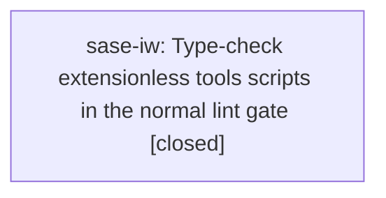

# Bead: sase-iw — Type-check extensionless tools scripts in the normal lint gate

[Bead Pages](../README.md) / sase-iw

**Status:** ✓ closed · **Resolution:** done · **Type:** ◆ task
**Owner:** `bryanbugyi34@gmail.com` · **Created by:** [bbugyi200.athena.sase-i8.10.land](https://github.com/sase-org/sase--agents/blob/main/agents/bbugyi200.athena.sase-i8.10.land/README.md) · **Assignee:** `sase-iw` · **Size:** large
**Created:** 2026-08-10 10:40:25 EDT · **Closed:** 2026-08-10 11:12:56 EDT

## Description

Proposed by phase bead sase-i8.10.4 (originally sase-i8.2). Reproduced on integrated master 1417de7db: pyproject.toml [tool.mypy].files is only ['src']; explicit '.venv/bin/mypy tools/validate_sase_core_rs' finds union-attr errors at lines 561, 564, and 567, while '.venv/bin/mypy tools' reports no .py[i] files because the tools are extensionless executables. Scope: design and implement reliable normal-gate mypy coverage for supported extensionless tools scripts, remediate the surfaced typing errors, and add a regression proving tool-script defects cannot remain invisible.

## Notes

[2026-08-10T15:12:56Z · sase-iw] Implemented the approved typecheck_extensionless_tools plan. Added executable helper tools/typecheck_extensionless_tools to discover extensionless Python tools by Python shebang under tools/ (including untracked files), skip transient/cache directories, and invoke the configured mypy once with --scripts-are-modules --follow-imports=skip --ignore-missing-imports while propagating mypy's exit status. Wired Justfile _lint-mypy to run the helper after the existing project mypy invocation. Fixed the direct tool diagnostics in tools/validate_sase_core_rs, tools/check_test_wait_helpers, tools/smoke_sase_core_rs_at_reference_file_gate, tools/render_model_alias_docs, and tools/test_image_notification without changing runtime behavior. Added focused helper tests for discovery, mypy invocation/exit propagation, and an intentional assignment-error failure, plus a Justfile dry-run contract test for the new _lint-mypy wiring. Verification: just install passed; .venv/bin/pytest tests/test_typecheck_extensionless_tools_tool.py tests/test_justfile_lint.py -q passed (40 passed); just _lint-mypy passed with project mypy success on 2964 source files and extensionless tools success on 38 source files. Ran just check: it passed fmt, keep-sorted, ruff, mypy, pyscripts, test-waits, changelog, and patch/stitch terminology, then failed at unrelated lint (symvision) on resolve_notification_tab_icon in src/sase/ace/tui/widgets/notification_tab_style.py, a file untouched by this change; recorded that blocker as ready task sase-iy.

[2026-08-10T15:14:31Z · sase-iw] Implemented extensionless tools mypy helper and wired it into _lint-mypy. Verified: just install; pytest tests/test_typecheck_extensionless_tools_tool.py tests/test_justfile_lint.py -q; just _lint-mypy. just check was blocked by unrelated symvision finding resolve_notification_tab_icon, tracked as ready task sase-iy.

## Lineage

## Agents

| Agent | Bead | Commits |
|---|---|---:|
| [bbugyi200.athena.sase-iw](https://github.com/sase-org/sase--agents/blob/main/families/bbugyi200.athena.sase-iw.md) | [sase-iw](README.md) | 1 |

## Commits

| Repo | Commit | Subject | Bead | Committed |
|---|---|---|---|---|
| sase | [`6e17536`](https://github.com/sase-org/sase/commit/6e1753647c7ad0bfdd6d29c92ad2d8da1e381021) | fix(lint): type-check extensionless tool scripts | [sase-iw](README.md) | 2026-08-10 11:15:49 EDT |
