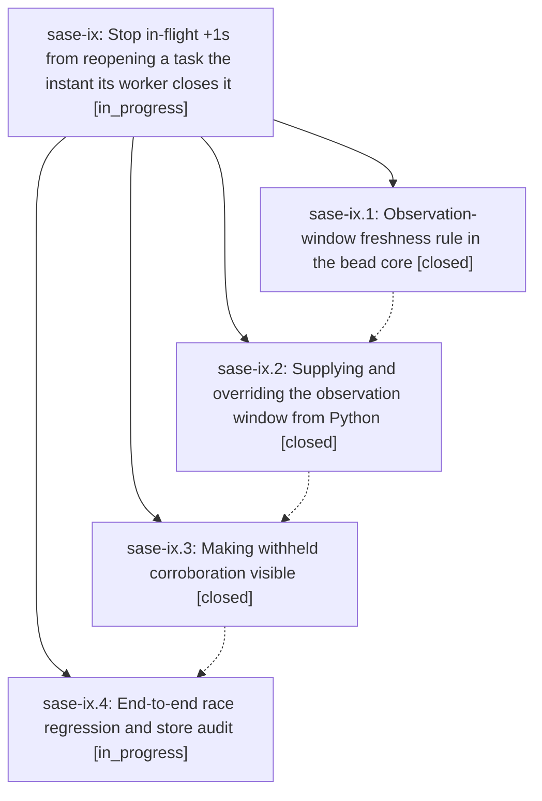

# Bead: sase-ix — Stop in-flight +1s from reopening a task the instant its worker closes it

[Bead Pages](../README.md) / sase-ix

**Status:** ◐ in_progress · **Type:** ▸ plan · **Tier:** epic
**Owner:** `bryanbugyi34@gmail.com` · **Created by:** [bbugyi200.athena.x9](https://github.com/sase-org/sase--agents/blob/main/agents/bbugyi200.athena.x9/README.md) · **Assignee:** `sase-ix.land`
**Created:** 2026-08-10 10:49:20 EDT
**Plan:** [202608/plus\_one\_post\_close\_reopen\_race.md](https://github.com/sase-org/sase--plans/blob/main/202608/plus_one_post_close_reopen_race.md)

## Description

A task bead that an assigned agent is actively working, or has just finished working, is never pushed back into the triage queue by corroboration that was already in flight before the close. Corroboration is still recorded, still visible to the owner, and a genuinely fresh reproduction still reopens the bead.

## Phases

| Bead | Title | Status | Size | Created | Agents | Commits |
|---|---|---|---|---|---:|---:|
| [sase-ix.1](sase-ix.1.md) | Observation-window freshness rule in the bead core | ✓ closed | medium | 2026-08-10 | 1 | 1 |
| [sase-ix.2](sase-ix.2.md) | Supplying and overriding the observation window from Python | ✓ closed | small | 2026-08-10 | 1 | 1 |
| [sase-ix.3](sase-ix.3.md) | Making withheld corroboration visible | ✓ closed | small | 2026-08-10 | 1 | 1 |
| [sase-ix.4](sase-ix.4.md) | End-to-end race regression and store audit | ◐ in_progress | small | 2026-08-10 | 1 | 0 |

## Lineage

## Agents

| Agent | Bead | Commits |
|---|---|---:|
| [bbugyi200.athena.sase-ix.1](https://github.com/sase-org/sase--agents/blob/main/agents/bbugyi200.athena.sase-ix.1/README.md) | [sase-ix.1](sase-ix.1.md) | 1 |
| [bbugyi200.athena.sase-ix.2](https://github.com/sase-org/sase--agents/blob/main/agents/bbugyi200.athena.sase-ix.2/README.md) | [sase-ix.2](sase-ix.2.md) | 1 |
| [bbugyi200.athena.sase-ix.3](https://github.com/sase-org/sase--agents/blob/main/agents/bbugyi200.athena.sase-ix.3/README.md) | [sase-ix.3](sase-ix.3.md) | 1 |
| [bbugyi200.athena.sase-ix.4](https://github.com/sase-org/sase--agents/blob/main/agents/bbugyi200.athena.sase-ix.4/README.md) | [sase-ix.4](sase-ix.4.md) | 0 |
| [bbugyi200.athena.sase-ix.land](https://github.com/sase-org/sase--agents/blob/main/agents/bbugyi200.athena.sase-ix.land/README.md) | [sase-ix](README.md) | 0 |

## Commits

| Repo | Commit | Subject | Bead | Committed |
|---|---|---|---|---|
| sase-core | [`sase-core@d1a19d5`](https://github.com/sase-org/sase-core/commit/d1a19d566a6606aac78b961bf7008003e9b8f25f) | fix(bead): avoid stale plus-one reopens after close | [sase-ix.1](sase-ix.1.md) | 2026-08-10 11:25:04 EDT |
| sase | [`47b2a74`](https://github.com/sase-org/sase/commit/47b2a74aa30541e82bcdfebf9111e1b5076bfb31) | feat(bead): supply and override the plus-one observation window | [sase-ix.2](sase-ix.2.md) | 2026-08-10 11:57:55 EDT |
| sase | [`187085a`](https://github.com/sase-org/sase/commit/187085a80b60f59641dfd076a9cb5cea9e499fca) | feat(beads): surface withheld post-close corroboration | [sase-ix.3](sase-ix.3.md) | 2026-08-10 12:24:21 EDT |
