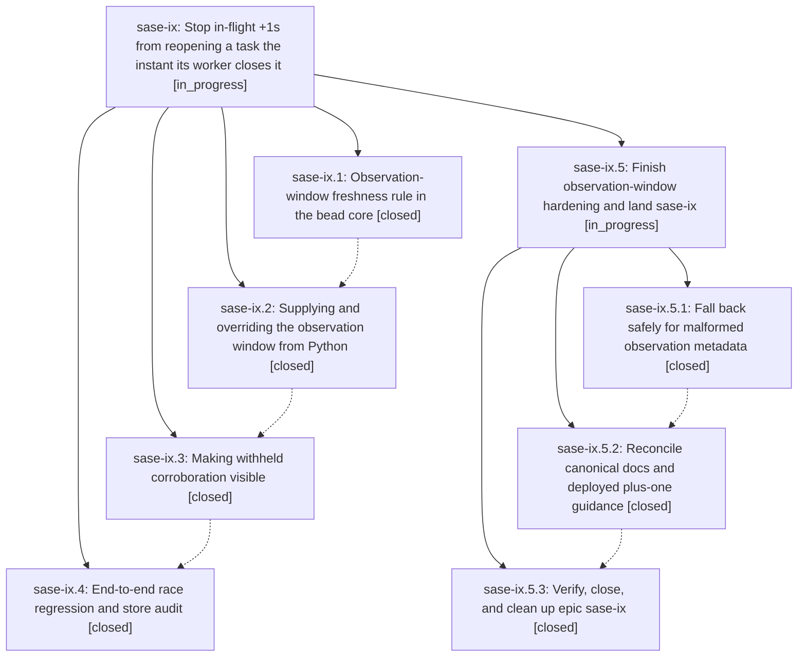

# Bead: sase-ix — Stop in-flight +1s from reopening a task the instant its worker closes it

[Bead Pages](../README.md) / sase-ix

**Status:** ◐ in_progress · **Type:** ▸ plan · **Tier:** epic
**Owner:** `bryanbugyi34@gmail.com` · **Created by:** [bbugyi200.athena.x9](https://github.com/sase-org/sase--agents/blob/main/agents/bbugyi200.athena.x9/README.md) · **Assignee:** `sase-ix.land`
**Created:** 2026-08-10 10:49:20 EDT
**Plan:** [202608/plus\_one\_post\_close\_reopen\_race.md](https://github.com/sase-org/sase--plans/blob/main/202608/plus_one_post_close_reopen_race.md)

## Description

A task bead that an assigned agent is actively working, or has just finished working, is never pushed back into the triage queue by corroboration that was already in flight before the close. Corroboration is still recorded, still visible to the owner, and a genuinely fresh reproduction still reopens the bead.

## Notes

[2026-08-10T17:29:34Z · wv.f4.f0] DISCOVERED ISSUE: tests/test_bead/test_plus_one_presentation.py::test_post_close_plus_one_badge_marker_search_and_json_agree fails on clean master HEAD (012e1a88b) -- 'sase bead search' with the exact 'Observed since' timestamp string does not find a closed bead that carries the [+1 after close] marker, even though 'sase bead show' and 'sase bead list --status closed' both surface it:

    assert '[+1 after close]' in search
    AssertionError: assert '[+1 after close]' in 'No beads match "2026-01-01T00:00:00Z".\n'

Confirmed pre-existing by stashing all local changes and rerunning the test alone against origin/master HEAD -- not caused by that unrelated change (an ACE Models-panel rendering fix in workspace sase_10). Also reproduced via a full 'just test-scoped' run (1 failed, 28460 passed, 10 skipped). This test was added by phase sase-ix.4 ('End-to-end race regression and store audit', commit 43337c3f7), so it looks like search indexing does not cover the observation-window/'Observed since' timestamp that list/show already render for post-close +1 corroboration -- may belong with sase-ix.5.3's verify-and-close work.

## Phases

| Bead | Title | Status | Size | Created | Agents | Commits |
|---|---|---|---|---|---:|---:|
| [sase-ix.1](sase-ix.1.md) | Observation-window freshness rule in the bead core | ✓ closed | medium | 2026-08-10 | 1 | 1 |
| [sase-ix.2](sase-ix.2.md) | Supplying and overriding the observation window from Python | ✓ closed | small | 2026-08-10 | 1 | 1 |
| [sase-ix.3](sase-ix.3.md) | Making withheld corroboration visible | ✓ closed | small | 2026-08-10 | 1 | 2 |
| [sase-ix.4](sase-ix.4.md) | End-to-end race regression and store audit | ✓ closed | small | 2026-08-10 | 1 | 1 |

## Lineage

## Agents

| Agent | Bead | Commits |
|---|---|---:|
| [bbugyi200.athena.sase-ix.1](https://github.com/sase-org/sase--agents/blob/main/agents/bbugyi200.athena.sase-ix.1/README.md) | [sase-ix.1](sase-ix.1.md) | 1 |
| [bbugyi200.athena.sase-ix.2](https://github.com/sase-org/sase--agents/blob/main/agents/bbugyi200.athena.sase-ix.2/README.md) | [sase-ix.2](sase-ix.2.md) | 1 |
| [bbugyi200.athena.sase-ix.3](https://github.com/sase-org/sase--agents/blob/main/agents/bbugyi200.athena.sase-ix.3/README.md) | [sase-ix.3](sase-ix.3.md) | 2 |
| [bbugyi200.athena.sase-ix.4](https://github.com/sase-org/sase--agents/blob/main/agents/bbugyi200.athena.sase-ix.4/README.md) | [sase-ix.4](sase-ix.4.md) | 1 |
| [bbugyi200.athena.sase-ix.5.1](https://github.com/sase-org/sase--agents/blob/main/agents/bbugyi200.athena.sase-ix.5.1/README.md) | [sase-ix.5.1](sase-ix.5.1.md) | 1 |
| [bbugyi200.athena.sase-ix.5.2](https://github.com/sase-org/sase--agents/blob/main/agents/bbugyi200.athena.sase-ix.5.2/README.md) | [sase-ix.5.2](sase-ix.5.2.md) | 1 |
| [bbugyi200.athena.sase-ix.5.3](https://github.com/sase-org/sase--agents/blob/main/agents/bbugyi200.athena.sase-ix.5.3/README.md) | [sase-ix.5.3](sase-ix.5.3.md) | 1 |
| [bbugyi200.athena.sase-ix.5.land](https://github.com/sase-org/sase--agents/blob/main/agents/bbugyi200.athena.sase-ix.5.land/README.md) | [sase-ix.5](sase-ix.5.md) | 0 |
| [bbugyi200.athena.sase-ix.land](https://github.com/sase-org/sase--agents/blob/main/agents/bbugyi200.athena.sase-ix.land/README.md) | [sase-ix](README.md) | 0 |

## Commits

| Repo | Commit | Subject | Bead | Committed |
|---|---|---|---|---|
| sase-core | [`sase-core@d1a19d5`](https://github.com/sase-org/sase-core/commit/d1a19d566a6606aac78b961bf7008003e9b8f25f) | fix(bead): avoid stale plus-one reopens after close | [sase-ix.1](sase-ix.1.md) | 2026-08-10 11:25:04 EDT |
| sase | [`47b2a74`](https://github.com/sase-org/sase/commit/47b2a74aa30541e82bcdfebf9111e1b5076bfb31) | feat(bead): supply and override the plus-one observation window | [sase-ix.2](sase-ix.2.md) | 2026-08-10 11:57:55 EDT |
| sase | [`187085a`](https://github.com/sase-org/sase/commit/187085a80b60f59641dfd076a9cb5cea9e499fca) | feat(beads): surface withheld post-close corroboration | [sase-ix.3](sase-ix.3.md) | 2026-08-10 12:24:21 EDT |
| sase-core | [`sase-core@4f09d27`](https://github.com/sase-org/sase-core/commit/4f09d2774bde8e7494871f68c1e9e322fd5b8d97) | feat(beads): search observed\_since corroboration evidence | [sase-ix.3](sase-ix.3.md) | 2026-08-10 12:26:10 EDT |
| sase | [`43337c3`](https://github.com/sase-org/sase/commit/43337c3f7a255bf0798689fcd83388eaabf09f0e) | test(bead): reproduce the plus-one post-close reopen race end to end | [sase-ix.4](sase-ix.4.md) | 2026-08-10 12:56:38 EDT |
| sase | [`f2f2624`](https://github.com/sase-org/sase/commit/f2f26245e59341888323420b71d69888b38c0f6b) | fix(identity): fall back safely on malformed observation metadata | [sase-ix.5.1](sase-ix.5.1.md) | 2026-08-10 13:45:09 EDT |
| sase | [`b67a842`](https://github.com/sase-org/sase/commit/b67a8420f22dedaf53df14d4c6035162c3b19102) | docs(beads): clarify closed-task plus-one boundary | [sase-ix.5.2](sase-ix.5.2.md) | 2026-08-10 14:05:04 EDT |
| sase--plans | [`sase--plans@8d0f7ac`](https://github.com/sase-org/sase--plans/commit/8d0f7ac7cafafbca6ce3787652735c617351b429) | docs: mark plus-one reopen landing plans done | [sase-ix.5.3](sase-ix.5.3.md) | 2026-08-10 14:25:46 EDT |
