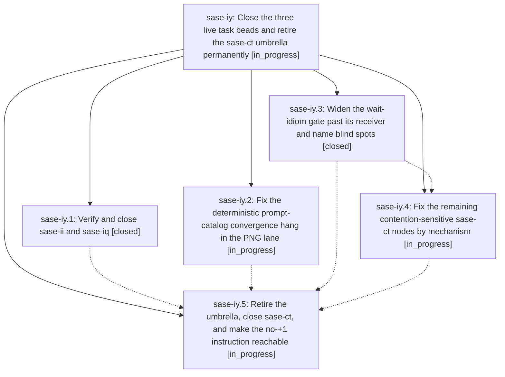

# Bead: sase-iy — Close the three live task beads and retire the sase-ct umbrella permanently

[Bead Pages](../README.md) / sase-iy

**Status:** ◐ in_progress · **Type:** ▸ plan · **Tier:** epic
**Owner:** `bryanbugyi34@gmail.com` · **Created by:** [bbugyi200.athena.xb](https://github.com/sase-org/sase--agents/blob/main/agents/bbugyi200.athena.xb/README.md) · **Assignee:** `sase-iy.land`
**Created:** 2026-08-10 11:01:13 EDT
**Plan:** [202608/retire\_sase\_ct\_umbrella.md](https://github.com/sase-org/sase--plans/blob/main/202608/retire_sase_ct_umbrella.md)

## Description

The three non-snoozed task beads (sase-ct, sase-ii, sase-iq) are closed with their underlying issues actually resolved. sase-ii and sase-iq are verified fixed on master and closed. The sase-ct class is attacked at the three mechanisms that produce it today — a deterministic prompt-catalog convergence hang that makes the PNG lane red in isolation, a wait-idiom gate blind spot that lets attempt-bounded pause loops back into ACE tests, and the residual contention-sensitive nodes — and then sase-ct is retired as an umbrella: it closes with a reason that forbids future +1 corroboration and directs the next reporter to file a node-specific task bead that references sase-ct as RELATED, and /sase_new_task is changed so that instruction is actually reachable at the moment an agent would otherwise +1.

## Notes

[2026-08-10T15:23:30Z · sase-il.land.f1] DISCOVERED ISSUE: Independent reproduction during tale-size PLAN-lane verification on 2026-08-10. Full `just test-visual --sase-update-visual-snapshots` failed 61 nodes under xdist after many tests timed out waiting for visual convergence with pending_workers=['prompt-catalog:0']; representative failures include prompt editing, frontmatter panel, completion, and highlighting snapshots. This matches active phase sase-iy.2's deterministic prompt-catalog convergence hang. The narrowed affected PLAN/context visual files passed with the same update flag: 42 passed in 18.58s.

## Phases

| Bead | Title | Status | Size | Created | Agents | Commits |
|---|---|---|---|---|---:|---:|
| [sase-iy.1](sase-iy.1.md) | Verify and close sase-ii and sase-iq | ✓ closed | small | 2026-08-10 | 1 | 0 |
| [sase-iy.2](sase-iy.2.md) | Fix the deterministic prompt-catalog convergence hang in the PNG lane | ◐ in_progress | medium | 2026-08-10 | 1 | 0 |
| [sase-iy.3](sase-iy.3.md) | Widen the wait-idiom gate past its receiver and name blind spots | ✓ closed | medium | 2026-08-10 | 1 | 1 |
| [sase-iy.4](sase-iy.4.md) | Fix the remaining contention-sensitive sase-ct nodes by mechanism | ◐ in_progress | medium | 2026-08-10 | 1 | 0 |
| [sase-iy.5](sase-iy.5.md) | Retire the umbrella, close sase-ct, and make the no-+1 instruction reachable | ◐ in_progress | medium | 2026-08-10 | 1 | 0 |

## Lineage

## Agents

| Agent | Bead | Commits |
|---|---|---:|
| [bbugyi200.athena.sase-iy.1](https://github.com/sase-org/sase--agents/blob/main/agents/bbugyi200.athena.sase-iy.1/README.md) | [sase-iy.1](sase-iy.1.md) | 0 |
| [bbugyi200.athena.sase-iy.2](https://github.com/sase-org/sase--agents/blob/main/agents/bbugyi200.athena.sase-iy.2/README.md) | [sase-iy.2](sase-iy.2.md) | 0 |
| [bbugyi200.athena.sase-iy.3](https://github.com/sase-org/sase--agents/blob/main/agents/bbugyi200.athena.sase-iy.3/README.md) | [sase-iy.3](sase-iy.3.md) | 1 |
| [bbugyi200.athena.sase-iy.4](https://github.com/sase-org/sase--agents/blob/main/agents/bbugyi200.athena.sase-iy.4/README.md) | [sase-iy.4](sase-iy.4.md) | 0 |
| [bbugyi200.athena.sase-iy.5](https://github.com/sase-org/sase--agents/blob/main/agents/bbugyi200.athena.sase-iy.5/README.md) | [sase-iy.5](sase-iy.5.md) | 0 |
| [bbugyi200.athena.sase-iy.land](https://github.com/sase-org/sase--agents/blob/main/agents/bbugyi200.athena.sase-iy.land/README.md) | [sase-iy](README.md) | 0 |

## Commits

| Repo | Commit | Subject | Bead | Committed |
|---|---|---|---|---|
| sase | [`c49452c`](https://github.com/sase-org/sase/commit/c49452c475730db67b18ab519885924b43d61692) | test: widen test wait helper gate | [sase-iy.3](sase-iy.3.md) | 2026-08-10 11:48:33 EDT |
