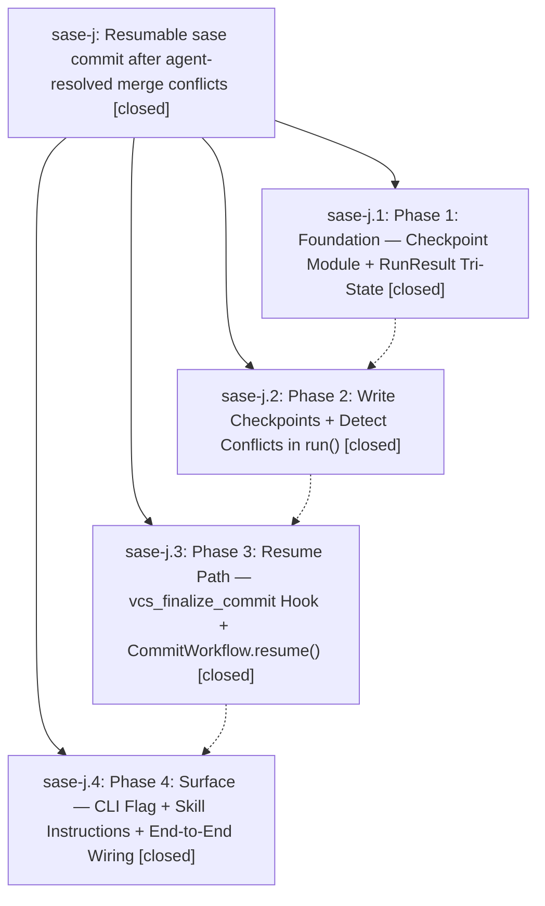

# Bead: sase-j — Resumable sase commit after agent-resolved merge conflicts

[Bead Pages](../README.md) / sase-j

**Status:** ✓ closed · **Resolution:** (unrecorded) · **Type:** plan · **Tier:** epic
**Owner:** `bryanbugyi34@gmail.com`
**Created:** 2026-04-18 01:25:55 UTC · **Closed:** 2026-04-18 03:59:47 UTC
**Plan:** [202604/commit\_resume\_1.md](https://github.com/sase-org/sase--plans/blob/main/202604/commit_resume_1.md)

## Phases

| Bead | Title | Status | Size | Agents | Commits |
|---|---|---|---|---:|---:|
| [sase-j.1](sase-j.1.md) | Phase 1: Foundation — Checkpoint Module + RunResult Tri-State | ✓ closed | small | 0 | 1 |
| [sase-j.2](sase-j.2.md) | Phase 2: Write Checkpoints + Detect Conflicts in run() | ✓ closed | small | 0 | 1 |
| [sase-j.3](sase-j.3.md) | Phase 3: Resume Path — vcs\_finalize\_commit Hook + CommitWorkflow.resume() | ✓ closed | small | 0 | 1 |
| [sase-j.4](sase-j.4.md) | Phase 4: Surface — CLI Flag + Skill Instructions + End-to-End Wiring | ✓ closed | small | 0 | 1 |

## Lineage

## Commits

| Commit | Subject | Bead | Committed (UTC) |
|---|---|---|---|
| [`bb72f3d`](https://github.com/sase-org/sase/commit/bb72f3dfaf7830e65c9d619c401657f50c369c72) | feat: introduce commit checkpoint module and RunResult tri-state (sase-j.1) | [sase-j.1](sase-j.1.md) | 2026-04-18 01:49:23 |
| [`18a04c8`](https://github.com/sase-org/sase/commit/18a04c805f8b1714bf95419b58d451693acef554) | feat: write commit checkpoints + detect merge conflicts in run() (sase-j.2) | [sase-j.2](sase-j.2.md) | 2026-04-18 02:46:24 |
| [`03e0f69`](https://github.com/sase-org/sase/commit/03e0f69b24810c40b0850a145682c5ee54789ce2) | feat: add CommitWorkflow.resume() + vcs\_finalize\_commit hook (sase-j.3) | [sase-j.3](sase-j.3.md) | 2026-04-18 03:21:58 |
| [`4355ba4`](https://github.com/sase-org/sase/commit/4355ba42f7ab656646bee15f89ac06d91d7dfefe) | feat: add \`sase commit --resume\` CLI flag + on-conflict skill instructions (sase-j.4) | [sase-j.4](sase-j.4.md) | 2026-04-18 03:36:50 |
