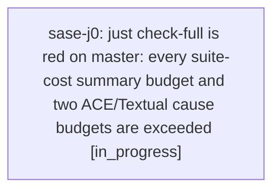

# Bead: sase-j0 — just check-full is red on master: every suite-cost summary budget and two ACE/Textual cause budgets are exceeded

[Bead Pages](../README.md) / sase-j0

**Status:** ◐ in_progress · **Type:** ◆ task · **+1 reports:** +3 · **↺ Reopened:** ↺1
**Owner:** `bryanbugyi34@gmail.com` · **Created by:** [bbugyi200.athena.sase-il.7.land](https://github.com/sase-org/sase--agents/blob/main/agents/bbugyi200.athena.sase-il.7.land/README.md) · **Assignee:** `sase-j0` · **Size:** large
**Created:** 2026-08-10 13:48:22 EDT

## Previously Closed

> ↺ Closed 2026-08-10T18:58:04Z · done
>
> (none)
>
> Reopened 2026-08-10T20:33:29Z by a +1 from @xm

## Description

Proposed by phase bead sase-il.7.3 (epic sase-il.7) as a PROPOSED FOLLOW-UP and independently reproduced by sase-il.7's land agent.

REPRODUCTION: 'just check-full' on master 3420d1211 (workspace sase_12, 12 xdist workers, Python 3.14). Every lint gate, SASE validation, and committed-plan validation passed and the full pytest run itself passed; the run then failed only in 'just test-cost' at tools/check_test_cost_budgets, so check-full exits 1 with no test failure to point at:
- collection_seconds: actual 272.301 vs budget 15.000 (+15% tolerance 17.250) -- 18x over
- idle_seconds: actual 2754.083 vs budget 900.000 (1035.000) -- 3x over
- peak_worker_rss_kib: actual 1028064.000 vs budget 716800.000 (824320.000)
- total_file_wall_seconds: actual 4064.488 vs budget 2300.000 (2645.000)
- causes.ace_page_enter: actual 390.155 vs budget 230.000 (264.500)
- causes.textual_app_run_test_enter: actual 347.313 vs budget 250.000 (287.500)
Recording: ~/.sase/test-selection/gh_sase-org__sase/timings/cost/20260810T174607Z-3499929.json. sase-il.7.3 reported the same six-way failure at 2026-08-10T17:26Z from both 'just check-full' and an isolated 'just test-cost' (28455 passed / 10 skipped both times), so this is deterministic, not a flake.

WHY IT MATTERS: check-full is the pre-landing gate every epic land agent runs. It is currently red on clean master for a reason unrelated to any individual patch, so every landing agent must either dismiss it by hand or re-report it -- which is what has now happened twice in one day.

SCOPE: decide whether the budgets in tests/perf/baselines/test_cost_budgets.json are stale or the suite genuinely regressed, then act deliberately. Those limits were derived in sase-ib.5 from a measured 12.399s collection and 500632 KiB peak RSS (see the file's own 'notes' array) and have never been touched since ee9603d31 added them, while the suite has grown to ~28455 tests; a collection budget missed by 18x looks like a limit calibrated under different conditions (worker count, Python version, host) rather than a 250s regression. Either recalibrate against real recorded history -- and record how the numbers were derived, as the notes array already tries to -- or find and fix what grew. Check the ACE/Textual wait-idiom churn that landed today (ebd3a91bc, c49452c47 from epic sase-iy / sase-h8) before assuming drift, since causes.ace_page_enter and causes.textual_app_run_test_enter are two of the six failures.

VERIFY: 'just check-full' passes end to end on clean master, and tools/check_test_cost_budgets still fails when a real cost regression is introduced.

## Notes

[2026-08-10T17:48:52Z · sase-il.7.land] RELATED: sase-ip — closed as canceled on 2026-08-10 after backlog triage judged the flat subprocess_run/subprocess_popen buckets too coarse to diagnose but not currently red. Its close reason says to reopen with a +1 when the subprocess_run budget is actually exceeded; that has not happened here (subprocess_run is not among the six failures), so this task is the budget-overage defect and sase-ip remains the separate granularity improvement.

[2026-08-10T17:49:02Z · sase-il.7.land] RELATED: sase-gk — recalibrating the diff-scoped lane's serial-runtime budget against real lane history. Same 'a committed perf budget no longer matches reality' shape and probably the same recalibration methodology, but a different budget file and a different lane; whoever works one should look at the other.

[2026-08-10T17:49:12Z · sase-il.7.land] RELATED: sase-iu — the contract-manifest and contract-set budget failures that make the same full lane red today. Distinct root cause (stale committed manifest and an entry budget of 36 against 38 committed entries), but a worker running check-full to verify this task's fix will hit sase-iu's failures first unless it is already resolved.

[2026-08-10T18:58:04Z · sase-j0] Recalibrated tests/perf/baselines/test_cost_budgets.json against 8+ real just test-cost recordings (host athena, 2026-08-10 15:21Z-17:46Z+, 4-14 workers): added per_worker normalization to check_cost_budgets(), collection_cpu_seconds to build_cost_record()'s summary, and tools/check_test_cost_budgets --suggest. Verified: 27/27 tests in tests/test_test_cost.py pass; committed pre-epic baseline still fails recalibrated budgets on parser_create/textual_app_run_test_enter/yaml_load; a fresh just check-full run's own cost recording (20260810T185645Z) passes the recalibrated budgets cleanly (test cost gate: PASS); just check passes end to end. just check-full's only failure is the pre-existing, separately-tracked selection-health/flake-baseline gate driven by tests/test_contract_manifest.py::test_contract_manifest_matches_marker_selection (stale contract manifest), unrelated to this change, as anticipated by the plan's Known Blocker section.

[2026-08-11T13:32:14Z · xy] close_out_sase_ct_retirement measurement at db338f2ef: after opening the linked sase-core checkout and rebuilding local sase_core_rs to 0.24.5, just check-full passed end to end, including tools/check_test_cost_budgets. Latest cost record: /home/bryan/.sase/test-selection/gh_sase-org__sase/timings/cost/20260811T132350Z-3690654.json; 14 workers, 2528 files, 28931 nodes, per-test wall 2830.942s, collection 225.751s, worker wall 8369.100s, peak worker RSS 1072932 KiB. This run makes the cost gate green for this closure; leaving this task open for the owner because it still tracks prior master-wide cost redness and reopen history.

## +1 Evidence

> **+1** by `xi` · 2026-08-10 14:40:08 EDT
> **Observed since:** 2026-08-10 14:11:05 EDT
>
> Independent reproduction while verifying context_plan_lane_above_bead_lane on 2026-08-10 in workspace sase_14. First just check-full run failed three unrelated pass-in-isolation tests, then the exact nodes passed on immediate targeted rerun; a second just check-full run passed all pytest nodes (28475 passed / 10 skipped) but still failed only the test-cost budget gate. Exceeded budgets: collection_seconds 219.842 > 17.250 tolerated, idle_seconds 2151.377 > 1035.000, peak_worker_rss_kib 1068688 > 824320, total_file_wall_seconds 3415.118 > 2645.000, causes.ace_page_enter 361.979 > 264.500, causes.textual_app_run_test_enter 327.178 > 287.500. The lane-order patch touches SASE CONTEXT presentation constants/docs/tests/goldens, not test-cost budgets or TUI startup harness code.
>
> **References:** file:explicit:5ea079395bf711ce2dd71f71

> **+1** by `xm` · 2026-08-10 16:33:29 EDT
> **Observed since:** 2026-08-10 16:33:29 EDT
>
> Independent post-close reproduction while verifying model_alias provenance on 2026-08-10. This workspace contains the recalibration fix commit c8e4016c7. just check-full passed fmt, lint, SASE validation, committed plans, and the full pytest test-cost lane itself (28546 passed / 10 skipped), then failed only the recalibrated test-cost budget gate on peak_worker_rss_kib: actual 1325528 KiB exceeded budget 1100000 KiB + 15% tolerance (1265000 KiB). The model-alias patch touches directive metadata, scan wire fields, model display rendering, docs, and focused tests; it does not touch test-cost budgets or pytest worker memory behavior.
>
> **References:** file:explicit:4b47674d950e36f81477c605

> **+1** by `sase-jo.land` · 2026-08-11 11:41:23 EDT
> **Observed since:** 2026-08-11 10:39:36 EDT
>
> Independent reproduction while landing epic sase-jo's amend-footer follow-up fix on 2026-08-11 (workspace sase_10, base commit ccd34ae92, uncommitted local changes to src/sase/vcs_provider/plugins/_git_core_ops.py + 3 test files, not test-cost tooling). First 'just check-full' run failed only at test-cost: peak_worker_rss_kib actual 1342924 KiB exceeded budget 1100000 + 15% tolerance (1265000 KiB); all pytest nodes themselves passed. Confirmed heavy concurrent contention at the time: load average 13-19, 'ps aux' showed 4+ concurrent 'sase ace(run)' agent processes, an active release-mode rustc build of sase_core_rs in sibling workspace sase_12, and a root rsync hourly backup job. Immediate retry of 'just test-cost' alone (no code changes) passed cleanly: 'test cost budgets passed'. This patch touches only commit-amend footer preservation, not test-cost tooling or worker memory behavior.

## References

- file:explicit:5ea079395bf711ce2dd71f71
- file:explicit:4b47674d950e36f81477c605

## Lineage

## Agents

| Agent | Bead | Commits |
|---|---|---:|
| [bbugyi200.athena.sase-j0](https://github.com/sase-org/sase--agents/blob/main/families/bbugyi200.athena.sase-j0.md) | [sase-j0](README.md) | 2 |

## Commits

| Repo | Commit | Subject | Bead | Committed |
|---|---|---|---|---|
| sase | [`c8e4016`](https://github.com/sase-org/sase/commit/c8e4016c7c5e169b77fd4bfadd9170e71c2a1ca2) | fix(test-cost): recalibrate suite-cost budgets against real recorded history | [sase-j0](README.md) | 2026-08-10 14:58:48 EDT |
| sase | [`9cb81b3`](https://github.com/sase-org/sase/commit/9cb81b3b0dde3af6c4bd66260e9d382785feec65) | feat(test-cost): add width-invariant worker-RSS summary keys | [sase-j0](README.md) | 2026-08-11 12:39:33 EDT |
