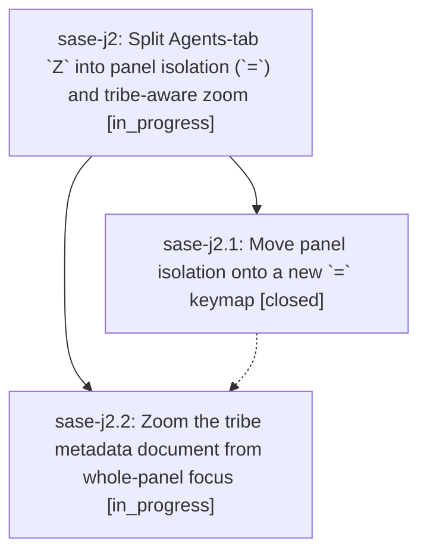

# Bead: sase-j2 — Split Agents-tab \`Z\` into panel isolation (\`=\`) and tribe-aware zoom

[Bead Pages](../README.md) / sase-j2

**Status:** ◐ in_progress · **Type:** ▸ plan · **Tier:** epic
**Owner:** `bryanbugyi34@gmail.com` · **Created by:** [bbugyi200.athena.xh](https://github.com/sase-org/sase--agents/blob/main/agents/bbugyi200.athena.xh/README.md) · **Assignee:** `sase-j2.land`
**Created:** 2026-08-10 14:07:55 EDT
**Plan:** [202608/tribe\_zoom\_and\_panel\_isolation\_keymap.md](https://github.com/sase-org/sase--plans/blob/main/202608/tribe_zoom_and_panel_isolation_keymap.md)

## Description

On the Agents tab, `=` isolates or restores tribe panels from any selection (whole-panel focus or a row inside a panel), and `Z` opens the zoom modal for agent rows, clan containers, agent lanes, and selected tribe panels alike.

## Phases

| Bead | Title | Status | Size | Created | Agents | Commits |
|---|---|---|---|---|---:|---:|
| [sase-j2.1](sase-j2.1.md) | Move panel isolation onto a new \`=\` keymap | ✓ closed | medium | 2026-08-10 | 1 | 1 |
| [sase-j2.2](sase-j2.2.md) | Zoom the tribe metadata document from whole-panel focus | ◐ in_progress | medium | 2026-08-10 | 1 | 0 |

## Lineage

## Agents

| Agent | Bead | Commits |
|---|---|---:|
| [bbugyi200.athena.sase-j2.1](https://github.com/sase-org/sase--agents/blob/main/agents/bbugyi200.athena.sase-j2.1/README.md) | [sase-j2.1](sase-j2.1.md) | 1 |
| [bbugyi200.athena.sase-j2.2](https://github.com/sase-org/sase--agents/blob/main/agents/bbugyi200.athena.sase-j2.2/README.md) | [sase-j2.2](sase-j2.2.md) | 0 |
| [bbugyi200.athena.sase-j2.land](https://github.com/sase-org/sase--agents/blob/main/agents/bbugyi200.athena.sase-j2.land/README.md) | [sase-j2](README.md) | 0 |

## Commits

| Repo | Commit | Subject | Bead | Committed |
|---|---|---|---|---|
| sase | [`5f6d8ea`](https://github.com/sase-org/sase/commit/5f6d8ea64f6e6aaabf562c68af84b5ecdcdae222) | feat(ace): move panel isolation onto a new = keymap | [sase-j2.1](sase-j2.1.md) | 2026-08-10 14:49:38 EDT |
