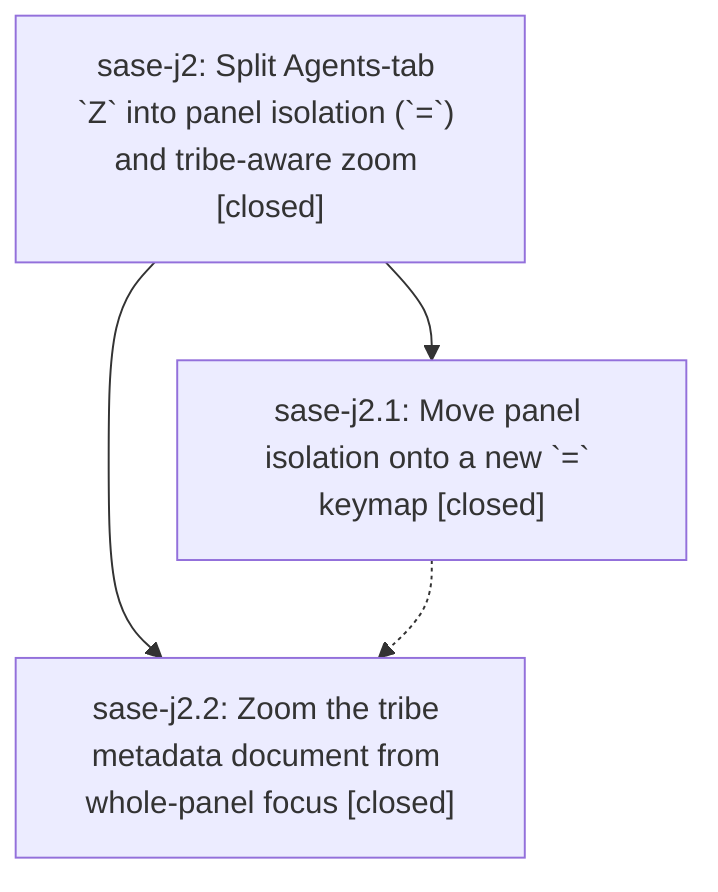

# Bead: sase-j2 — Split Agents-tab \`Z\` into panel isolation (\`=\`) and tribe-aware zoom

[Bead Pages](../README.md) / sase-j2

**Status:** ✓ closed · **Resolution:** done · **Type:** ▸ plan · **Tier:** epic
**Owner:** `bryanbugyi34@gmail.com` · **Created by:** [bbugyi200.athena.xh](https://github.com/sase-org/sase--agents/blob/main/agents/bbugyi200.athena.xh/README.md) · **Assignee:** `sase-j2.land`
**Created:** 2026-08-10 14:07:55 EDT · **Closed:** 2026-08-10 16:09:05 EDT
**Plan:** [202608/tribe\_zoom\_and\_panel\_isolation\_keymap.md](https://github.com/sase-org/sase--plans/blob/main/202608/tribe_zoom_and_panel_isolation_keymap.md)

## Description

On the Agents tab, `=` isolates or restores tribe panels from any selection (whole-panel focus or a row inside a panel), and `Z` opens the zoom modal for agent rows, clan containers, agent lanes, and selected tribe panels alike.

## Notes

[2026-08-10T20:09:05Z · sase-j2.land] Epic complete and landed. Verified per the land-audit plan:

SOURCE/COMMIT VERIFICATION: Both children closed (sase-j2.1 panel isolation on =, sase-j2.2 tribe-aware zoom on Z), neither with PROPOSED FOLLOW-UP notes. Implementation commits 5f6d8ea64 and 63f9f15d6 confirmed matching intended behavior (source, tests, docs, keymaps, command metadata, footer plumbing, modal refresh/enrichment, isolation state handling).

LATER NON-EPIC COMMITS: c8e4016c7 and 83bb8a6f7 are test-infrastructure changes; e01584098 (snippet destination resolver) touches default_config.yml and modal exports in areas separate from this epic's keymap/zoom code. All three confirmed to need no integration changes.

TERMINOLOGY CLEANUP (Phase 1): Updated stale Z/zoom-action wording to isolation-action terminology in src/sase/ace/tui/actions/agents/_folding_panels.py (marker docstring), tests/ace/tui/test_agent_panel_isolation_revert.py (module title + restore-ownership comment), tests/ace/tui/test_agent_panel_collapse_isolation.py (renamed three test_capital_z_* tests to test_equals_*), and tests/test_keymaps_display_help.py (renamed test to say zoom_and_isolation explicitly). No behavior changed. Broad re-search found no remaining stale Z/zoom-isolation wording; legitimate zoom-search and unrelated Z bindings preserved.

VISUAL GOLDENS (Phase 2): Regenerated exactly the 23 reproducibly-stale PNG goldens named in the plan via --sase-update-visual-snapshots. Reviewed every diff: all confined to the bottom footer/panel-reflow region, consistent with the new "= only panel" footer affordance and its deterministic layout reflow. No unrelated content changes.

VERIFICATION COMMANDS/RESULTS (Phase 3): (1) The focused 200-test behavior/keymap/command/footer suite: 200 passed. (2) just test-visual without update flag: 647 passed, 1 skipped, 1 failed on re-run — the failure (test_plans_filter_bar_prefilled_png_snapshot) is an unrelated golden not touched by this epic, reproduced flaky under full parallel load, confirmed passing in isolation (1 passed in 6.80s), and corroborated onto the existing sase-ct parallel-flake umbrella (+61). (3) just check-full: every lint gate green (fmt, keep-sorted, ruff, mypy, pyscripts, test waits, changelog, patch/stitch terminology, symvision, toobig), SASE validation green, committed-plans green, and the full test-cost pytest lane (superset of the focused 200) passed; only the flake-baseline gate (just selection-health --fail-on-new-flake) failed, flagging tests/test_bead/test_plus_one_presentation.py::test_post_close_plus_one_badge_marker_search_and_json_agree as newly reproducible — unrelated to this epic's scope, already tracked and corroborated on existing ready task sase-j6 (which documents two disjoint failing change sets, neither touching this epic's files). (4) git diff --check clean. (5) Current source paths named in the epic plan re-inspected and match; the diff is exactly the 32 files from Phases 1-2 (3 source/test files + 1 test rename + 23 regenerated PNG goldens, wait: 4 code files + 23 goldens = 27... actually 32 total changed paths, all epic-scoped).

FOLLOW-UP PROPOSALS: None. No PROPOSED FOLLOW-UP notes existed on either child or the epic; no /sase_new_task outcome required for epic-caused work. (The two unrelated flakes discovered while running the verification gates were filed/corroborated as tasks sase-j6 and sase-ct per the repo's discovered-work policy, not as epic follow-ups.)

## Phases

| Bead | Title | Status | Size | Created | Agents | Commits |
|---|---|---|---|---|---:|---:|
| [sase-j2.1](sase-j2.1.md) | Move panel isolation onto a new \`=\` keymap | ✓ closed | medium | 2026-08-10 | 1 | 1 |
| [sase-j2.2](sase-j2.2.md) | Zoom the tribe metadata document from whole-panel focus | ✓ closed | medium | 2026-08-10 | 1 | 1 |

## Lineage

## Agents

| Agent | Bead | Commits |
|---|---|---:|
| [bbugyi200.athena.sase-j2.1](https://github.com/sase-org/sase--agents/blob/main/agents/bbugyi200.athena.sase-j2.1/README.md) | [sase-j2.1](sase-j2.1.md) | 1 |
| [bbugyi200.athena.sase-j2.2](https://github.com/sase-org/sase--agents/blob/main/agents/bbugyi200.athena.sase-j2.2/README.md) | [sase-j2.2](sase-j2.2.md) | 1 |
| [bbugyi200.athena.sase-j2.land](https://github.com/sase-org/sase--agents/blob/main/families/bbugyi200.athena.sase-j2.land.md) | [sase-j2](README.md) | 2 |

## Commits

| Repo | Commit | Subject | Bead | Committed |
|---|---|---|---|---|
| sase | [`5f6d8ea`](https://github.com/sase-org/sase/commit/5f6d8ea64f6e6aaabf562c68af84b5ecdcdae222) | feat(ace): move panel isolation onto a new = keymap | [sase-j2.1](sase-j2.1.md) | 2026-08-10 14:49:38 EDT |
| sase | [`63f9f15`](https://github.com/sase-org/sase/commit/63f9f15d69433c602b974757673de47ef5cff7bf) | feat(tui): zoom tribe metadata panels | [sase-j2.2](sase-j2.2.md) | 2026-08-10 15:26:09 EDT |
| sase--plans | [`sase--plans@bf4fdc7`](https://github.com/sase-org/sase--plans/commit/bf4fdc7db66e372603ba68043d8015859078006f) | docs: mark tribe\_zoom\_and\_panel\_isolation\_keymap plan done | [sase-j2](README.md) | 2026-08-10 16:13:52 EDT |
| sase | [`5b97f27`](https://github.com/sase-org/sase/commit/5b97f275518a5990068a8bc13f671f04e2e80170) | test: finish epic sase-j2's isolation terminology cleanup and stale goldens | [sase-j2](README.md) | 2026-08-10 16:16:43 EDT |
