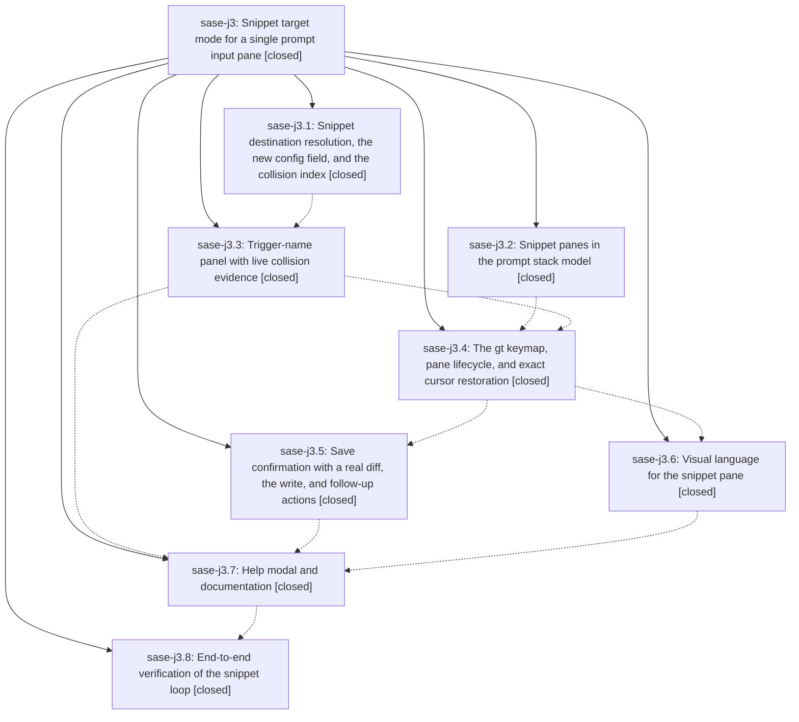

# Bead: sase-j3 — Snippet target mode for a single prompt input pane

[Bead Pages](../README.md) / sase-j3

**Status:** ✓ closed · **Resolution:** done · **Type:** ▸ plan · **Tier:** epic
**Owner:** `bryanbugyi34@gmail.com` · **Created by:** [bbugyi200.athena.xl](https://github.com/sase-org/sase--agents/blob/main/agents/bbugyi200.athena.xl/README.md) · **Assignee:** `sase-j3.land`
**Created:** 2026-08-10 14:49:25 EDT · **Closed:** 2026-08-10 19:15:34 EDT
**Plan:** [202608/snippet\_target\_mode.md](https://github.com/sase-org/sase--plans/blob/main/202608/snippet_target_mode.md)

## Description

Authoring and editing an ACE snippet is a first-class prompt-bar loop: `gt` / `Ctrl+G t` asks for the trigger name with live collision evidence, opens one visibly distinct snippet pane at the bottom of the prompt input stack (pre-filled with the existing definition when the trigger already exists), and `<enter>` saves it to the user's configured snippet config file — showing a real diff before writing and offering exactly the follow-up actions that file needs — after which the pane disappears and the cursor returns to precisely where it was.

## Notes

[2026-08-10T23:15:34Z · sase-j3.land] Verified all 8 phases against the shipped code, not just the bead notes, and read every phase commit (e01584098, 4d8be52cf, 21c83218f, 64ddea98a, ba77762e6, de530b340, 0ccd7f844, aae179e86, d4b913bb9).

WHAT I CONFIRMED IN THE SOURCE. target: ace.snippet_config_path exists in default_config.yml, sase.schema.json, and _state_init_late.py; snippet discovery lives in the Textual-free src/sase/xprompt/snippet_targets.py with modals/snippet_config_location_modal.py deleted and no compatibility alias anywhere (grepped .py/.pyi/.md); resolve_snippet_save_target implements all six rules and pipes through write_targets.resolve_xprompt_write_target; snippet_collision is pure and built on resolution_after_save. model: PromptStackState carries snippet_item/snippet_index/has_snippet_pane/agent_items/agent_count/append_snippet_pane/remove_snippet_pane/retarget_snippet_pane/snippet_is_dirty, and texts/join/editor_markdown/is_effectively_empty are agent-only, so no launch, stash, or save-as payload can contain the snippet body. name: snippet_name_modal.py builds every verdict row from the plan's table and loads bodies through asyncio.to_thread. pane: the gt binding is in _PROMPT_G_PREFIX_BINDINGS, and _prompt_input_bar_snippet_pane.py implements open/retarget/close with PromptFocusRestore(item_id, cursor, vim_mode) and the dirty-discard ConfirmActionModal guard. save: snippet_save_confirm_modal.py renders draft/existing/diff with the changed-on-disk reload branch, and both gx and gt route through the single save_snippet() coroutine, so the write, last-used location, live publish, and post-write commit/scoped-chezmoi-apply chain cannot drift. visual: the separator title bar, the .prompt-pane.snippet-target $primary CSS, and the snippet subtitles are all present. docs: the gt row is in the help popup and both docs/ace.md keymap tables, and ace.snippet_config_path is documented in docs/configuration.md.

EPIC WORK I FINISHED HERE. Phase sase-j3.6 recorded a PROPOSED FOLLOW-UP that its fourth planned PNG golden -- the save confirmation showing a diff -- could not be pinned because sase-j3.5's modal did not exist in its workspace. That is epic scope, not a follow-up, so I completed it: new tests/ace/tui/visual/test_ace_png_snapshots_snippet_save.py and golden snippet_save_confirm_diff_120x40.png, rendering the real unified diff, the [Diff] tab strip, and the overwrite verdict. All four of the visual phase's planned goldens now exist.

INTEGRATION. Compared the epic's 56 touched files against all 13 non-epic commits that landed between 2026-08-10 14:49 and 18:44. Only four overlaps exist (5f6d8ea64 and 63f9f15d6 on docs/ace.md, 5f6d8ea64 on default_config.yml, 83e3d3c27 on docs/configuration.md, c69d16378 on styles.tcss) and every one of them predates the epic commit that touched the same file, so each phase already rebased onto it. Semantically: no other code computes a snippet destination or writes ace.snippets outside snippet_targets.py, snippet_config_yaml.py, and the two save paths, so nothing duplicates or conflicts with what this epic added; the = keymap (sase-j2.1) is app-level and does not collide with the prompt-bar g table; the opt-in global-state leak detector (sase-j7.2) has nothing to catch here, since none of the epic's new modules introduce module-level mutable state; and _editor_helper_snippets.py reads the merged config, so it needs no change.

VERIFICATION. just install, then just check-full on this tree: every lint gate (fmt python/markdown, keep-sorted, ruff, mypy, pyscripts, test waits, changelog, patch/stitch terminology, symvision, toobig), SASE validation, committed-plans validation, and the full pytest cost lane all pass. Full just test-visual: 652 passed, 1 skipped -- one more than sase-j3.8's 651, which is exactly the golden added above. check-full stops only at its final gate, the flake baseline, on two nodes that are not this epic's.

PROPOSED FOLLOW-UPS, ALL RESOLVED. (1) sase-j3.5 and sase-j3.8 both proposed the logs-pane scroll-extremes flake: filed as new task sase-jb (large, ready). I read the durable selection-health record store directly rather than trusting the summary -- the node has two qualifying full-run failures with disjoint change sets (head e01584098 carrying only sase-j7.2's leak-detector test files, head ba77762e6 carrying only sase-j3.5's snippet-save files), and neither touches logs-pane code, so it is not attributable to this epic. (2) sase-j3.8 also proposed the plus-one presentation flake: task sase-j6 already tracked it, so I recorded a +1 with independent evidence instead of a duplicate -- that node has three disjoint-change-set failures, the earliest (head 012e1a88b, models_panel_rendering.py) predating any sase-j3 commit. Both nodes are also recorded as a DISCOVERED ISSUE on in-progress epic sase-h8.10, which owns clearing the nodes that fail sase-h8's flake-gate exit criterion. (3) sase-j3.6's PNG-golden proposal was epic work and is done, as described above. Nothing was declined.

ONE GAP I FOUND AND DID NOT FIX, filed as task sase-jc (medium, ready): resolve_snippet_save_target accepts any writable .yml path, but sase's config loader only merges ~/.config/sase/sase.yml, its sase_*.yml overlays, and the project sase/sase.yml. So ace.snippet_config_path: 'snippets.yml' is accepted with no fallback_reason, the snippet is written and published live for the session, and it silently disappears on the next start -- a near-miss with the documented 'sase_snippets.yml' example, which does load. I left it for the owner because there are two defensible fixes (reject non-loadable destinations with a fallback_reason, or teach the loader to read the configured file) and because narrowing the resolver would intersect sase-j3.8's deliberate out-of-discovery picker work in d4b913bb9. This is a plan-faithful implementation of rules the plan did not include, not a phase that failed to do its job.

[2026-08-10T23:24:13Z · sase-j3.land] POST-CLOSE CLEANUP (all verified with just check, fully green, scoped lane escalated to the full suite on the Justfile change): removed the expired --epic-symbol "sase-j3(SnippetTriggerMatch)" entry from the Justfile's symvision invocation, then resolved what it had been holding open. SnippetTriggerMatch had no non-test consumer and in fact no consumer outside its own module at all -- nothing in src/ or tests/ names the type; callers reach those records only through SnippetCollision.matches. Per the symvision decision hierarchy that makes it case 2 (private, used only within its defining file) rather than case 1 (delete): renamed it to _SnippetTriggerMatch, dropped it from __all__, and documented why it is private. No code died and no tests changed. just symvision now reports 'All public/private classes/functions are used properly!'. Plan file plans:202608/snippet_target_mode.md set to status: done.

[2026-08-10T23:25:27Z · sase-j3.land] Land verification: read shipped source for all 8 phases against their commits (ace.snippet_config_path config/schema/state, Textual-free snippet_targets.py with old modal deleted and no compat alias, agent-only stack partition, gt binding, exact cursor/mode restore via PromptFocusRestore, diff confirmation, gx/gt sharing one save_snippet() coroutine). Integrated: diffed the epic's 56 files against all 13 non-epic commits in the epic window; 4 file overlaps all predate their epic commit (phases already rebased) and nothing duplicates or conflicts semantically. Finished phase j3.6's proposed follow-up as epic work by adding the fourth PNG golden snippet_save_confirm_diff_120x40.png (unpinnable until j3.5's modal existed); just test-visual 652 passed / 1 skipped. Follow-ups filed: sase-jb (logs-pane flake, new), +1 on existing sase-j6, both recorded on active epic sase-h8.10 which owns that gate; sase-jc for resolve_snippet_save_target accepting .yml paths sase never merges. just check-full green on every lint gate and the full pytest lane except the flake-baseline gate on two foreign nodes whose failures span non-epic change sets.

## Phases

| Bead | Title | Status | Size | Created | Agents | Commits |
|---|---|---|---|---|---:|---:|
| [sase-j3.1](sase-j3.1.md) | Snippet destination resolution, the new config field, and the collision index | ✓ closed | medium | 2026-08-10 | 1 | 1 |
| [sase-j3.2](sase-j3.2.md) | Snippet panes in the prompt stack model | ✓ closed | medium | 2026-08-10 | 1 | 2 |
| [sase-j3.3](sase-j3.3.md) | Trigger-name panel with live collision evidence | ✓ closed | medium | 2026-08-10 | 1 | 1 |
| [sase-j3.4](sase-j3.4.md) | The gt keymap, pane lifecycle, and exact cursor restoration | ✓ closed | medium | 2026-08-10 | 1 | 1 |
| [sase-j3.5](sase-j3.5.md) | Save confirmation with a real diff, the write, and follow-up actions | ✓ closed | medium | 2026-08-10 | 1 | 1 |
| [sase-j3.6](sase-j3.6.md) | Visual language for the snippet pane | ✓ closed | medium | 2026-08-10 | 1 | 1 |
| [sase-j3.7](sase-j3.7.md) | Help modal and documentation | ✓ closed | small | 2026-08-10 | 1 | 1 |
| [sase-j3.8](sase-j3.8.md) | End-to-end verification of the snippet loop | ✓ closed | small | 2026-08-10 | 1 | 1 |

## Lineage

## Agents

| Agent | Bead | Commits |
|---|---|---:|
| [bbugyi200.athena.sase-j3.1](https://github.com/sase-org/sase--agents/blob/main/agents/bbugyi200.athena.sase-j3.1/README.md) | [sase-j3.1](sase-j3.1.md) | 1 |
| [bbugyi200.athena.sase-j3.2](https://github.com/sase-org/sase--agents/blob/main/agents/bbugyi200.athena.sase-j3.2/README.md) | [sase-j3.2](sase-j3.2.md) | 2 |
| [bbugyi200.athena.sase-j3.3](https://github.com/sase-org/sase--agents/blob/main/agents/bbugyi200.athena.sase-j3.3/README.md) | [sase-j3.3](sase-j3.3.md) | 1 |
| [bbugyi200.athena.sase-j3.4](https://github.com/sase-org/sase--agents/blob/main/agents/bbugyi200.athena.sase-j3.4/README.md) | [sase-j3.4](sase-j3.4.md) | 1 |
| [bbugyi200.athena.sase-j3.5](https://github.com/sase-org/sase--agents/blob/main/agents/bbugyi200.athena.sase-j3.5/README.md) | [sase-j3.5](sase-j3.5.md) | 1 |
| [bbugyi200.athena.sase-j3.6](https://github.com/sase-org/sase--agents/blob/main/agents/bbugyi200.athena.sase-j3.6/README.md) | [sase-j3.6](sase-j3.6.md) | 1 |
| [bbugyi200.athena.sase-j3.7](https://github.com/sase-org/sase--agents/blob/main/agents/bbugyi200.athena.sase-j3.7/README.md) | [sase-j3.7](sase-j3.7.md) | 1 |
| [bbugyi200.athena.sase-j3.8](https://github.com/sase-org/sase--agents/blob/main/agents/bbugyi200.athena.sase-j3.8/README.md) | [sase-j3.8](sase-j3.8.md) | 1 |
| [bbugyi200.athena.sase-j3.land](https://github.com/sase-org/sase--agents/blob/main/agents/bbugyi200.athena.sase-j3.land/README.md) | [sase-j3](README.md) | 1 |

## Commits

| Repo | Commit | Subject | Bead | Committed |
|---|---|---|---|---|
| sase | [`e015840`](https://github.com/sase-org/sase/commit/e01584098b773fd177331e923d346ec981040113) | feat(ace): add snippet destination resolver, config field, and collision index | [sase-j3.1](sase-j3.1.md) | 2026-08-10 15:28:16 EDT |
| sase | [`4d8be52`](https://github.com/sase-org/sase/commit/4d8be52cf1821d435c87ffc442fc87dd05cc3088) | feat(ace): add prompt stack snippet pane model | [sase-j3.2](sase-j3.2.md) | 2026-08-10 15:47:24 EDT |
| sase | [`21c8321`](https://github.com/sase-org/sase/commit/21c83218fe1a7c8fc81c440ab09bde90d5ebbe82) | fix(ace): keep snippet pane target internal | [sase-j3.2](sase-j3.2.md) | 2026-08-10 15:59:33 EDT |
| sase | [`64ddea9`](https://github.com/sase-org/sase/commit/64ddea98a879ef774c41fc2bc10b7ccc6c101a55) | feat(tui): add snippet trigger name modal | [sase-j3.3](sase-j3.3.md) | 2026-08-10 16:20:08 EDT |
| sase | [`ba77762`](https://github.com/sase-org/sase/commit/ba77762e68fd045df73b8106dd589d91787e9ca1) | feat(ace): add snippet target pane lifecycle | [sase-j3.4](sase-j3.4.md) | 2026-08-10 17:01:58 EDT |
| sase | [`de530b3`](https://github.com/sase-org/sase/commit/de530b340f6bbd1dd14ccb7f00f122cd145aa99f) | feat(ace): confirm snippet pane saves | [sase-j3.5](sase-j3.5.md) | 2026-08-10 17:45:58 EDT |
| sase | [`0ccd7f8`](https://github.com/sase-org/sase/commit/0ccd7f84473191551aba0091b8ca9c401053d579) | feat(ace): give the snippet pane its own theme-safe visual language | [sase-j3.6](sase-j3.6.md) | 2026-08-10 17:53:29 EDT |
| sase | [`aae179e`](https://github.com/sase-org/sase/commit/aae179e86fabbffdf3e572b808d531884e317564) | docs(ace): document snippet pane keybinding and config field | [sase-j3.7](sase-j3.7.md) | 2026-08-10 18:07:03 EDT |
| sase | [`d4b913b`](https://github.com/sase-org/sase/commit/d4b913bb9a353dfa571b04fa6a1c253f8c025db8) | fix: honor configured snippet target in unified save | [sase-j3.8](sase-j3.8.md) | 2026-08-10 18:44:08 EDT |
| sase | [`9edf680`](https://github.com/sase-org/sase/commit/9edf680793f7ad322cad812d5006975384119646) | chore(ace): land sase-j3 snippet target mode | [sase-j3](README.md) | 2026-08-10 19:32:08 EDT |
