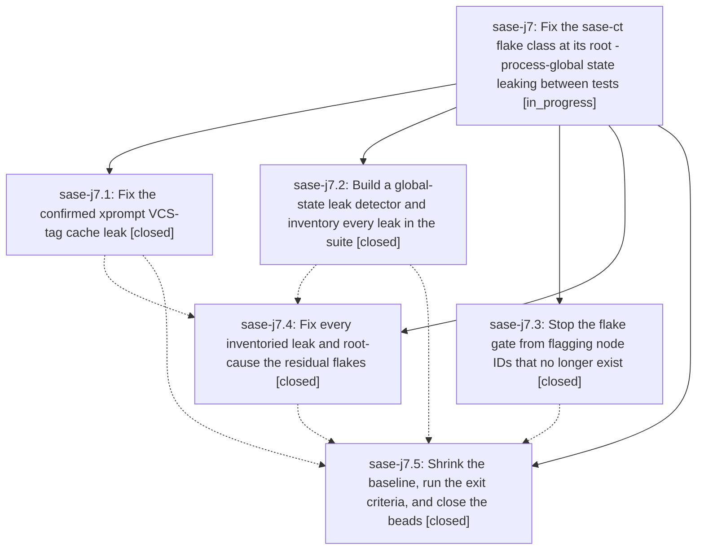

# Bead: sase-j7 — Fix the sase-ct flake class at its root - process-global state leaking between tests

[Bead Pages](../README.md) / sase-j7

**Status:** ◐ in_progress · **Type:** ▸ plan · **Tier:** epic
**Owner:** `bryanbugyi34@gmail.com` · **Created by:** [bbugyi200.athena.sase-j0.w1.f0](https://github.com/sase-org/sase--agents/blob/main/agents/bbugyi200.athena.sase-j0.w1.f0/README.md) · **Assignee:** `sase-j7.land`
**Created:** 2026-08-10 15:44:26 EDT
**Plan:** [202608/fix\_sase\_ct\_flake\_class.md](https://github.com/sase-org/sase--plans/blob/main/202608/fix_sase_ct_flake_class.md)

## Description

The tests behind sase-ct stop failing under the full parallel lane because the process-global state that leaks between tests is fixed by mechanism, a leak detector gate makes the class non-recurring, tests/reproducible_flake_baseline.txt shrinks to only nodes proven still broken, and sase-ct, sase-iy.5, sase-j4, sase-j5, and sase-j6 are closed on evidence.

## Notes

[2026-08-10T23:29:55Z · sase-j7.4] DISCOVERED ISSUE: During fix_global_state_leaks verification on 2026-08-10, just check escalated to the full scoped pytest lane and failed exactly tests/notification_store/test_snooze_e2e_matrix.py::TestSnoozeStateMatrix::test_resnooze_replaces_the_single_scheduled_deadline after the ordinary lint gates passed. The same node passed immediately in isolation with .venv/bin/python -m pytest tests/notification_store/test_snooze_e2e_matrix.py::TestSnoozeStateMatrix::test_resnooze_replaces_the_single_scheduled_deadline -vv, and the full tests/notification_store/test_snooze_e2e_matrix.py file passed right after. A 14-worker tools/run_pytest cost pass on the same tree passed all 28,625 tests plus the new global-state detector with 0 poisoning changes, so this looks like a remaining full-lane/pass-isolation flake for the active sase-j7/sase-ct retirement work rather than a deterministic notification snooze contract break. Related but not duplicate: closed task sase-d7 covered an old core floor for notification snooze contracts; closed task sase-i5 covered expired bead snooze fixture dates.

[2026-08-11T00:15:36Z · sase-j9.land] DISCOVERED ISSUE: Follow-up proposals from phase sase-j9.1 independently recur during sase-j9 landing at HEAD c0238421b: just selection-health --fail-on-new-flake still names tests/ace/tui/test_logs_pane.py::test_logs_tab_g_and_shift_g_scroll_detail_extremes and tests/test_bead/test_plus_one_presentation.py::test_post_close_plus_one_badge_marker_search_and_json_agree after both pass in isolated pytest runs. Corroborated exact ready tasks sase-jb and sase-j6; this evidence belongs to active epic sase-j7 because phase sase-j7.5 explicitly owns shrinking the flake baseline and closing those nodes.

## Phases

| Bead | Title | Status | Size | Created | Agents | Commits |
|---|---|---|---|---|---:|---:|
| [sase-j7.1](sase-j7.1.md) | Fix the confirmed xprompt VCS-tag cache leak | ✓ closed | medium | 2026-08-10 | 1 | 1 |
| [sase-j7.2](sase-j7.2.md) | Build a global-state leak detector and inventory every leak in the suite | ✓ closed | medium | 2026-08-10 | 1 | 1 |
| [sase-j7.3](sase-j7.3.md) | Stop the flake gate from flagging node IDs that no longer exist | ✓ closed | medium | 2026-08-10 | 1 | 1 |
| [sase-j7.4](sase-j7.4.md) | Fix every inventoried leak and root-cause the residual flakes | ✓ closed | large | 2026-08-10 | 1 | 1 |
| [sase-j7.5](sase-j7.5.md) | Shrink the baseline, run the exit criteria, and close the beads | ✓ closed | medium | 2026-08-10 | 1 | 1 |

## Lineage

## Agents

| Agent | Bead | Commits |
|---|---|---:|
| [bbugyi200.athena.sase-j7.1](https://github.com/sase-org/sase--agents/blob/main/agents/bbugyi200.athena.sase-j7.1/README.md) | [sase-j7.1](sase-j7.1.md) | 1 |
| [bbugyi200.athena.sase-j7.2](https://github.com/sase-org/sase--agents/blob/main/agents/bbugyi200.athena.sase-j7.2/README.md) | [sase-j7.2](sase-j7.2.md) | 1 |
| [bbugyi200.athena.sase-j7.3](https://github.com/sase-org/sase--agents/blob/main/agents/bbugyi200.athena.sase-j7.3/README.md) | [sase-j7.3](sase-j7.3.md) | 1 |
| [bbugyi200.athena.sase-j7.4](https://github.com/sase-org/sase--agents/blob/main/families/bbugyi200.athena.sase-j7.4.md) | [sase-j7.4](sase-j7.4.md) | 1 |
| [bbugyi200.athena.sase-j7.5](https://github.com/sase-org/sase--agents/blob/main/agents/bbugyi200.athena.sase-j7.5/README.md) | [sase-j7.5](sase-j7.5.md) | 1 |
| [bbugyi200.athena.sase-j7.land](https://github.com/sase-org/sase--agents/blob/main/agents/bbugyi200.athena.sase-j7.land/README.md) | [sase-j7](README.md) | 0 |

## Commits

| Repo | Commit | Subject | Bead | Committed |
|---|---|---|---|---|
| sase | [`1b47ea7`](https://github.com/sase-org/sase/commit/1b47ea712ad1e75cbde27ea6aacb32b39daa429c) | feat(selection-health): skip stale node IDs in the reproducible-flake gate | [sase-j7.3](sase-j7.3.md) | 2026-08-10 16:17:14 EDT |
| sase | [`c052094`](https://github.com/sase-org/sase/commit/c0520947de793ff7c10422d4cf18fef19f81f5b4) | fix(cache): give workspace-provider metadata caches a real invalidation entry point | [sase-j7.1](sase-j7.1.md) | 2026-08-10 16:24:22 EDT |
| sase | [`6f4a032`](https://github.com/sase-org/sase/commit/6f4a032cd4ae8ffccd3d9707af2b8537d967b6fc) | test: add opt-in global state leak detector | [sase-j7.2](sase-j7.2.md) | 2026-08-10 17:25:21 EDT |
| sase | [`6385a8e`](https://github.com/sase-org/sase/commit/6385a8ebb16d6315b2fd74fd4ef47b630f516ace) | test: gate cost lane on global-state leak detector | [sase-j7.4](sase-j7.4.md) | 2026-08-10 20:14:05 EDT |
| sase | [`b4d0045`](https://github.com/sase-org/sase/commit/b4d004522cd3ac502fa1e1ecdbff9a22afe94470) | test: shrink reproducible flake baseline | [sase-j7.5](sase-j7.5.md) | 2026-08-10 21:13:50 EDT |
