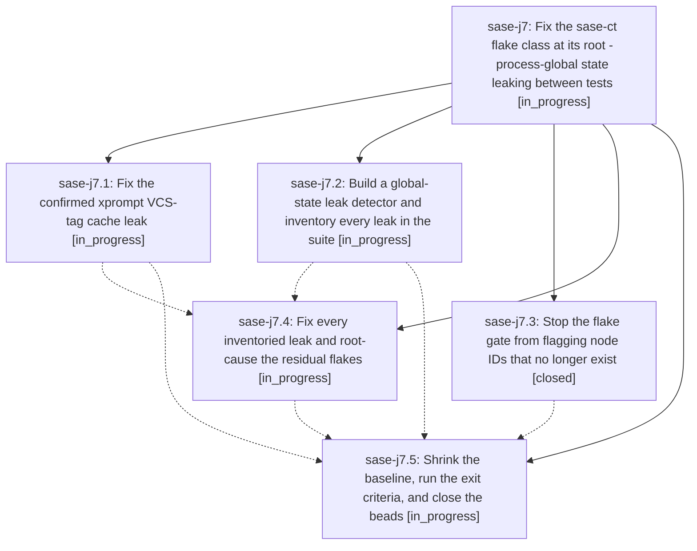

# Bead: sase-j7 — Fix the sase-ct flake class at its root - process-global state leaking between tests

[Bead Pages](../README.md) / sase-j7

**Status:** ◐ in_progress · **Type:** ▸ plan · **Tier:** epic
**Owner:** `bryanbugyi34@gmail.com` · **Created by:** [bbugyi200.athena.sase-j0.w1.f0](https://github.com/sase-org/sase--agents/blob/main/agents/bbugyi200.athena.sase-j0.w1.f0/README.md) · **Assignee:** `sase-j7.land`
**Created:** 2026-08-10 15:44:26 EDT
**Plan:** [202608/fix\_sase\_ct\_flake\_class.md](https://github.com/sase-org/sase--plans/blob/main/202608/fix_sase_ct_flake_class.md)

## Description

The tests behind sase-ct stop failing under the full parallel lane because the process-global state that leaks between tests is fixed by mechanism, a leak detector gate makes the class non-recurring, tests/reproducible_flake_baseline.txt shrinks to only nodes proven still broken, and sase-ct, sase-iy.5, sase-j4, sase-j5, and sase-j6 are closed on evidence.

## Phases

| Bead | Title | Status | Size | Created | Agents | Commits |
|---|---|---|---|---|---:|---:|
| [sase-j7.1](sase-j7.1.md) | Fix the confirmed xprompt VCS-tag cache leak | ◐ in_progress | medium | 2026-08-10 | 1 | 0 |
| [sase-j7.2](sase-j7.2.md) | Build a global-state leak detector and inventory every leak in the suite | ◐ in_progress | medium | 2026-08-10 | 1 | 0 |
| [sase-j7.3](sase-j7.3.md) | Stop the flake gate from flagging node IDs that no longer exist | ✓ closed | medium | 2026-08-10 | 1 | 1 |
| [sase-j7.4](sase-j7.4.md) | Fix every inventoried leak and root-cause the residual flakes | ◐ in_progress | large | 2026-08-10 | 1 | 0 |
| [sase-j7.5](sase-j7.5.md) | Shrink the baseline, run the exit criteria, and close the beads | ◐ in_progress | medium | 2026-08-10 | 1 | 0 |

## Lineage

## Agents

| Agent | Bead | Commits |
|---|---|---:|
| [bbugyi200.athena.sase-j7.1](https://github.com/sase-org/sase--agents/blob/main/agents/bbugyi200.athena.sase-j7.1/README.md) | [sase-j7.1](sase-j7.1.md) | 0 |
| [bbugyi200.athena.sase-j7.2](https://github.com/sase-org/sase--agents/blob/main/agents/bbugyi200.athena.sase-j7.2/README.md) | [sase-j7.2](sase-j7.2.md) | 0 |
| [bbugyi200.athena.sase-j7.3](https://github.com/sase-org/sase--agents/blob/main/agents/bbugyi200.athena.sase-j7.3/README.md) | [sase-j7.3](sase-j7.3.md) | 1 |
| [bbugyi200.athena.sase-j7.4](https://github.com/sase-org/sase--agents/blob/main/agents/bbugyi200.athena.sase-j7.4/README.md) | [sase-j7.4](sase-j7.4.md) | 0 |
| [bbugyi200.athena.sase-j7.5](https://github.com/sase-org/sase--agents/blob/main/agents/bbugyi200.athena.sase-j7.5/README.md) | [sase-j7.5](sase-j7.5.md) | 0 |
| [bbugyi200.athena.sase-j7.land](https://github.com/sase-org/sase--agents/blob/main/agents/bbugyi200.athena.sase-j7.land/README.md) | [sase-j7](README.md) | 0 |

## Commits

| Repo | Commit | Subject | Bead | Committed |
|---|---|---|---|---|
| sase | [`1b47ea7`](https://github.com/sase-org/sase/commit/1b47ea712ad1e75cbde27ea6aacb32b39daa429c) | feat(selection-health): skip stale node IDs in the reproducible-flake gate | [sase-j7.3](sase-j7.3.md) | 2026-08-10 16:17:14 EDT |
